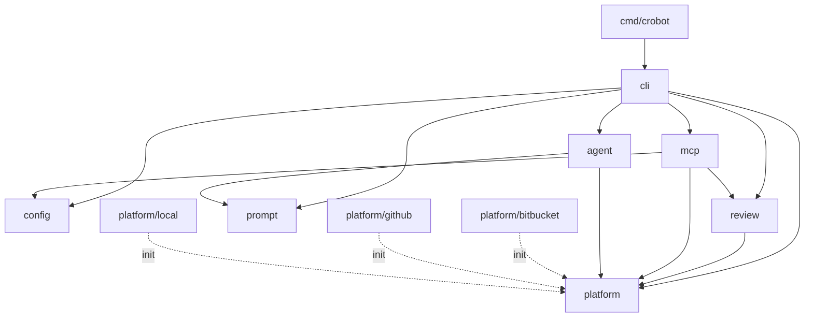
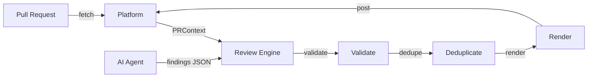

# Lesson 00: The Architecture of CRoBot

Before diving into Go syntax and semantics, let's orient ourselves in the
codebase. This lesson walks through the project structure, the entry point, the
module system, and the high-level architecture so that every subsequent lesson
has a map to reference.

---

## Go Project Layout Conventions

If you are coming from Java, you are used to `src/main/java/` hierarchies
dictated by build tools. In Python, you typically have a flat package directory
with `__init__.py` files. In Rust, Cargo enforces `src/main.rs` or
`src/lib.rs`. Go takes a different approach: there is no mandated layout from
the language specification, but a strong set of community conventions has
emerged.

Two directories matter most:

**`cmd/`** -- Contains one subdirectory per executable the project produces.
Each subdirectory has a `main.go` with `package main` and a `func main()`. If
your project builds multiple binaries (a server and a CLI, for example), each
gets its own directory under `cmd/`. CRoBot builds one binary, so there is
exactly one: `cmd/crobot/`.

**`internal/`** -- This is where Go diverges from mere convention. The Go
compiler itself enforces a visibility rule: packages under `internal/` can only
be imported by code rooted in the parent of `internal/`. Any external module
that tries to `import "github.com/cristian-fleischer/crobot/internal/config"`
will get a compile error -- not a linter warning, not a runtime exception, a
hard compiler rejection. This gives you encapsulation at the module boundary
without needing access modifiers on packages.

If you are used to Python's `_private_module` convention (which is purely
advisory) or Java's module system (which took decades to arrive), Go's
`internal/` directory is a refreshingly simple enforcement mechanism that has
been part of the toolchain since Go 1.4.

---

## The Entry Point

Go programs start at `func main()` inside `package main`. Here is the entire
entry point for CRoBot.

From `cmd/crobot/main.go`:

```go
// Package main is the entry point for the crobot CLI.
package main

import (
	"fmt"
	"os"

	"github.com/cristian-fleischer/crobot/internal/cli"
)

func main() {
	cmd := cli.RootCmd()
	if err := cmd.Execute(); err != nil {
		fmt.Fprintf(os.Stderr, "Error: %v\n", err)
		os.Exit(1)
	}
}
```

That is the whole file -- 17 lines including the package comment. A few things
to note:

- **`package main`** declares this as an executable package. In Go, only
  `package main` produces a binary; every other package name produces a library.
  There is no `if __name__ == "__main__"` guard like Python.

- **`func main()`** is the entry point. No arguments, no return value. Command
  line arguments come from `os.Args`, not function parameters.

- **`os.Exit(1)`** is how you set a non-zero exit code. Go's `main` function
  does not return an int. If you simply `return` from `main`, the exit code is
  0. If you want to signal failure to the shell, you must call `os.Exit`
  explicitly.

- **The function is tiny.** This is idiomatic Go. The entry point constructs the
  CLI and delegates immediately. All the real logic lives in library packages
  under `internal/`. This pattern makes the code testable -- you can call
  `cli.RootCmd()` from a test without launching a subprocess.

---

## Go Modules

Go modules are the dependency management system, introduced in Go 1.11 and the
default since Go 1.16. The `go.mod` file at the project root defines the
module.

From `go.mod`:

```
module github.com/cristian-fleischer/crobot

go 1.25.0

require (
	github.com/mark3labs/mcp-go v0.45.0
	github.com/spf13/cobra v1.10.2
	gopkg.in/yaml.v3 v3.0.1
)
```

Breaking this down:

- **`module github.com/cristian-fleischer/crobot`** -- The module path. This is
  both the import path prefix for all packages in the project and (by
  convention) the URL where the source code lives. When another Go project
  writes `import "github.com/cristian-fleischer/crobot/internal/cli"`, the
  toolchain knows which module to fetch.

- **`go 1.25.0`** -- The minimum Go version required. The toolchain uses this
  to decide which language features are available.

- **`require`** -- Direct dependencies. CRoBot has only three:
  - `cobra` -- CLI framework (commands, flags, help text)
  - `yaml.v3` -- YAML parsing for configuration files
  - `mcp-go` -- Model Context Protocol SDK for AI tool integration

The full `go.mod` also lists indirect dependencies (pulled in transitively), but
the direct dependency list is deliberately small. Go's standard library is
extensive -- HTTP clients, JSON encoding, cryptography, testing, and more are
all built in -- so projects tend to have far fewer third-party dependencies than
you might be used to in Node.js or Python.

If you are familiar with other ecosystems: `go.mod` serves the same role as
`package.json` (Node.js), `requirements.txt` / `pyproject.toml` (Python), or
`Cargo.toml` (Rust). The companion `go.sum` file is the lockfile, pinning exact
hashes for reproducible builds -- analogous to `package-lock.json` or
`Cargo.lock`.

---

## Package Organization

Here is the full project layout:

```
cmd/crobot/              -- Entry point (package main)
internal/
  agent/                 -- ACP agent client & session management
  cli/                   -- Cobra CLI commands (flags, subcommands, output)
  config/                -- Configuration loading (YAML files + environment variables)
  mcp/                   -- MCP server (exposes CRoBot tools to AI agents)
  platform/              -- Platform abstraction (Bitbucket, GitHub, local git)
    bitbucket/           -- Bitbucket API implementation
    github/              -- GitHub API implementation
    local/               -- Local git diff implementation
  prompt/                -- AI prompt generation (review instructions, templates)
  review/                -- Review engine (validate, deduplicate, render, post)
  version/               -- Version string
```

What each package does:

- **`agent`** -- Manages communication with AI coding agents via the Agent
  Communication Protocol (ACP), including spawning sessions and parsing
  responses.
- **`cli`** -- Defines every subcommand (`export-pr-context`,
  `apply-review-findings`, `serve`, etc.) using the Cobra framework. This is the
  largest package.
- **`config`** -- Loads configuration from a YAML file, overlays environment
  variables, and exposes a typed config struct.
- **`mcp`** -- Runs CRoBot as an MCP server so AI agents can call its tools
  programmatically rather than through the CLI.
- **`platform`** -- Defines the `Platform` interface and shared types. The
  subdirectories (`bitbucket`, `github`, `local`) each provide a concrete
  implementation.
- **`prompt`** -- Assembles the system prompts and review instructions sent to
  AI agents.
- **`review`** -- The core review pipeline: validate findings against the diff,
  deduplicate against existing comments, render Markdown, and post results.
- **`version`** -- Holds a single exported `Version` variable used by the CLI's
  `--version` flag.

Two things to notice about Go package organization:

**Packages are flat.** There is no deep nesting. `internal/review/` is not
further subdivided into `internal/review/validation/`,
`internal/review/rendering/`, etc. Each directory is exactly one package, and Go
encourages keeping packages focused but not fragmented.

**Each directory is exactly one package.** Every `.go` file in a directory must
have the same `package` declaration. You cannot mix `package review` and
`package validate` in the same folder. This is a compiler rule, not a
convention.

---

## Package Dependency Graph

The following diagram shows how the packages depend on each other. Solid arrows
are direct imports. Dotted arrows indicate the platform implementations
registering themselves with the `platform` package via `init()` functions (more
on `init()` in Lesson 01).



Notice how dependencies flow downward. `cli` sits at the top, orchestrating
everything. The `platform` package sits at the bottom, providing the interface
that multiple packages depend on. No package imports `cli` -- it is a
consumer, not a provider. This is a clean dependency graph with no cycles
(Go forbids circular imports at compile time).

---

## Data Flow: How a Review Works

When CRoBot runs a review, data flows through the system in a pipeline:



1. The **Platform** layer fetches PR metadata, changed files, and diff hunks
   from the hosting service (Bitbucket, GitHub, or local git).
2. An **AI Agent** analyzes the code and produces a JSON array of findings.
3. The **Review Engine** validates each finding (is the line within the diff?),
   deduplicates against existing bot comments, renders Markdown, and posts the
   results back through the Platform layer.

This separation means the review engine does not know or care whether it is
talking to Bitbucket or GitHub. The platform abstraction handles that. You will
see how this is implemented using Go interfaces in Lesson 04.

---

## What's Next

In [Lesson 01: Packages & Visibility](01-packages-and-visibility.md), we go
deeper into Go's package system -- how `package` declarations work, what makes
a name exported vs. unexported, how `init()` functions run, and the blank import
trick that wires the platform implementations into the factory at startup.
