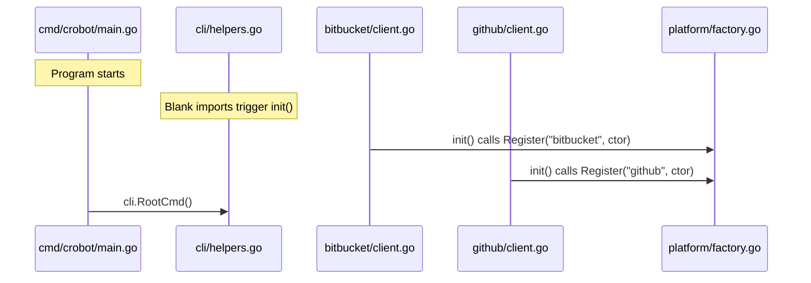

# Lesson 01: Packages and the Capital Letter Rule

Go's package system is the foundation for code organization and access control.
If you have worked with Java packages, Python modules, or C# namespaces, the
concepts will feel familiar -- but the mechanism for controlling visibility is
unlike anything in those languages.

This lesson uses real code from CRoBot to illustrate every concept.

---

## Package Declarations

Every Go source file begins with a `package` declaration. All files in the same
directory must declare the same package name, and by convention the package name
matches the directory name.

From `internal/platform/platform.go`:

```go
// Package platform defines the abstractions and shared types for interacting
// with code-hosting platforms (Bitbucket, GitHub, GitLab, etc.).
package platform
```

The file lives in the `internal/platform/` directory, so the package is named
`platform`. This is a convention, not a compiler requirement -- but violating it
will confuse every Go developer who reads your code.

The full **import path** is derived from the module path in `go.mod` plus the
directory path. CRoBot's module is declared as:

```
module github.com/cristian-fleischer/crobot
```

So the import path for this package is
`github.com/cristian-fleischer/crobot/internal/platform`. Other packages in the
same module import it by that full path:

```go
import "github.com/cristian-fleischer/crobot/internal/platform"
```

After importing, you reference the package's exported symbols as
`platform.Something` -- the last segment of the import path becomes the
qualifier.

**One package per directory.** You cannot have `package foo` and `package bar`
in the same directory (the sole exception is `_test` packages, covered in a
later lesson). If you need to split code across multiple files, that is fine --
they all share the same package and can access each other's unexported symbols
freely.

---

## Exported vs Unexported -- The Capital Letter Rule

Go has exactly one visibility mechanism: the case of the first letter.

| First letter | Visibility | Accessible from |
|---|---|---|
| **Uppercase** (`Platform`, `Register`) | Exported (public) | Any package that imports this one |
| **Lowercase** (`registry`, `validSides`) | Unexported (private) | Only within the same package |

There is no `public`, `private`, `protected`, `internal`, or `friend`. There
are no annotations, decorators, or access modifier keywords. The compiler
enforces this based purely on the first character of the identifier.

### Exported: the `Platform` interface

From `internal/platform/platform.go`:

```go
type Platform interface {
	GetPRContext(ctx context.Context, opts PRRequest) (*PRContext, error)
	GetFileContent(ctx context.Context, opts FileRequest) ([]byte, error)
	ListBotComments(ctx context.Context, opts PRRequest) ([]Comment, error)
	CreateInlineComment(ctx context.Context, opts PRRequest, comment InlineComment) (*Comment, error)
	DeleteComment(ctx context.Context, opts PRRequest, commentID string) error
}
```

The capital `P` in `Platform` makes it importable by other packages. Every
method on the interface also starts with a capital letter, which is required --
an interface with unexported methods can only be satisfied within the same
package.

### Exported vs unexported in `factory.go`

From `internal/platform/factory.go`:

```go
var (
	registryMu sync.RWMutex
	registry   = map[string]Constructor{}
)

func Register(name string, ctor Constructor) {
	registryMu.Lock()
	defer registryMu.Unlock()
	registry[name] = ctor
}

func NewPlatform(name string, cfg config.Config) (Platform, error) {
	registryMu.RLock()
	ctor, ok := registry[name]
	registryMu.RUnlock()
	if !ok {
		return nil, fmt.Errorf("%w: %q", ErrUnknownPlatform, name)
	}
	return ctor(cfg)
}
```

`registryMu` and `registry` start with lowercase letters -- they are internal
implementation details. No code outside `package platform` can touch them
directly. `Register` and `NewPlatform` start with uppercase letters -- they form
the public API that platform implementations and CLI code call into.

This is the Go equivalent of having a private field with public getter/setter
methods, except the language removes all ceremony. You simply capitalize the
name and it is exported.

### Exported vs unexported in `finding.go`

From `internal/platform/finding.go`:

```go
var validSides = map[string]bool{
	"new": true,
	"old": true,
}

var validSeverities = map[string]bool{
	"info":    true,
	"warning": true,
	"error":   true,
}

type ReviewFinding struct {
	Path          string   `json:"path"`
	Line          int      `json:"line"`
	Side          string   `json:"side"`
	Severity      string   `json:"severity"`
	SeverityScore int      `json:"severity_score,omitempty"`
	Category      string   `json:"category"`
	Criteria      []string `json:"criteria,omitempty"`
	Message       string   `json:"message"`
	Suggestion    string   `json:"suggestion,omitempty"`
	Fingerprint   string   `json:"fingerprint"`
}

func (f ReviewFinding) Validate() error {
	// ... uses validSides and validSeverities internally
}
```

`validSides` and `validSeverities` are unexported package-level variables --
lookup tables used only inside validation logic. `ReviewFinding` and its
`Validate()` method are exported, forming the public contract. Outside packages
can create a `ReviewFinding` and call `Validate()`, but they cannot inspect or
modify the validation lookup tables.

### Comparison with other languages

| Language | Public | Private | Protected | Package-private |
|---|---|---|---|---|
| **Go** | Capital letter | Lowercase letter | N/A | N/A |
| **Java** | `public` | `private` | `protected` | (default) |
| **Python** | Convention (no `_`) | Convention (`_prefix`) | Convention (`__mangling`) | N/A |
| **C#** | `public` | `private` | `protected` | `internal` |

Go's approach is simpler and compiler-enforced. There is no way to circumvent
it short of reflection (and even reflection cannot set unexported struct fields
from outside the package). Python's `_` prefix is merely a convention; Go's
capital letter rule is a hard constraint.

---

## Blank Imports and the `_` Idiom

From `internal/cli/helpers.go`:

```go
import (
	"fmt"
	"strings"

	"github.com/cristian-fleischer/crobot/internal/agent"
	"github.com/cristian-fleischer/crobot/internal/config"
	"github.com/cristian-fleischer/crobot/internal/platform"

	// Register platform implementations via their init() functions.
	_ "github.com/cristian-fleischer/crobot/internal/platform/bitbucket"
	_ "github.com/cristian-fleischer/crobot/internal/platform/github"
)
```

Go's compiler rejects unused imports. If you import a package but never
reference any of its exported symbols, the build fails. But sometimes you need
a package loaded purely for its side effects -- specifically, so its `init()`
functions execute.

The blank identifier `_` as an import alias tells the compiler: "I know I am
not using any exported names from this package. Import it anyway." The comment
above the blank imports is a convention that explains *why* the import exists.

Without these two lines, the bitbucket and github platform implementations
would never register themselves, and `NewPlatform("bitbucket", cfg)` would
return `ErrUnknownPlatform`.

---

## The `init()` Function

Every package can define one or more `init()` functions. They run automatically
when the package is loaded, before `main()` executes. They take no arguments
and return no values.

From `internal/platform/bitbucket/client.go`:

```go
package bitbucket

func init() {
	platform.Register("bitbucket", func(cfg config.Config) (platform.Platform, error) {
		return NewClient(&Config{
			Workspace: cfg.Bitbucket.Workspace,
			User:      cfg.Bitbucket.User,
			Token:     cfg.Bitbucket.Token,
		})
	})
}
```

From `internal/platform/github/client.go`:

```go
package github

func init() {
	platform.Register("github", func(cfg config.Config) (platform.Platform, error) {
		return NewClient(&Config{
			Owner: cfg.GitHub.Owner,
			Token: cfg.GitHub.Token,
		})
	})
}
```

Each `init()` function calls `platform.Register()`, inserting a constructor
function into the shared registry. This is how CRoBot implements its plugin
system: platform implementations register themselves at startup without the
core code needing to know about them at compile time.

### Execution order

1. **Dependencies first.** Before a package's `init()` runs, all of its
   imported packages' `init()` functions have already run. The `bitbucket`
   package imports `platform`, so `platform`'s `init()` (if any) runs before
   `bitbucket`'s.
2. **Alphabetical by file within a package.** If a package has multiple files
   with `init()` functions, they run in lexical filename order.
3. **Multiple per file.** A single file can define multiple `init()` functions
   and they all run, in the order they appear.
4. **Before `main()`.** All `init()` functions across all transitively imported
   packages complete before `main()` is called.

### Registration flow



When the program starts, Go loads all transitively imported packages. The blank
imports in `helpers.go` pull in the `bitbucket` and `github` packages. Their
`init()` functions fire, registering constructors with the platform factory.
By the time `main()` runs and the CLI processes a command, both platforms are
available.

### When to use `init()`

`init()` is appropriate for lightweight registration, as shown above. Avoid
using it for heavy work like network calls, file I/O, or anything that can
fail in a way the caller should handle. Since `init()` cannot return an error,
failures must either panic (bad for user experience) or be silently swallowed
(bad for debugging).

---

## Package-Level Variables vs Instance Variables

Go does not have classes. It has structs (data) and methods (functions with a
receiver). This creates two distinct scopes for state.

### Package-level variables

From `internal/platform/factory.go`:

```go
var (
	registryMu sync.RWMutex
	registry   = map[string]Constructor{}
)
```

These are declared at the top level of the package, outside any function. They
are initialized once when the package loads and live for the lifetime of the
program. If you are coming from Java, think of these as `static` fields --
shared across all uses, not tied to any instance.

Because `registryMu` and `registry` are unexported, they are encapsulated
within `package platform`. The exported functions `Register` and `NewPlatform`
mediate all access, providing thread safety via the mutex.

### Struct fields (instance-level)

From `internal/platform/bitbucket/client.go`:

```go
type Client struct {
	httpClient *http.Client
	baseURL    string
	user       string
	token      string
	workspace  string
}
```

Each call to `NewClient()` creates a separate `Client` value with its own
`httpClient`, `baseURL`, `user`, `token`, and `workspace`. These are
instance-level -- analogous to instance fields in Java or Python's `self.x`.

Note that these struct fields are all lowercase (unexported). Code outside
`package bitbucket` cannot access `client.token` directly. This is the same
capital letter rule applied to struct fields: if a field needs to be read by
other packages (for example, for JSON serialization), it must start with an
uppercase letter. CRoBot's `ReviewFinding` struct exports its fields
(`Path`, `Line`, `Side`, etc.) because they need to be marshaled to JSON.

---

## Key Takeaways

- **Capital letter = exported. That is the only mechanism.** No keywords, no
  annotations. The compiler enforces it.
- **`init()` runs at startup** -- use it for lightweight registration, not
  heavy work. It cannot return errors.
- **Blank imports (`_`) trigger side effects** without using exported names.
  This is how CRoBot's platform plugins register themselves.
- **One package per directory.** All files in a directory share the same
  package name and can access each other's unexported symbols.
- **Packages are flat** -- resist the urge to create deep hierarchies.
  `internal/platform/bitbucket` is three levels deep, and that is about as deep
  as idiomatic Go gets.
