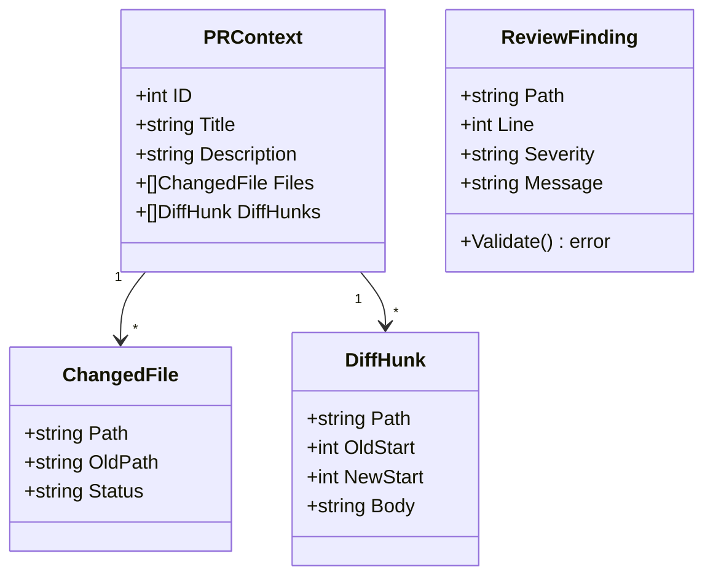

# Lesson 02: Types, Structs, and JSON

Go has no classes. Structs are the primary way to group related data, and struct
tags drive how that data gets serialized to and from formats like JSON. This
lesson walks through how CRoBot defines its core data types, serializes them,
and attaches behavior via method receivers.

---

## Struct Definitions

A struct is a composite type that groups named fields. If you are coming from
Java or C#, think of a struct as a final class with only public fields and no
inheritance. From Python, think of a frozen dataclass.

Here is the `PRContext` type and its related structs from CRoBot:

```go
// internal/platform/types.go

type PRContext struct {
    ID           int           `json:"id"`
    Title        string        `json:"title"`
    Description  string        `json:"description"`
    Author       string        `json:"author"`
    SourceBranch string        `json:"source_branch"`
    TargetBranch string        `json:"target_branch"`
    State        string        `json:"state"`
    HeadCommit   string        `json:"head_commit"`
    BaseCommit   string        `json:"base_commit"`
    Files        []ChangedFile `json:"files"`
    DiffHunks    []DiffHunk    `json:"diff_hunks"`
}

type ChangedFile struct {
    Path    string `json:"path"`
    OldPath string `json:"old_path,omitempty"`
    Status  string `json:"status"`
}

type DiffHunk struct {
    Path     string `json:"path"`
    OldStart int    `json:"old_start"`
    OldLines int    `json:"old_lines"`
    NewStart int    `json:"new_start"`
    NewLines int    `json:"new_lines"`
    Body     string `json:"body"`
}
```

A few things to notice:

**Field declarations are `Name Type`, not `Type Name`.** This is the opposite
of C, Java, and C#. Go consistently puts the name first, whether in variable
declarations (`var count int`), function parameters (`func foo(n int)`), or
struct fields.

**`[]ChangedFile` is a slice, not an array.** In Go, arrays have a fixed size
baked into the type (`[5]int` is a different type from `[10]int`). Slices are
dynamic, backed by an underlying array that grows as needed. In practice, you
almost always use slices. If you know Python, a slice is closer to a `list`; if
you know Java, it is closer to `ArrayList` -- except slices are built into the
language, not a library type.

**These structs form a type hierarchy through composition.** `PRContext`
contains a `[]ChangedFile` and a `[]DiffHunk`. There is no inheritance or
subclassing -- just one struct embedding or referencing another. This is the
Go way: composition over inheritance, enforced by the language.

---

## Struct Tags and JSON Serialization

The backtick-enclosed strings after each field are **struct tags**. They are
string metadata attached to fields, readable at runtime via Go's `reflect`
package. The `encoding/json` package uses tags with the key `json` to control
serialization.

```go
// internal/platform/types.go

type ChangedFile struct {
    Path    string `json:"path"`
    OldPath string `json:"old_path,omitempty"`
    Status  string `json:"status"`
}
```

- `json:"path"` tells the JSON encoder to use `"path"` as the key (instead of
  the Go field name `Path`).
- `json:"old_path,omitempty"` uses `"old_path"` as the key **and** omits the
  field entirely from the output when its value is the zero value for its type
  (empty string `""` in this case).

The `ReviewFinding` struct from `finding.go` demonstrates a mix of required and
optional fields:

```go
// internal/platform/finding.go

type ReviewFinding struct {
    Path          string   `json:"path"`
    Line          int      `json:"line"`
    Side          string   `json:"side"`
    Severity      string   `json:"severity"`
    SeverityScore int      `json:"severity_score,omitempty"`
    Category      string   `json:"category"`
    Criteria      []string `json:"criteria,omitempty"`
    Message       string   `json:"message"`
    Suggestion    string   `json:"suggestion,omitempty"`
    Fingerprint   string   `json:"fingerprint"`
}
```

Fields like `Path`, `Line`, `Severity`, and `Message` always appear in the JSON
output. Fields like `SeverityScore` (zero value `0`), `Criteria` (zero value
`nil`), and `Suggestion` (zero value `""`) are omitted when they have nothing
useful to say.

**Comparison to other languages:**

- **Java:** Struct tags serve a similar purpose to annotations like
  `@JsonProperty("path")` or `@JsonIgnore`. The difference is that Go tags are
  plain strings parsed by convention, not typed constructs checked at compile
  time.
- **Python:** Similar to `dataclasses.field(metadata=...)` or Pydantic's
  `Field(alias="path")`. Python decorators modify behavior; Go tags are
  purely metadata that libraries opt in to reading.
- **TypeScript:** No direct equivalent. Libraries like `class-transformer` use
  decorators, but most TS projects just define interfaces that match the JSON
  shape directly.

---

## Zero Values

Every type in Go has a well-defined **zero value** -- the value a variable holds
when it is declared but not explicitly initialized. There is no `null`,
`undefined`, or uninitialized memory.

| Type | Zero Value |
|------|------------|
| `string` | `""` |
| `int`, `float64`, etc. | `0` |
| `bool` | `false` |
| pointer, slice, map, interface, channel, function | `nil` |
| struct | all fields at their zero values |

This has practical consequences:

```go
// A freshly declared struct has all fields zeroed:
var f ReviewFinding
// f.Path == "", f.Line == 0, f.Criteria == nil, etc.

// A nil slice is perfectly usable with append:
var files []ChangedFile        // files is nil
files = append(files, file)    // works fine -- no need to call make()
```

You can see this pattern in `ComputeDiffStats` in `diffsize.go`, where
`order` starts as a nil slice and grows via `append`:

```go
// internal/platform/diffsize.go

var order []string
acc := make(map[string]*fileAcc)

for _, h := range hunks {
    a, ok := acc[h.Path]
    if !ok {
        a = &fileAcc{}
        acc[h.Path] = a
        order = append(order, h.Path)
    }
    // ...
}
```

**Maps are the exception.** A nil map will panic if you try to write to it, even
though reads return the zero value silently. You must initialize a map with
`make()` before writing:

```go
// This panics at runtime:
var m map[string]int
m["key"] = 1  // panic: assignment to entry in nil map

// This works:
m := make(map[string]int)
m["key"] = 1  // fine
```

Notice that `acc` in the code above is created with `make(map[string]*fileAcc)`
-- this is required because the loop writes to it.

**This is why `omitempty` is useful.** The JSON encoder checks for zero values
when deciding whether to include a field. A `nil` slice, an empty string, and
a `0` integer are all zero values, so they all get omitted with `omitempty`.

---

## json.RawMessage -- Deferred Parsing

Sometimes you receive JSON where part of the structure varies depending on
context. In CRoBot, the agent client uses JSON-RPC 2.0, where every message has
the same envelope but the `params` and `result` fields carry different shapes
depending on the method being called:

```go
// internal/agent/client.go

type Request struct {
    JSONRPC string          `json:"jsonrpc"`
    ID      int             `json:"id"`
    Method  string          `json:"method"`
    Params  json.RawMessage `json:"params,omitempty"`
}

type Response struct {
    JSONRPC string          `json:"jsonrpc"`
    ID      int             `json:"id"`
    Result  json.RawMessage `json:"result,omitempty"`
    Error   *RPCError       `json:"error,omitempty"`
}
```

`json.RawMessage` is a `[]byte` type that the JSON encoder and decoder treat
specially. When unmarshaling, it stores the raw JSON bytes without parsing them.
When marshaling, it writes the bytes directly into the output. This lets you
decode the outer envelope first, then decide how to decode the inner payload
based on the method name or other context.

The `rawMessage` struct in the same file shows another use -- a discriminator
type used to figure out what kind of JSON-RPC message was received before
routing it to the correct typed struct:

```go
// internal/agent/client.go

type rawMessage struct {
    JSONRPC string          `json:"jsonrpc"`
    ID      *int            `json:"id,omitempty"`
    Method  string          `json:"method,omitempty"`
    Params  json.RawMessage `json:"params,omitempty"`
    Result  json.RawMessage `json:"result,omitempty"`
    Error   *RPCError       `json:"error,omitempty"`
}
```

Note `ID *int` here -- a pointer to int. This is a common pattern when you need
to distinguish "field is absent" from "field is zero." A regular `int` would be
`0` whether the JSON had `"id": 0` or omitted the field entirely. A `*int` is
`nil` when absent and `&0` when explicitly set to zero.

**Comparison to other languages:**

- **Java (Jackson):** `json.RawMessage` is analogous to `JsonNode` -- you
  parse the tree lazily and inspect it before binding to a concrete type.
- **Python:** Similar to keeping part of the parsed `dict` from `json.loads()`
  unparsed. Python does not really have this concept natively since everything
  is dynamically typed, but libraries like Pydantic have `Json[Any]` for
  similar use cases.

---

## Method Receivers -- Value vs Pointer

Go attaches methods to types using **receivers**. The receiver appears between
the `func` keyword and the method name:

```go
// internal/platform/finding.go

func (f ReviewFinding) Validate() error {
    if f.Path == "" {
        return fmt.Errorf("review finding: %w", ErrEmptyPath)
    }
    if f.Line <= 0 {
        return fmt.Errorf("review finding: %w: got %d", ErrInvalidLine, f.Line)
    }
    if !validSides[f.Side] {
        return fmt.Errorf("review finding: %w: got %q", ErrInvalidSide, f.Side)
    }
    // ... more checks ...
    return nil
}
```

The `(f ReviewFinding)` part is the receiver. It names the variable `f` and
gives it the type `ReviewFinding`. This is a **value receiver** -- the method
gets a copy of the struct. Any modifications to `f` inside the method would
not affect the caller's original value.

A **pointer receiver** looks like `(f *ReviewFinding)` and operates on the
original struct:

```go
// hypothetical example
func (f *ReviewFinding) SetPath(path string) {
    f.Path = path  // modifies the original, not a copy
}
```

**When to use which:**

- **Value receiver:** The method only reads the struct (like `Validate`). The
  struct is small. You want to guarantee immutability.
- **Pointer receiver:** The method modifies the struct. The struct is large
  and you want to avoid copying it. The type needs to satisfy an interface that
  expects pointer receivers.

**Rule of thumb:** If any method on a type needs a pointer receiver, use pointer
receivers for all methods on that type. Consistency matters because a value and
a pointer to that value can have different method sets, which affects interface
satisfaction.

The `RPCError` type in `client.go` uses a pointer receiver:

```go
// internal/agent/client.go

func (e *RPCError) Error() string {
    return fmt.Sprintf("rpc error %d: %s", e.Code, e.Message)
}
```

This makes `*RPCError` (not `RPCError`) satisfy the `error` interface. Since
`RPCError` is used as `*RPCError` throughout the codebase (notice `Error
*RPCError` in the `Response` struct), a pointer receiver is the right choice.

**Comparison to other languages:**

- **Java/JavaScript:** The receiver is like `this`, but explicit. You name it,
  you see it in the parameter list, and you choose whether it is by value or by
  pointer.
- **Python:** Similar to `self`, except Go makes you decide between a copy and
  a reference. Python's `self` is always a reference.

---

## Type Aliases and Named Types

Go lets you define a new named type from any existing type. This is not just
an alias -- it creates a distinct type with its own method set:

```go
// internal/platform/factory.go

type Constructor func(cfg config.Config) (Platform, error)
```

`Constructor` is a named function type. Any function with the signature
`func(config.Config) (Platform, error)` can be used wherever `Constructor` is
expected. But now you can refer to it by name, making function signatures that
accept or return it much more readable:

```go
// Without the named type:
func Register(name string, ctor func(cfg config.Config) (Platform, error)) { ... }

// With the named type:
func Register(name string, ctor Constructor) { ... }
```

Named types can also have methods attached. For example, you could define:

```go
type StringSlice []string

func (s StringSlice) Contains(target string) bool {
    for _, v := range s {
        if v == target {
            return true
        }
    }
    return false
}
```

The standard library uses this pattern extensively -- `http.HandlerFunc` is a
named function type with a `ServeHTTP` method, which makes any plain function
satisfy the `http.Handler` interface.

---

## Type Relationships in CRoBot

The following diagram shows how the core data types relate to each other.
`PRContext` aggregates slices of `ChangedFile` and `DiffHunk`, while
`ReviewFinding` is produced independently and has its own validation method.



`ReviewResult` (in `internal/review/engine.go`) then ties findings to their
outcomes -- each finding either gets posted as a comment, skipped (duplicate or
below threshold), or marked as failed:

```go
// internal/review/engine.go

type ReviewResult struct {
    Posted  []PostedComment  `json:"posted"`
    Skipped []SkippedComment `json:"skipped"`
    Failed  []FailedComment  `json:"failed"`
    Summary ReviewSummary    `json:"summary"`
}
```

---

## Key Takeaways

- **Structs are Go's primary data structure.** No classes, no inheritance.
  Group fields, compose types, attach methods via receivers.
- **Struct tags drive serialization.** They are metadata strings, not logic.
  The `encoding/json` package reads them; you can write libraries that read
  custom tags too.
- **Zero values mean uninitialized is always usable** (usually). Strings are
  empty, numbers are zero, slices are nil but appendable. The exception is maps
  -- always `make()` before writing.
- **`json.RawMessage` defers parsing** when the JSON shape varies at runtime.
  Decode the envelope, then decode the payload once you know what it is.
- **Value vs pointer receivers:** Use a value receiver when the method only
  reads. Use a pointer receiver when it modifies state, when the struct is
  large, or when consistency with other methods requires it.
- **Named types** give readable names to function signatures, slices, or any
  other type -- and they can have their own methods.

---

Next: [Lesson 03: Error Handling](03-error-handling.md) -- the `error`
interface, wrapping, sentinel errors, and custom error types.
