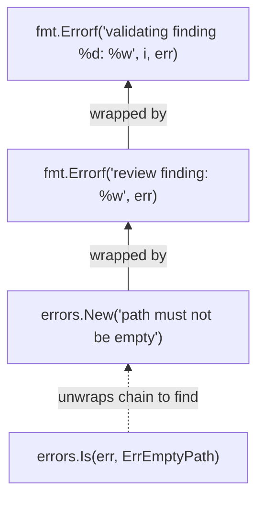

# Lesson 03: Errors as Values

Go has no exceptions. No `try`, no `catch`, no `throw`, no `raises`, no
`throws` clause. Errors in Go are ordinary values -- returned from functions,
stored in variables, passed around, inspected, and wrapped -- just like any
other data. This lesson explores how Go's error handling works in practice,
using CRoBot's codebase to illustrate every pattern.

---

## No Exceptions -- Errors Are Return Values

In most languages, errors interrupt the normal flow of execution. Java throws
checked exceptions. Python raises and catches. Rust uses `Result<T, E>` which,
while value-based like Go, uses the type system and pattern matching to enforce
handling at compile time.

Go takes the most explicit path possible: functions that can fail return an
`error` as the last return value, and the caller checks it immediately.

From `internal/platform/finding.go`:

```go
func ParseFindings(data []byte) ([]ReviewFinding, error) {
	var findings []ReviewFinding
	if err := json.Unmarshal(data, &findings); err != nil {
		return nil, fmt.Errorf("parsing findings: %w", err)
	}
	return findings, nil
}
```

The pattern is universal across Go code:

1. Call a function that returns `(result, error)`.
2. Check `if err != nil`.
3. Either return the error (possibly wrapped with context) or proceed with the
   result.

There is no way to silently ignore an error in Go without being deliberate
about it. If you write `json.Unmarshal(data, &findings)` without capturing the
error return, the compiler will reject it (unused multi-value). You have to
explicitly discard it with `_` -- which is a visible decision, not a hidden
default.

If you are coming from Java, think of it this way: every function call is like
a checked exception, but instead of try/catch blocks wrapping entire regions
of code, each call site handles its own errors inline. The error path is
always visible right next to the success path.

If you are coming from Rust, Go's approach is similar in spirit to
`Result<T, E>` but without the compiler enforcing exhaustive matching. Go
trades type-system enforcement for readability and simplicity -- the `if err
!= nil` pattern is so consistent that you can scan any Go function and
immediately see every failure point.

---

## The `error` Interface

The `error` type in Go is not a class, not a struct, not a special language
construct. It is an interface with a single method:

```go
type error interface {
	Error() string
}
```

That is the entire contract. Any type that has an `Error() string` method
satisfies it. There are no stack traces, no error codes, no severity levels
built in. If you want those things, you build them yourself -- and Go gives
you the tools to do so cleanly.

This minimalism is deliberate. The `error` interface is the simplest possible
abstraction: an error is something that can describe itself as a string.
Everything else -- wrapping, categorization, structured data -- is layered on
top using composition, not inheritance.

---

## Sentinel Errors

Sometimes callers need to distinguish between different kinds of errors. "File
not found" should be handled differently from "permission denied." Go handles
this with *sentinel errors* -- package-level variables created with
`errors.New()` that serve as unique, comparable identifiers.

From `internal/platform/errors.go`:

```go
package platform

import "errors"

// Sentinel errors for validation and factory operations.
var (
	// ErrEmptyPath indicates a ReviewFinding has an empty Path field.
	ErrEmptyPath = errors.New("path must not be empty")

	// ErrInvalidLine indicates a ReviewFinding has a non-positive Line value.
	ErrInvalidLine = errors.New("line must be greater than 0")

	// ErrInvalidSide indicates a ReviewFinding has a Side value that is
	// neither "new" nor "old".
	ErrInvalidSide = errors.New("side must be \"new\" or \"old\"")

	// ErrInvalidSeverity indicates a ReviewFinding has a Severity value that
	// is not one of "info", "warning", or "error".
	ErrInvalidSeverity = errors.New("severity must be \"info\", \"warning\", or \"error\"")

	// ErrEmptyCategory indicates a ReviewFinding has an empty Category field.
	ErrEmptyCategory = errors.New("category must not be empty")

	// ErrEmptyMessage indicates a ReviewFinding has an empty Message field.
	ErrEmptyMessage = errors.New("message must not be empty")

	// ErrInvalidSeverityScore indicates a ReviewFinding has a SeverityScore
	// outside the valid range of 1-10.
	ErrInvalidSeverityScore = errors.New("severity_score must be between 1 and 10 (or 0 to omit)")

	// ErrUnknownPlatform indicates the factory was asked for a platform name
	// it does not recognise.
	ErrUnknownPlatform = errors.New("unknown platform")
)
```

A few conventions to note:

- **Named with the `Err` prefix.** This is universal in Go: `ErrNotFound`,
  `ErrTimeout`, `ErrUnauthorized`. The standard library follows this
  convention (`io.EOF`, `fs.ErrNotExist`, `context.Canceled`), and so should
  your code.

- **Created with `errors.New()`.** Each call to `errors.New` returns a
  distinct value. Even `errors.New("x") == errors.New("x")` is `false` --
  identity is based on the pointer, not the string content. This is what makes
  them reliable as sentinels.

- **Declared as package-level `var`, not `const`.** Error values are
  interfaces, and interfaces cannot be constants in Go. Using `var` is the
  standard pattern.

- **Grouped in a `var (...)` block.** This keeps all sentinel errors for the
  package visible in one place. When you need to know what errors a package
  can produce, you look for the `var` block with `Err` prefixed names.

Sentinel errors are for errors that callers need to handle differently. If
nobody needs to distinguish your error from any other, a simple
`fmt.Errorf("something went wrong")` is fine -- you do not need a sentinel
for every possible failure.

---

## Error Wrapping with `%w`

Raw sentinel errors lack context. Knowing that "path must not be empty"
occurred is useful, but knowing *where* it occurred is essential. Go solves
this with error wrapping using `fmt.Errorf` and the `%w` verb.

### Adding context to a sentinel

From `internal/platform/finding.go`, the `Validate` method:

```go
func (f ReviewFinding) Validate() error {
	if f.Path == "" {
		return fmt.Errorf("review finding: %w", ErrEmptyPath)
	}
	if f.Line <= 0 {
		return fmt.Errorf("review finding: %w: got %d", ErrInvalidLine, f.Line)
	}
	if !validSides[f.Side] {
		return fmt.Errorf("review finding: %w: got %q", ErrInvalidSide, f.Side)
	}
	// ...
}
```

Each return wraps the sentinel error with `%w`, adding a "review finding:"
prefix for context. Some also append the invalid value (`: got %d`) so the
caller sees exactly what went wrong. The resulting error message reads
naturally: `"review finding: line must be greater than 0: got -1"`.

### Wrapping with the sentinel as the format prefix

From `internal/platform/factory.go`:

```go
func NewPlatform(name string, cfg config.Config) (Platform, error) {
	registryMu.RLock()
	ctor, ok := registry[name]
	registryMu.RUnlock()
	if !ok {
		return nil, fmt.Errorf("%w: %q", ErrUnknownPlatform, name)
	}
	return ctor(cfg)
}
```

Here the sentinel itself is the first element in the format string:
`fmt.Errorf("%w: %q", ErrUnknownPlatform, name)`. This produces something like
`"unknown platform: \"gitlab\""`. The position of `%w` does not matter -- what
matters is that `%w` (not `%v` or `%s`) is used, because only `%w` creates the
wrapping chain that `errors.Is()` can traverse.

### Chained wrapping across call boundaries

From `internal/platform/diff.go`:

```go
if strings.HasPrefix(line, "@@") {
	hunk, consumed, err := parseDiffHunk(currentPath, lines, i)
	if err != nil {
		return nil, fmt.Errorf("parsing hunk at line %d: %w", i, err)
	}
	// ...
}
```

And deeper in the same file, `parseDiffHunkHeader` wraps its own errors:

```go
oldStart, oldLines, err = parseDiffRange(parts[0], "-")
if err != nil {
	return 0, 0, 0, 0, fmt.Errorf("parsing old range: %w", err)
}
```

Which in turn wraps the errors from `parseDiffRange`:

```go
start, err = strconv.Atoi(parts[0])
if err != nil {
	return 0, 0, fmt.Errorf("parsing start: %w", err)
}
```

This builds a chain of wrapped errors. If `strconv.Atoi` fails, the final
error reads something like:
`"parsing hunk at line 42: parsing old range: parsing start: strconv.Atoi: parsing \"abc\": invalid syntax"`.

Each layer adds its own context without discarding the original cause. This is
Go's answer to stack traces: instead of an automatic trace captured at throw
time, you build a descriptive chain of context manually at each call site. The
result is often more useful than a raw stack trace because each level describes
*what was happening*, not just *where in the code* it happened.

---

## Checking Errors -- `errors.Is()` and `errors.As()`

Wrapping creates chains. Inspecting those chains requires tools beyond `==`.

### `errors.Is()` -- finding a sentinel in the chain

From `internal/config/config.go`, the `loadFile` function:

```go
func loadFile(path string, cfg *Config) error {
	data, err := os.ReadFile(path)
	if err != nil {
		if errors.Is(err, fs.ErrNotExist) {
			return nil
		}
		return fmt.Errorf("reading file: %w", err)
	}
	// ...
}
```

`os.ReadFile` returns an error that wraps `fs.ErrNotExist` when the file does
not exist. A simple `err == fs.ErrNotExist` would not work here because the
returned error is a `*fs.PathError` that wraps the sentinel. `errors.Is()`
walks the entire wrapping chain, unwrapping layer by layer, until it either
finds the target sentinel or runs out of chain.

This is the key reason wrapping with `%w` matters: it preserves the ability
for upstream callers to ask "was the root cause a not-found error?" regardless
of how many layers of context have been added. If you had used `%v` instead of
`%w`, the original error identity would be lost, and `errors.Is()` would
return `false`.

The logic in `loadFile` is a clean example of error discrimination: a missing
config file is not an error (silently return nil), but a permission error or
disk failure *is* an error (propagate it). Without `errors.Is()`, you would be
reduced to string matching on the error message, which is fragile and
un-Go-like.

### Type assertions on errors -- the manual approach

From `internal/platform/local/provider.go`, the `git` helper method:

```go
func (p *Provider) git(ctx context.Context, args ...string) (string, error) {
	cmd := exec.CommandContext(ctx, "git", args...)
	cmd.Dir = p.repoDir
	out, err := cmd.Output()
	if err != nil {
		if exitErr, ok := err.(*exec.ExitError); ok {
			return "", fmt.Errorf("git %s: %s", args[0], strings.TrimSpace(string(exitErr.Stderr)))
		}
		return "", err
	}
	return strings.TrimSpace(string(out)), nil
}
```

Here the code uses a *type assertion* (`err.(*exec.ExitError)`) to check
whether the error is a specific concrete type. If the subprocess exited with
a non-zero status, `cmd.Output()` returns an `*exec.ExitError`, which carries
the stderr output and exit code. The type assertion extracts this structured
data so the function can include the subprocess's stderr in its own error
message.

Go also provides `errors.As()`, which is to type assertions what `errors.Is()`
is to equality checks: it walks the wrapping chain looking for an error that
can be assigned to a target type. You would use it like this:

```go
var exitErr *exec.ExitError
if errors.As(err, &exitErr) {
	// exitErr is now populated with the matched error
	fmt.Println("exit code:", exitErr.ExitCode())
}
```

The direct type assertion in `provider.go` works because `cmd.Output()` returns
the `*exec.ExitError` directly without wrapping. If intermediate code wrapped
the error with `fmt.Errorf("...: %w", err)`, the type assertion would fail but
`errors.As()` would still find it inside the chain. As a rule of thumb:

- Use **`errors.Is()`** when checking for a specific sentinel value.
- Use **`errors.As()`** when extracting a specific error type from the chain.
- Use a **direct type assertion** only when you know the error is not wrapped.

---

## Custom Error Types

Sometimes a string message is not enough. You need structured data -- error
codes, metadata, machine-readable fields. Go handles this by defining struct
types that satisfy the `error` interface.

From `internal/agent/client.go`:

```go
// RPCError represents a JSON-RPC 2.0 error object.
type RPCError struct {
	Code    int    `json:"code"`
	Message string `json:"message"`
	Data    any    `json:"data,omitempty"`
}

// Error implements the error interface for RPCError.
func (e *RPCError) Error() string {
	return fmt.Sprintf("rpc error %d: %s", e.Code, e.Message)
}
```

`RPCError` is an ordinary struct with three fields: `Code` (a JSON-RPC error
code like `-32601` for "method not found"), `Message` (a human-readable
description), and `Data` (arbitrary additional context). The `Error()` method
makes it satisfy the `error` interface, so it can be returned anywhere an
`error` is expected.

This is how it gets used in the response handling:

```go
if resp.Error != nil {
	return nil, fmt.Errorf("agent: request %q: %w", method, resp.Error)
}
```

The `RPCError` is wrapped with `%w`, so callers further up the chain could use
`errors.As()` to extract the original `RPCError` and inspect its `Code` field
to decide how to handle different JSON-RPC error codes programmatically.

The key insight is that Go's `error` interface is *just* an interface. Any type
can implement it. You do not need to inherit from a base error class or
register error types in a central location. If your type has `Error() string`,
it is an error. This is the same structural typing you will see with all Go
interfaces (covered in Lesson 04), applied to the most fundamental interface in
the language.

---

## Error Wrapping Chain

The following diagram shows how error wrapping builds a chain that
`errors.Is()` can traverse:



At the bottom of the chain is the sentinel error created with `errors.New()`.
Each `fmt.Errorf("%w")` call adds a layer of context on top. When
`errors.Is()` receives the outermost error, it peels off layers one at a time
until it finds (or fails to find) the target sentinel. The chain is a linked
list of errors, not a string -- the original error's identity is preserved at
every level.

---

## Key Takeaways

- **`if err != nil` is Go's error handling.** It is explicit, visible at every
  call site, and never hidden behind control flow constructs. You will write it
  hundreds of times. This is intentional.

- **Sentinel errors (`ErrFoo`) are for errors callers need to distinguish.**
  Use `errors.New()` for values, name them with the `Err` prefix, and declare
  them as package-level variables.

- **`fmt.Errorf("%w")` wraps errors and preserves the chain.** Always use `%w`
  (not `%v`) when you want callers to be able to inspect the underlying cause.

- **`errors.Is()` checks for a specific error in the chain.** It replaces `==`
  comparison when errors might be wrapped.

- **`errors.As()` extracts a specific error type from the chain.** It replaces
  direct type assertions when errors might be wrapped.

- **Custom error types carry structured data.** Any struct with an
  `Error() string` method is an error. Use them when callers need more than a
  message string.

- **The lack of exceptions is intentional.** Go trades the terseness of
  try/catch for the explicitness of checking every error at every call site.
  Error paths are never hidden, never surprising, and never require reading a
  `throws` clause to know what might go wrong. Whether you find this verbose
  or refreshing depends on which bugs have kept you up at night.

---

## What's Next

In [Lesson 04: Interfaces & Polymorphism](04-interfaces-and-polymorphism.md),
we explore how Go's interface system works without explicit `implements`
declarations -- and how CRoBot uses the `Platform` interface to support
Bitbucket, GitHub, and local git through a single factory, without any of the
implementations knowing about each other.
