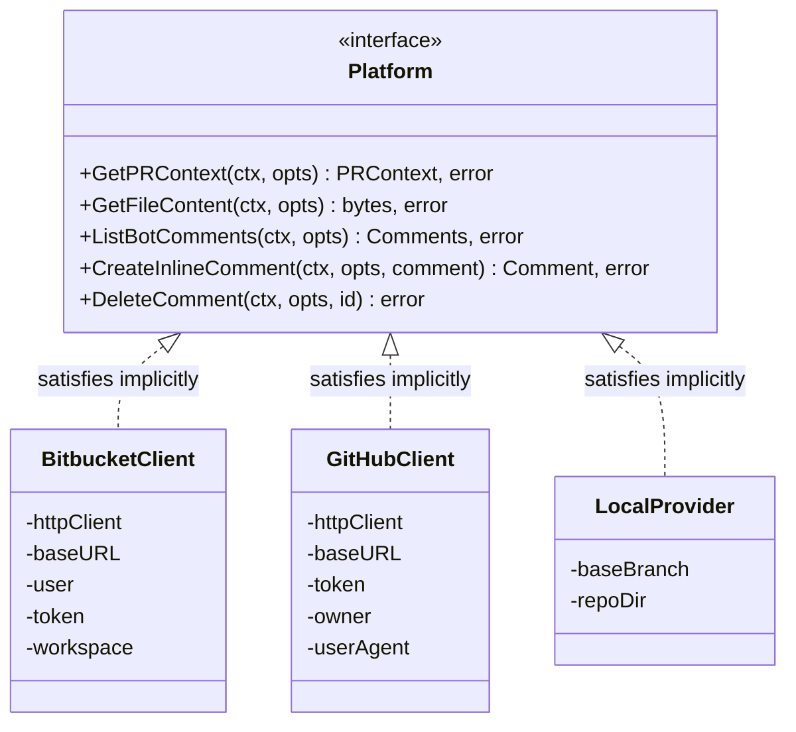
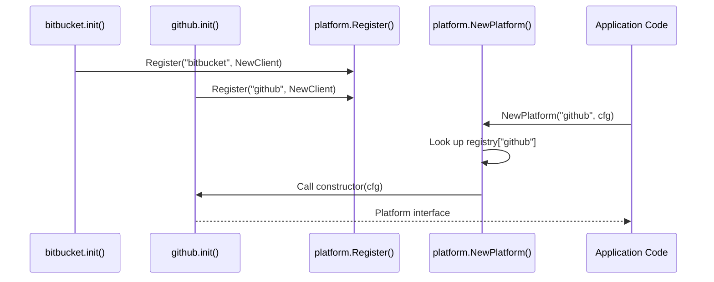

# Lesson 04: Implicit Interfaces and the Factory Pattern

Go interfaces look like interfaces in Java, C#, or TypeScript -- but they work
in a fundamentally different way. There is no `implements` keyword. A type
satisfies an interface simply by having the right methods. The compiler checks
this at compile time, but the type itself never declares which interfaces it
satisfies.

This lesson walks through CRoBot's `Platform` interface, its three
implementations, the factory that wires them together, and the consumers that
depend only on the abstraction.

---

## Interfaces in Go -- Implicit Satisfaction

The `Platform` interface defines the contract that every code-hosting
integration must satisfy. It has five methods, each accepting a
`context.Context` as its first parameter (a Go convention covered in a later
lesson).

From `internal/platform/platform.go`:

```go
type Platform interface {
	GetPRContext(ctx context.Context, opts PRRequest) (*PRContext, error)
	GetFileContent(ctx context.Context, opts FileRequest) ([]byte, error)
	ListBotComments(ctx context.Context, opts PRRequest) ([]Comment, error)
	CreateInlineComment(ctx context.Context, opts PRRequest, comment InlineComment) (*Comment, error)
	DeleteComment(ctx context.Context, opts PRRequest, commentID string) error
}
```

Now look at the Bitbucket implementation.

From `internal/platform/bitbucket/client.go`:

```go
type Client struct {
	httpClient *http.Client
	baseURL    string
	user       string
	token      string
	workspace  string
}
```

Search this struct definition for the word `Platform`. It is not there. Search
the entire file -- there is no `implements Platform`, no `extends Platform`, no
annotation, no marker of any kind. Yet this type *does* satisfy the `Platform`
interface, because it has methods with the exact signatures that `Platform`
requires: `GetPRContext`, `GetFileContent`, `ListBotComments`,
`CreateInlineComment`, and `DeleteComment`.

The GitHub implementation is the same story -- a completely different struct with
different internal fields, but the same five method signatures.

From `internal/platform/github/client.go`:

```go
type Client struct {
	httpClient *http.Client
	baseURL    string
	token      string
	owner      string
	userAgent  string
}
```

Different fields (`owner` instead of `workspace`, an extra `userAgent`),
different authentication mechanism (Bearer token vs. Basic Auth), different API
endpoints -- but the same interface, satisfied implicitly.

### How Go differs from other languages

In Java, you would write:

```java
public class BitbucketClient implements Platform { ... }
```

In C#:

```csharp
public class BitbucketClient : IPlatform { ... }
```

In TypeScript:

```typescript
class BitbucketClient implements Platform { ... }
```

All three require the implementor to *declare* which interface it satisfies. Go
does not. This is called **structural typing** -- if the structure matches (the
right methods with the right signatures), the type satisfies the interface. It
is similar in spirit to duck typing ("if it walks like a duck and quacks like a
duck..."), but with compile-time checking rather than runtime failures.

The practical consequence: you can define an interface *after* the concrete
types already exist, and those types satisfy it retroactively without any code
changes. You can also define an interface in a completely separate package from
the types that satisfy it. This decoupling is impossible in languages that
require explicit `implements` declarations.

---

## Small Interfaces

Go has a proverb: **"The bigger the interface, the weaker the abstraction."**

The `Platform` interface has five methods. By Go standards, that is already on
the larger side. Compare it to interfaces from the standard library:

- **`io.Reader`** -- one method: `Read(p []byte) (n int, err error)`
- **`io.Writer`** -- one method: `Write(p []byte) (n int, err error)`
- **`error`** -- one method: `Error() string`
- **`fmt.Stringer`** -- one method: `String() string`

These single-method interfaces are the backbone of Go's standard library. The
entire I/O system is built on `io.Reader` and `io.Writer`. Every error in Go
satisfies the `error` interface (as covered in Lesson 03). The smaller the
interface, the more types can satisfy it, and the more broadly useful it
becomes.

`Platform`'s five methods are justified because a code review tool genuinely
needs all five operations from any hosting platform. But you should resist the
impulse to add a sixth method "just in case." Every method added to an
interface is a method that every implementation must provide -- including test
mocks.

A related principle: **define interfaces where they are consumed, not where they
are implemented.** The `Platform` interface lives in `internal/platform/`, the
same package that defines the shared types (`PRRequest`, `PRContext`, etc.). The
implementations live in subpackages (`bitbucket/`, `github/`, `local/`) and
never reference the interface type by name in their own code. The consumers --
`review.Engine`, `mcp.handler` -- import the `platform` package and depend on
the interface. This keeps the dependency direction clean: implementations depend
on the abstraction package for types, consumers depend on it for the interface.

---

## The Factory Pattern with Self-Registration

CRoBot uses a factory pattern to create the right `Platform` implementation at
runtime based on a string name. The factory lives in
`internal/platform/factory.go` and has four components.

### The Constructor type

```go
type Constructor func(cfg config.Config) (Platform, error)
```

A `Constructor` is a function type: it takes the application configuration and
returns a `Platform` (the interface, not any concrete type) or an error. This
is a first-class function -- Go treats functions as values, so you can store
them in maps, pass them as arguments, and return them from other functions.

### The registry

```go
var (
	registryMu sync.RWMutex
	registry   = map[string]Constructor{}
)
```

The registry is an unexported package-level map from string names to
constructor functions. The `sync.RWMutex` protects it for concurrent access --
multiple `init()` functions might call `Register()` during startup, and
`NewPlatform()` might be called from multiple goroutines later.

### The Register function

```go
func Register(name string, ctor Constructor) {
	registryMu.Lock()
	defer registryMu.Unlock()
	registry[name] = ctor
}
```

`Register` is exported (capital R) because it is called from other packages.
It inserts a constructor into the registry under a given name. The mutex
ensures thread safety.

### The NewPlatform factory function

```go
func NewPlatform(name string, cfg config.Config) (Platform, error) {
	registryMu.RLock()
	ctor, ok := registry[name]
	registryMu.RUnlock()
	if !ok {
		return nil, fmt.Errorf("%w: %q", ErrUnknownPlatform, name)
	}
	return ctor(cfg)
}
```

`NewPlatform` looks up the constructor by name, calls it with the
configuration, and returns whatever `Platform` implementation it produces.
Notice the return type is `Platform` -- the interface. The factory knows
nothing about `bitbucket.Client` or `github.Client`. It only knows the
interface.

### Self-registration via init()

The implementations register themselves using `init()` functions that call
`Register`.

From `internal/platform/bitbucket/client.go`:

```go
func init() {
	platform.Register("bitbucket", func(cfg config.Config) (platform.Platform, error) {
		return NewClient(&Config{
			Workspace: cfg.Bitbucket.Workspace,
			User:      cfg.Bitbucket.User,
			Token:     cfg.Bitbucket.Token,
		})
	})
}
```

From `internal/platform/github/client.go`:

```go
func init() {
	platform.Register("github", func(cfg config.Config) (platform.Platform, error) {
		return NewClient(&Config{
			Owner: cfg.GitHub.Owner,
			Token: cfg.GitHub.Token,
		})
	})
}
```

This creates a plugin system. To add a new platform (say, GitLab), you would:

1. Create `internal/platform/gitlab/client.go` with a `Client` struct that has
   the five required methods.
2. Write an `init()` function that calls `platform.Register("gitlab", ...)`.
3. Add a blank import (`_ "...gitlab"`) where needed.

No changes to the factory. No changes to the `Platform` interface. No changes
to any consumer. The new implementation registers itself just by being imported.

---

## Constructor Functions

Go has no constructors, no `new` keyword for custom types, and no special
initialization syntax. The convention is to write a function named `NewFoo()`
that returns a configured instance.

From `internal/platform/bitbucket/client.go`:

```go
func NewClient(cfg *Config) (*Client, error) {
	if cfg == nil {
		return nil, fmt.Errorf("bitbucket: config must not be nil")
	}
	if cfg.User == "" {
		return nil, fmt.Errorf("bitbucket: user must not be empty")
	}
	if cfg.Token == "" {
		return nil, fmt.Errorf("bitbucket: token must not be empty")
	}

	baseURL := cfg.BaseURL
	if baseURL == "" {
		baseURL = defaultBaseURL
	}

	httpClient := cfg.HTTPClient
	if httpClient == nil {
		httpClient = &http.Client{Timeout: 30 * time.Second}
	}

	return &Client{
		httpClient: httpClient,
		baseURL:    baseURL,
		user:       cfg.User,
		token:      cfg.Token,
		workspace:  cfg.Workspace,
	}, nil
}
```

From `internal/platform/github/client.go`:

```go
func NewClient(cfg *Config) (*Client, error) {
	if cfg == nil {
		return nil, fmt.Errorf("github: config must not be nil")
	}
	if cfg.Token == "" {
		return nil, fmt.Errorf("github: token must not be empty")
	}

	baseURL := cfg.BaseURL
	if baseURL == "" {
		baseURL = defaultBaseURL
	}

	httpClient := cfg.HTTPClient
	if httpClient == nil {
		httpClient = &http.Client{Timeout: 30 * time.Second}
	}

	return &Client{
		httpClient: httpClient,
		baseURL:    baseURL,
		token:      cfg.Token,
		owner:      cfg.Owner,
		userAgent:  "CRoBot/" + version.Version,
	}, nil
}
```

Both follow the same pattern: validate inputs, apply defaults, return a pointer
to the struct. Both return `*Client` (the concrete type), not the `Platform`
interface. This is intentional -- returning the concrete type gives callers
full access to any additional methods on the struct. The widening to the
`Platform` interface happens at the point of use, either in the factory's
`Constructor` function or when assigning to a field typed as `platform.Platform`.

The local provider uses an even simpler constructor since it needs no
authentication.

From `internal/platform/local/provider.go`:

```go
func New(baseBranch, repoDir string) *Provider {
	return &Provider{
		baseBranch: baseBranch,
		repoDir:    repoDir,
	}
}
```

No error return because there is nothing to validate at construction time
(validation happens later in `GetPRContext`). The function is named `New` rather
than `NewProvider` because the package is `local` and `local.New()` reads
clearly enough -- `local.NewProvider()` would be redundant. This is a common Go
naming convention: when the package name already implies the type, `New()`
suffices.

---

## Consuming Interfaces

The value of the `Platform` interface becomes clear in the consuming code.

### The review engine

From `internal/review/engine.go`:

```go
type Engine struct {
	platform platform.Platform
	config   EngineConfig
}

func NewEngine(p platform.Platform, cfg EngineConfig) *Engine {
	return &Engine{
		platform: p,
		config:   cfg,
	}
}
```

The `Engine` stores a `platform.Platform` -- the interface, not any concrete
type. It calls methods on `e.platform` without knowing or caring whether it is
talking to Bitbucket, GitHub, or a local git repo. In its `Run` method, it
calls `e.platform.GetPRContext(...)`, `e.platform.ListBotComments(...)`, and
`e.platform.CreateInlineComment(...)` through the interface.

### The MCP handler

From `internal/mcp/handler.go`:

```go
type handler struct {
	platform platform.Platform
	config   config.Config
}

func newHandler(plat platform.Platform, cfg config.Config) *handler {
	return &handler{
		platform: plat,
		config:   cfg,
	}
}
```

The MCP handler follows the exact same pattern: accept the interface, store it,
call methods on it. It does not import `bitbucket` or `github` -- it only
imports `platform`.

Both consumers are **testable by design**. You can construct a mock struct with
the five required methods, pass it to `NewEngine()` or `newHandler()`, and test
the consumer's logic without making any HTTP calls. The interface boundary is
the natural seam for test doubles.

---

## The Local Provider -- Partial Implementation

The `local.Provider` is an interesting case. It satisfies the `Platform`
interface, but two of its methods return errors unconditionally.

From `internal/platform/local/provider.go`:

```go
func (p *Provider) CreateInlineComment(_ context.Context, _ platform.PRRequest, _ platform.InlineComment) (*platform.Comment, error) {
	return nil, fmt.Errorf("local mode does not support posting comments")
}

func (p *Provider) DeleteComment(_ context.Context, _ platform.PRRequest, _ string) error {
	return fmt.Errorf("local mode does not support deleting comments")
}
```

In Java or C#, you might reach for an abstract base class or throw an
`UnsupportedOperationException`. Go's approach is simpler: implement the
method, return an error. The interface is still satisfied. The caller handles
the error through the normal error-handling path, not through a special
exception hierarchy.

This is a trade-off. The interface says "a Platform can create comments," but
the local provider cannot. Go does not give you a way to express "this type
implements methods 1-3 but not 4-5" at the type level. The error is discovered
at runtime, not compile time. For CRoBot this is acceptable because the CLI
knows when it is in local mode and avoids calling those methods. But it is
worth being aware of the limitation.

---

## Composition Over Inheritance

Go has no inheritance. No `extends`, no base classes, no class hierarchies.
This is not an omission -- it is a deliberate design choice. Go offers two
composition mechanisms instead.

### Interface composition

You can embed one interface inside another to build larger interfaces from
smaller ones. The standard library does this:

```go
type ReadWriter interface {
	Reader
	Writer
}
```

`ReadWriter` does not repeat the `Read` and `Write` method signatures. It
embeds `Reader` and `Writer`, inheriting their method sets. Any type that
satisfies both `Reader` and `Writer` automatically satisfies `ReadWriter`.

CRoBot's `Platform` interface does not use composition because its five
methods are cohesive and do not decompose into smaller reusable interfaces. But
if you needed a read-only subset (say, `PlatformReader` with just
`GetPRContext` and `GetFileContent`), you could define it as a separate
interface and embed it in `Platform`.

### Struct embedding

You can embed one struct inside another to gain its fields and methods.

```go
type Base struct {
	ID string
}

func (b *Base) Identify() string { return b.ID }

type Extended struct {
	Base  // embedded, not a named field
	Name string
}
```

An `Extended` value has an `Identify()` method without writing any forwarding
code. This is delegation, not inheritance -- there is no `super` call, no
virtual dispatch, no method resolution order. If `Extended` defines its own
`Identify()`, it shadows the embedded one entirely.

CRoBot's platform implementations do not use struct embedding because each is
standalone. `bitbucket.Client`, `github.Client`, and `local.Provider` share no
fields and no behavior. They are independent types that happen to satisfy the
same interface. This is the typical Go pattern: composition through interfaces
at the boundary, independent implementations behind it.

---

## Interface Satisfaction



No arrows connect the implementations to each other. There is no shared base
type, no common ancestor. The only relationship is through the interface.

---

## Factory Registration Sequence



The `init()` functions run at program startup. By the time application code
calls `NewPlatform`, all implementations have already registered themselves.
The factory looks up the constructor by name, calls it, and returns the
interface. The application code never imports `github` or `bitbucket` directly
-- it only needs the blank imports to trigger the `init()` calls.

---

## Key Takeaways

- **Interfaces are satisfied implicitly.** The compiler checks that a type has
  the right methods. No `implements` keyword, no declaration on the
  implementing type.
- **Keep interfaces small.** One to three methods is the sweet spot. The
  standard library's most powerful abstractions (`io.Reader`, `error`) have a
  single method.
- **Factory + init() = plugin system without import cycles.** New
  implementations register themselves by being imported. The factory and
  consumers never need to change.
- **`NewFoo()` functions replace constructors.** They validate inputs, apply
  defaults, and return a configured instance. Return the concrete type; let the
  caller widen to an interface when needed.
- **Composition over inheritance is not just a guideline in Go -- it is the
  only option.** There are no classes, no `extends`, no method resolution
  order. Interfaces compose by embedding; structs compose by embedding. Both
  provide delegation, not inheritance.
