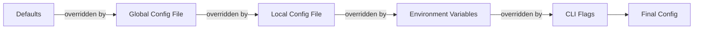

# Lesson 05: Configuration Patterns

Go does not have builder patterns, keyword arguments, or annotation-driven
config binding. Instead, it relies on plain structs, struct tags, and explicit
wiring. This lesson walks through CRoBot's configuration system to show how
these pieces fit together into a layered, testable config pipeline.

---

## Config Structs -- Go's Answer to Builder Patterns

In Java you might reach for a builder. In Python you might use `**kwargs` or
dataclasses. In Go, you define a struct.

From `internal/config/config.go`:

```go
type Config struct {
	Platform  string          `yaml:"platform"`
	Bitbucket BitbucketConfig `yaml:"bitbucket"`
	GitHub    GitHubConfig    `yaml:"github"`
	Review    ReviewConfig    `yaml:"review"`
	Agent     AgentConfig     `yaml:"agent"`
	AI        AIConfig        `yaml:"ai"`
}
```

Each subsystem gets its own nested struct. `BitbucketConfig` holds
Bitbucket-specific fields, `ReviewConfig` holds review behavior settings, and
so on. The top-level `Config` composes them:

```go
type BitbucketConfig struct {
	Workspace string `yaml:"workspace"`
	Repo      string `yaml:"repo"`
	User      string `yaml:"user"`
	Token     string `yaml:"token"`
}

type ReviewConfig struct {
	MaxComments       int    `yaml:"max_comments"`
	DryRun            bool   `yaml:"dry_run"`
	BotLabel          string `yaml:"bot_label"`
	SeverityThreshold string `yaml:"severity_threshold"`
	PhilosophyPath    string `yaml:"philosophy_path"`
}
```

This pattern scales well. When a new subsystem appears (say, AI provider
settings), you add a new struct and embed it in `Config`:

```go
type AIConfig struct {
	DefaultProvider string                `yaml:"default_provider"`
	Providers       map[string]ProviderDef `yaml:"providers"`
	MaxTokens       int                    `yaml:"max_tokens"`
	Temperature     float64                `yaml:"temperature"`
}
```

The struct hierarchy mirrors the YAML structure exactly. A config file like this
maps one-to-one onto the Go types:

```yaml
platform: bitbucket
bitbucket:
  workspace: my-team
  repo: my-repo
review:
  max_comments: 25
  dry_run: true
```

Not every config struct needs tags. `ClientConfig` from
`internal/agent/client.go` is used purely in-memory -- no serialization
needed:

```go
type ClientConfig struct {
	Command string
	Args    []string
	Dir     string
	Env     []string
	Timeout time.Duration
	Stderr  io.Writer
}
```

No `yaml` or `json` tags here. This struct exists to group related parameters
for spawning an agent subprocess. Without it, the function signature would be
`NewClient(command string, args []string, dir string, env []string, timeout
time.Duration, stderr io.Writer)` -- six positional parameters where the caller
has to remember the order.

### Comparison with other languages

| Language | Approach | Trade-off |
|---|---|---|
| **Go** | Config struct with fields | Explicit, compiler-checked, no runtime surprises |
| **Java** | Builder pattern | Flexible but verbose boilerplate |
| **Python** | `**kwargs` or dataclasses | Concise but no compile-time checks |
| **C#** | Options pattern + DI | Powerful but requires a DI container |

Go's approach is the least magical. You can read a config struct and know every
possible field without searching for annotations, decorators, or builder
methods.

---

## Struct Tags for YAML

Struct tags are metadata strings attached to struct fields. They have no effect
on the Go compiler -- they are consumed at runtime by serialization libraries
via reflection.

From `internal/config/config.go`, the `BitbucketConfig` struct:

```go
type BitbucketConfig struct {
	Workspace string `yaml:"workspace"`
	Repo      string `yaml:"repo"`
	User      string `yaml:"user"`
	Token     string `yaml:"token"`
}
```

Each field has a `yaml:"..."` tag that tells `gopkg.in/yaml.v3` which YAML key
maps to which struct field. Without the tag, the library would use the field
name as-is (`Workspace` in YAML instead of `workspace`).

Multiple tags can coexist on the same field. CRoBot's `ReviewFinding` struct
(from `internal/platform/finding.go`) demonstrates this with JSON tags:

```go
type ReviewFinding struct {
	Path          string   `json:"path"`
	Line          int      `json:"line"`
	SeverityScore int      `json:"severity_score,omitempty"`
	Criteria      []string `json:"criteria,omitempty"`
}
```

The `omitempty` option tells the JSON encoder to skip the field if it holds a
zero value. This same option works in YAML tags as well.

### Hiding secrets with `yaml:"-"`

The special tag value `"-"` tells the serializer to skip the field entirely.
From `internal/config/config.go`:

```go
type ProviderDef struct {
	Model  string `yaml:"model"`
	APIKey string `yaml:"-"`
}
```

The `APIKey` field is populated from environment variables only. The `yaml:"-"`
tag prevents it from being written to config files if someone were to marshal a
`Config` back to YAML. This is a deliberate safety measure -- API keys should
never end up serialized to disk accidentally.

The `gopkg.in/yaml.v3` package uses these tags in the same way that
`encoding/json` uses `json` tags. If you need both YAML and JSON
serialization, you put both tags on the field:

```go
Field string `yaml:"field_name" json:"field_name"`
```

---

## Layered Configuration

CRoBot resolves configuration through a layered pipeline where each layer
overrides the previous one. This is the same pattern used by tools like Docker,
kubectl, and Git -- and aligns with the 12-factor app methodology.



### Step 1: Defaults

From `internal/config/config.go`:

```go
func Defaults() Config {
	return Config{
		Platform: "bitbucket",
		Review: ReviewConfig{
			MaxComments:       25,
			DryRun:            true,
			BotLabel:          "crobot",
			SeverityThreshold: "warning",
		},
	}
}
```

`Defaults()` returns a `Config` with sensible built-in values. Note that
`DryRun` defaults to `true` -- a safe default that prevents accidentally
posting comments before the user is ready.

Fields not explicitly set here get their zero values: `""` for strings, `0`
for ints, `nil` for maps and slices. This is fine -- the zero values mean
"not configured," and downstream code checks for that.

### Step 2: Config files

```go
func Load(globalPath, localPath string, lookupEnv EnvLookupFunc) (Config, error) {
	cfg := Defaults()

	for _, path := range []string{globalPath, localPath} {
		if path == "" {
			continue
		}
		if err := loadFile(path, &cfg); err != nil {
			return Config{}, fmt.Errorf("loading config %s: %w", path, err)
		}
	}

	applyEnv(&cfg, lookupEnv)
	return cfg, nil
}
```

`Load` starts with defaults, then layers the global config file
(`~/.config/crobot/config.yaml`) and the local config file (`.crobot.yaml`
in the project root). Local overrides global because it is applied second.

The `loadFile` function handles missing files gracefully:

```go
func loadFile(path string, cfg *Config) error {
	data, err := os.ReadFile(path)
	if err != nil {
		if errors.Is(err, fs.ErrNotExist) {
			return nil // missing file is not an error
		}
		return fmt.Errorf("reading file: %w", err)
	}

	if err := yaml.Unmarshal(data, cfg); err != nil {
		return fmt.Errorf("parsing YAML: %w", err)
	}
	return nil
}
```

The key detail: `yaml.Unmarshal` merges into the existing `cfg` value. It only
overwrites fields that appear in the YAML file -- fields not mentioned in the
file retain their previous values (from defaults or the global config). This is
what makes the layering work.

### Step 3: Environment variables

Applied by `applyEnv()` (covered in the next section).

### Step 4: CLI flags

The `Load` function handles layers 1-3. CLI flag overrides are applied by the
caller after `Load` returns. This is noted in the function's doc comment:
"The returned Config is ready for CLI flag overrides to be applied on top."

The convenience wrapper `LoadDefault` shows how production code calls `Load`
with the standard paths and `os.LookupEnv`:

```go
func LoadDefault() (Config, error) {
	globalPath := ""
	if home, err := os.UserHomeDir(); err == nil {
		globalPath = filepath.Join(home, ".config", "crobot", "config.yaml")
	}
	return Load(globalPath, ".crobot.yaml", os.LookupEnv)
}
```

---

## Function Types for Testability

One of the most practical patterns in Go is using function types as parameters
for dependency injection. No framework required -- just pass a function.

From `internal/config/config.go`:

```go
type EnvLookupFunc func(key string) (string, bool)
```

This is a named function type. Its signature matches `os.LookupEnv` exactly:
it takes a string key and returns a string value plus a boolean indicating
whether the variable was set.

The `applyEnv` function takes this type as a parameter instead of calling
`os.LookupEnv` directly:

```go
func applyEnv(cfg *Config, lookupEnv EnvLookupFunc) {
	if lookupEnv == nil {
		return
	}
	if v, ok := lookupEnv("CROBOT_PLATFORM"); ok {
		cfg.Platform = v
	}
	// ... more env var mappings
}
```

In production, `LoadDefault` passes `os.LookupEnv`:

```go
return Load(globalPath, ".crobot.yaml", os.LookupEnv)
```

In tests, you can inject a fake that returns whatever you want:

```go
fakeLookup := func(key string) (string, bool) {
	env := map[string]string{
		"CROBOT_PLATFORM":  "github",
		"CROBOT_DRY_RUN":   "false",
	}
	v, ok := env[key]
	return v, ok
}

cfg, err := config.Load("", "", fakeLookup)
```

No mocking library. No interface to implement. No dependency injection
container. You define a function type, accept it as a parameter, and callers
pass in either the real implementation or a test double.

This pattern appears throughout the Go standard library. `http.HandlerFunc`,
`sort.Slice`'s comparison function, and `filepath.WalkFunc` all use the same
idea: behavior as a function parameter.

### Why not an interface?

You could define a `type EnvLookup interface { Lookup(string) (string, bool) }`
and it would work. But for a single method, a function type is simpler -- there
is no struct to create, no method to implement, and lambdas (function literals
in Go terminology) work directly. Interfaces become worthwhile when you have
multiple related methods that belong together.

---

## Environment Variable Overlay

The `applyEnv` function maps environment variables to config fields one by one:

```go
func applyEnv(cfg *Config, lookupEnv EnvLookupFunc) {
	if lookupEnv == nil {
		return
	}

	if v, ok := lookupEnv("CROBOT_PLATFORM"); ok {
		cfg.Platform = v
	}
	if v, ok := lookupEnv("CROBOT_BITBUCKET_WORKSPACE"); ok {
		cfg.Bitbucket.Workspace = v
	}
	if v, ok := lookupEnv("CROBOT_BITBUCKET_REPO"); ok {
		cfg.Bitbucket.Repo = v
	}
	if v, ok := lookupEnv("CROBOT_BITBUCKET_TOKEN"); ok {
		cfg.Bitbucket.Token = v
	}
	// ... and so on for every supported env var
}
```

Each mapping follows the same pattern: look up the variable, and if it is set,
assign its value to the corresponding config field. The two-return-value idiom
(`v, ok`) distinguishes "variable set to empty string" from "variable not set."

### Type conversions

Environment variables are always strings, but config fields are not. For
integer fields, `strconv.Atoi` handles the conversion:

```go
if v, ok := lookupEnv("CROBOT_MAX_COMMENTS"); ok {
	if n, err := strconv.Atoi(v); err == nil {
		cfg.Review.MaxComments = n
	}
}
```

If the string is not a valid integer, the conversion error is silently
ignored and the field retains its previous value. This is a deliberate
design choice -- a malformed environment variable should not crash the
program.

For boolean fields, CRoBot uses a custom `parseBool` function:

```go
func parseBool(s string) bool {
	switch strings.ToLower(strings.TrimSpace(s)) {
	case "true", "1", "yes":
		return true
	case "false", "0", "no", "":
		return false
	default:
		slog.Warn("unrecognized boolean value", "value", s)
		return false
	}
}
```

This is more forgiving than `strconv.ParseBool` from the standard library,
accepting `"yes"` and `"no"` in addition to `"true"` and `"false"`. The
unrecognized case logs a warning rather than failing, which is a user-friendly
approach for CLI tools.

### Why the manual mapping?

The `applyEnv` function is verbose -- every environment variable is mapped
individually. Libraries like `envconfig` or `viper` can do this automatically
using struct tags and reflection. CRoBot takes the explicit approach instead.

The trade-off is clear: more lines of code, but you can read the function and
immediately see every environment variable that is supported, what config field
it maps to, and how the type conversion works. There is no hidden behavior, no
tag-parsing logic to debug, and no magic. When a user asks "which environment
variables does CRoBot support?", you point them at this one function.

### API key handling

The API key section shows a slightly different pattern -- a map-driven
approach for multiple providers:

```go
apiKeyEnvVars := map[string]string{
	"CROBOT_ANTHROPIC_API_KEY":  "anthropic",
	"CROBOT_OPENAI_API_KEY":     "openai",
	"CROBOT_GOOGLE_API_KEY":     "google",
	"CROBOT_OPENROUTER_API_KEY": "openrouter",
}
for envVar, providerName := range apiKeyEnvVars {
	if v, ok := lookupEnv(envVar); ok {
		if cfg.AI.Providers == nil {
			cfg.AI.Providers = make(map[string]ProviderDef)
		}
		p := cfg.AI.Providers[providerName]
		p.APIKey = v
		cfg.AI.Providers[providerName] = p
	}
}
```

Note the `nil` map check before assignment. In Go, writing to a `nil` map
panics at runtime. The `make(map[string]ProviderDef)` call initializes it. Also
note the read-modify-write on the map value: because `ProviderDef` is a struct
(a value type), `cfg.AI.Providers[providerName]` returns a copy. You must
modify the copy and write it back.

---

## Key Takeaways

- **Config structs replace builders and option objects.** Group related
  parameters into a struct. Nest structs to model hierarchical config. This
  gives you compile-time type checking with no boilerplate.

- **Struct tags drive serialization.** `yaml:"name"` and `json:"name"` tell
  encoding libraries how to map between struct fields and external formats.
  Use `yaml:"-"` to prevent sensitive fields like API keys from being
  serialized.

- **Function types as parameters enable testing without mocking frameworks.**
  Define a function type that matches the signature of the real dependency
  (like `os.LookupEnv`), accept it as a parameter, and tests can inject
  fakes directly.

- **Explicit over magic.** Go config code is more verbose than annotation-driven
  or reflection-based approaches, but every mapping is visible in the source.
  When something goes wrong, you can trace the data flow without consulting
  framework documentation.

- **Layered config is a standard CLI pattern.** Defaults, then config files,
  then environment variables, then CLI flags -- each layer overrides the
  previous one. CRoBot implements this with a simple loop and `yaml.Unmarshal`'s
  merge behavior.
