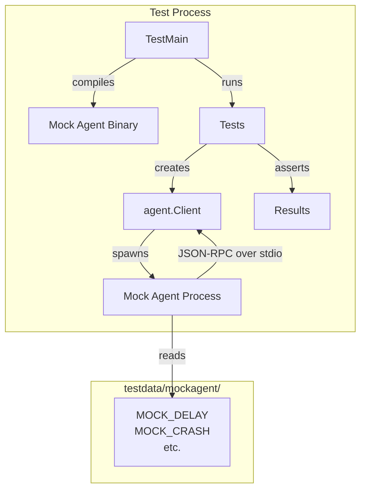

# Lesson 06: Testing in Go

Go ships with a built-in test framework. There is no test runner to install, no
assertion library to choose, no configuration file to write. You run `go test
./...` and it finds, compiles, and executes every test in your module. This
lesson walks through CRoBot's test suite to show how real Go projects use
table-driven tests, parallel execution, subprocess helpers, and `TestMain` to
test everything from pure validation logic to full agent integration flows.

---

## The Basics -- `_test.go` and `testing.T`

Go tests live in files ending with `_test.go`. The compiler excludes these files
from production builds entirely -- they only exist during `go test`. Every test
function starts with `Test`, takes a single `*testing.T` parameter, and returns
nothing.

Here is one of the simplest tests in CRoBot:

```go
// internal/agent/fs_test.go

func TestFSHandlerWriteDenied(t *testing.T) {
    t.Parallel()

    handler, err := NewFSHandler("abc123", "/tmp")
    if err != nil {
        t.Fatalf("NewFSHandler: %v", err)
    }

    params, _ := json.Marshal(map[string]string{"path": "test.go", "content": "package main"})
    _, err = handler.HandleRequest(context.Background(), "fs/write_text_file", params)
    if err == nil {
        t.Fatal("expected error for write operation, got nil")
    }
    if !strings.Contains(err.Error(), "not permitted") {
        t.Errorf("expected 'not permitted' error, got: %v", err)
    }
}
```

Notice two different failure methods:

- **`t.Fatalf()`** stops the test immediately. Use it when the rest of the test
  cannot possibly succeed -- if `NewFSHandler` fails, there is no handler to
  test, so continuing would just produce noise.
- **`t.Errorf()`** records a failure but keeps running. Use it when subsequent
  checks are still meaningful -- the error was non-nil, but you also want to
  verify its message content.

Go also provides `t.Skip()` for tests that depend on the environment:

```go
// internal/agent/fs_test.go

func TestFSHandlerReadTextFile(t *testing.T) {
    t.Parallel()

    out, err := exec.Command("git", "rev-parse", "HEAD").Output()
    if err != nil {
        t.Skip("not in a git repository")
    }
    commit := strings.TrimSpace(string(out))
    // ... rest of test uses the real git repo ...
}
```

When `t.Skip()` is called, the test is marked as skipped (not failed) and
appears as `--- SKIP` in the output. This is the right choice when a test
needs external dependencies like a git repository, a database, or a network
connection that may not be available in all environments.

**Comparison to other frameworks:**

- **JUnit (Java):** Go has no `@Test` annotation, no `assertEquals()`, no test
  lifecycle hooks. You write `if got != want { t.Errorf(...) }` directly. This
  feels verbose at first, but it means tests are plain Go code with no magic.
- **pytest (Python):** No `assert` statement rewriting, no fixture injection, no
  conftest.py. Go's approach is deliberately minimal -- the standard library
  gives you `testing.T` and that is it.
- **Jest (JavaScript):** No `describe`/`it`/`expect` chain. Go uses subtests
  (`t.Run`) for grouping, which you will see in the next section.

---

## Table-Driven Tests

Table-driven tests are the dominant testing pattern in Go. You define a slice of
test cases as struct literals, then loop over them with `t.Run()`. This is how
CRoBot validates review findings against PR context:

```go
// internal/review/validate_test.go

func TestValidateFindings(t *testing.T) {
    t.Parallel()

    ctx := testPRContext()

    tests := []struct {
        name              string
        findings          []platform.ReviewFinding
        threshold         string
        wantValidCount    int
        wantRejectedCount int
        wantReasons       []string // substring match on rejection reasons
    }{
        {
            name:              "valid finding in hunk range",
            findings:          []platform.ReviewFinding{validFinding()},
            threshold:         "info",
            wantValidCount:    1,
            wantRejectedCount: 0,
        },
        {
            name: "path not in changed files",
            findings: []platform.ReviewFinding{
                {
                    Path: "src/missing.go", Line: 5, Side: "new",
                    Severity: "warning", Category: "bug", Message: "msg", Fingerprint: "fp",
                },
            },
            threshold:         "info",
            wantValidCount:    0,
            wantRejectedCount: 1,
            wantReasons:       []string{"not in changed files"},
        },
        {
            name: "line outside hunk range - new side",
            findings: []platform.ReviewFinding{
                {
                    Path: "src/main.go", Line: 5, Side: "new",
                    Severity: "warning", Category: "bug", Message: "msg", Fingerprint: "fp",
                },
            },
            threshold:         "info",
            wantValidCount:    0,
            wantRejectedCount: 1,
            wantReasons:       []string{"not within any diff hunk"},
        },
        // ... 20+ more cases covering boundary conditions, severity thresholds, etc.
    }

    for _, tt := range tests {
        t.Run(tt.name, func(t *testing.T) {
            t.Parallel()

            valid, rejected := review.ValidateFindings(tt.findings, ctx, tt.threshold)

            if len(valid) != tt.wantValidCount {
                t.Errorf("valid count: got %d, want %d", len(valid), tt.wantValidCount)
            }
            if len(rejected) != tt.wantRejectedCount {
                t.Errorf("rejected count: got %d, want %d", len(rejected), tt.wantRejectedCount)
            }

            for i, reason := range tt.wantReasons {
                if i >= len(rejected) {
                    t.Errorf("expected reason %d (%q) but only got %d rejections", i, reason, len(rejected))
                    continue
                }
                if !containsSubstring(rejected[i].Reason, reason) {
                    t.Errorf("rejected[%d].Reason = %q, want substring %q", i, rejected[i].Reason, reason)
                }
            }
        })
    }
}
```

A few things to notice about this pattern:

**The test case struct is anonymous.** There is no need to define a named type
for something used in exactly one place. The struct definition sits right inside
the slice declaration.

**`t.Run(tt.name, func(t *testing.T) {...})` creates subtests.** Each case runs
as an independent subtest with its own name. When you run `go test -v`, the
output looks like:

```
=== RUN   TestValidateFindings
=== RUN   TestValidateFindings/valid_finding_in_hunk_range
=== RUN   TestValidateFindings/path_not_in_changed_files
=== RUN   TestValidateFindings/line_outside_hunk_range_-_new_side
--- PASS: TestValidateFindings (0.00s)
```

You can also run a single subtest with `go test -run TestValidateFindings/path_not_in_changed_files`.

**Adding a new test case is just adding a struct literal.** No new function, no
new file. You add one more entry to the slice and the loop picks it up. This
makes it easy to cover boundary conditions exhaustively -- the commit hash
validation test in `fs_test.go` has 18 cases covering everything from valid
short hashes to strings with special characters:

```go
// internal/agent/fs_test.go

func TestNewFSHandler_CommitHashValidation(t *testing.T) {
    t.Parallel()

    tests := []struct {
        name    string
        commit  string
        wantErr bool
    }{
        {name: "full 40-char hash", commit: "abcdef1234567890abcdef1234567890abcdef12", wantErr: false},
        {name: "short 7-char hash", commit: "abc1234", wantErr: false},
        {name: "minimum 4-char hash", commit: "abcd", wantErr: false},
        {name: "uppercase hex rejected", commit: "ABCDEF", wantErr: true},
        {name: "too short 3 chars", commit: "abc", wantErr: true},
        {name: "empty string", commit: "", wantErr: true},
        {name: "contains special chars", commit: "abc!@#$", wantErr: true},
        // ... more cases ...
    }

    for _, tt := range tests {
        t.Run(tt.name, func(t *testing.T) {
            t.Parallel()

            handler, err := NewFSHandler(tt.commit, "/repo")

            if tt.wantErr {
                if err == nil {
                    t.Errorf("NewFSHandler(%q) expected error, got nil", tt.commit)
                }
                return
            }

            if err != nil {
                t.Fatalf("NewFSHandler(%q) unexpected error: %v", tt.commit, err)
            }
            if handler.headCommit != tt.commit {
                t.Errorf("headCommit = %q, want %q", handler.headCommit, tt.commit)
            }
        })
    }
}
```

**Comparison to parameterized tests:**

- **JUnit 5:** `@ParameterizedTest` with `@MethodSource` or `@CsvSource`.
  Go's version is more explicit but equally powerful.
- **pytest:** `@pytest.mark.parametrize("name,commit,want_err", [...])`.
  Same idea, different syntax. Go's struct-based approach is more readable
  when test cases have many fields.

---

## Parallel Tests with `t.Parallel()`

By default, Go runs tests within a package sequentially. Calling `t.Parallel()`
at the start of a test function opts that test into concurrent execution:

```go
// internal/agent/fs_test.go

func TestFSHandlerWriteDenied(t *testing.T) {
    t.Parallel()
    // ...
}

func TestFSHandlerTerminalDenied(t *testing.T) {
    t.Parallel()
    // ...
}

func TestFSHandlerUnknownMethod(t *testing.T) {
    t.Parallel()
    // ...
}
```

When multiple tests in the same package call `t.Parallel()`, the test runner
executes them concurrently instead of one at a time. This can significantly
reduce test suite run time -- especially for tests that involve I/O, subprocess
execution, or network calls.

Subtests inside table-driven tests can also be parallel:

```go
for _, tt := range tests {
    t.Run(tt.name, func(t *testing.T) {
        t.Parallel()
        // This subtest runs concurrently with other parallel subtests
    })
}
```

**The key rule:** parallel tests must not share mutable state. Each test should
create its own data, use its own temp directories (`t.TempDir()` returns a
unique directory per test), and avoid writing to package-level variables. In
CRoBot, every parallel test creates its own `FSHandler` or `Client` instance --
no shared state, no coordination needed.

**Comparison to other tools:**

- **pytest-xdist:** Distributes tests across processes, usually at the file or
  module level. Go's `t.Parallel()` is more granular -- you opt in per
  individual test function.
- **JUnit 5:** `@Execution(CONCURRENT)` at the class level. Go's approach
  is per-test, giving you finer control over which tests are safe to
  parallelize.

---

## Black-Box vs White-Box Testing

Look at the package declarations in CRoBot's agent test files:

```go
// internal/agent/fs_test.go
package agent

// internal/agent/integration_test.go
package agent_test
```

These are two different testing modes, and both files live in the same
directory (`internal/agent/`).

**`package agent`** (white-box testing): The test file is part of the `agent`
package itself. It can access unexported (lowercase) identifiers -- struct
fields, helper functions, internal state. The `fs_test.go` file uses this mode
because it needs to access `handler.headCommit` and `handler.repoDir`, which
are unexported fields:

```go
// internal/agent/fs_test.go (package agent)

func TestNewFSHandler(t *testing.T) {
    t.Parallel()

    handler, err := NewFSHandler("abc123", "/repo")
    if err != nil {
        t.Fatalf("NewFSHandler: %v", err)
    }
    if handler.headCommit != "abc123" {
        t.Errorf("expected headCommit=abc123, got %q", handler.headCommit)
    }
    if handler.repoDir != "/repo" {
        t.Errorf("expected repoDir=/repo, got %q", handler.repoDir)
    }
}
```

**`package agent_test`** (black-box testing): The test file is in a separate
package. It can only access exported (uppercase) identifiers, exactly like any
external consumer of the package. The `integration_test.go` file uses this
mode -- it imports `agent` and only calls public API like `agent.NewClient`,
`agent.NewSession`, and `agent.ExtractFindings`:

```go
// internal/agent/integration_test.go (package agent_test)

import (
    "github.com/cristian-fleischer/crobot/internal/agent"
    "github.com/cristian-fleischer/crobot/internal/platform"
)

func TestIntegration_FullFlow(t *testing.T) {
    t.Parallel()

    client := agent.NewClient(agent.ClientConfig{
        Command: mockAgentBinary,
        Timeout: 10 * time.Second,
    })
    // ... only exported identifiers used ...
}
```

**When to use which:**

- **Black-box** (`package foo_test`): For testing the public API. Ensures your
  package is usable from the outside. Catches accidental dependencies on
  internal state. Preferred for integration tests.
- **White-box** (`package foo`): For testing internal logic that is not exposed.
  Useful for validating invariants, edge cases in private helpers, or struct
  fields that are not part of the public API.

Both can coexist in the same directory. The Go toolchain handles this
gracefully -- it is the only case where two packages are allowed in a single
directory.

---

## `TestMain` -- One-Time Setup and Teardown

Sometimes you need to run setup once before any test in the package executes.
Go provides `TestMain` for this:

```go
// internal/agent/integration_test.go

var mockAgentBinary string

func TestMain(m *testing.M) {
    // Build the mock agent binary.
    tmpDir, err := os.MkdirTemp("", "crobot-mockagent-*")
    if err != nil {
        panic("creating temp dir: " + err.Error())
    }
    defer os.RemoveAll(tmpDir)

    binary := filepath.Join(tmpDir, "mockagent")
    cmd := exec.Command("go", "build", "-o", binary, "./testdata/mockagent")
    cmd.Dir = filepath.Join(".")
    cmd.Stdout = os.Stdout
    cmd.Stderr = os.Stderr
    if err := cmd.Run(); err != nil {
        panic("building mock agent: " + err.Error())
    }

    mockAgentBinary = binary
    os.Exit(m.Run())
}
```

`TestMain(m *testing.M)` replaces the default test runner for the package. If
you define it, the `go test` command calls `TestMain` instead of running tests
directly. You are responsible for calling `m.Run()` to actually execute the
tests and passing its return code to `os.Exit()`.

In this case, `TestMain` compiles the mock agent binary once, stores its path
in a package-level variable, and then runs all the tests. Without `TestMain`,
every test function would need to compile the binary itself -- wasteful and
slow.

The pattern is:

1. Do expensive setup (compile binaries, start containers, seed databases)
2. Store results in package-level variables
3. Call `os.Exit(m.Run())`
4. Teardown happens in `defer` statements before `os.Exit`, or not at all
   (temp directories clean up automatically)

**Comparison to other frameworks:**

- **JUnit 5:** Similar to `@BeforeAll` in a test class, except `TestMain`
  applies to the entire package, not a single class.
- **pytest:** Similar to a session-scoped fixture in `conftest.py`. The
  difference is that Go's `TestMain` is imperative code, not a fixture
  decorator.

---

## Subprocess Test Helpers

Go has a well-known pattern for testing code that spawns subprocesses. Instead
of mocking `exec.Command`, you make the test binary itself act as the
subprocess.

Here is how CRoBot does it:

```go
// internal/agent/client_test.go

func TestHelperEcho(t *testing.T) {
    if os.Getenv("CROBOT_TEST_HELPER") != "echo" {
        return
    }

    // This runs as a subprocess -- read requests, write responses.
    dec := json.NewDecoder(os.Stdin)
    enc := json.NewEncoder(os.Stdout)

    for dec.More() {
        var msg rawMessage
        if err := dec.Decode(&msg); err != nil {
            os.Exit(1)
        }

        if msg.ID != nil && msg.Method != "" {
            result, _ := json.Marshal(map[string]string{"echo": msg.Method})
            resp := Response{
                JSONRPC: "2.0",
                ID:      *msg.ID,
                Result:  result,
            }
            if err := enc.Encode(resp); err != nil {
                os.Exit(1)
            }
        }
    }
}
```

When run normally (without the environment variable), `TestHelperEcho` returns
immediately -- it is effectively a no-op test. But when the test binary is
re-invoked as a subprocess with `CROBOT_TEST_HELPER=echo` set, it acts as a
JSON-RPC echo server.

The test that uses it spawns the test binary as a subprocess:

```go
// internal/agent/client_test.go

func helperCommand(helperName string) (string, []string) {
    return os.Args[0], []string{"-test.run=^TestHelper", "-test.v"}
}

func TestSendRequest(t *testing.T) {
    t.Parallel()

    cmd, args := helperCommand("echo")
    client := NewClient(ClientConfig{
        Command: cmd,
        Args:    args,
        Env:     []string{"CROBOT_TEST_HELPER=echo"},
    })

    ctx := context.Background()
    if err := client.Start(ctx); err != nil {
        t.Fatalf("Start: %v", err)
    }
    defer client.Close()

    result, err := client.SendRequest(ctx, "test/ping", nil)
    if err != nil {
        t.Fatalf("SendRequest: %v", err)
    }

    var out map[string]string
    if err := json.Unmarshal(result, &out); err != nil {
        t.Fatalf("unmarshal result: %v", err)
    }

    if out["echo"] != "test/ping" {
        t.Errorf("expected echo=test/ping, got %q", out["echo"])
    }
}
```

The trick is `os.Args[0]` -- this is the path to the currently running test
binary. By passing `-test.run=^TestHelper` as an argument, only the helper
functions match and run. The environment variable then selects which helper
behavior to activate.

This pattern has several advantages:

- No external dependencies. The test binary _is_ the subprocess.
- The helper code lives right next to the tests that use it.
- You can create multiple helpers (`TestHelperEcho`, `TestHelperError`,
  `TestHelperServerRequest`) with different behaviors, selected by env var.

---

## The Mock Agent

For integration tests that need a more complete subprocess -- one that speaks a
full protocol, has configurable behavior, and runs as a standalone binary --
CRoBot uses a mock agent in the `testdata/` directory:

```go
// internal/agent/testdata/mockagent/main.go

// Package main implements a mock ACP agent for integration testing.
// It reads JSON-RPC 2.0 messages from stdin and writes responses to stdout.
// Behavior is configurable via environment variables:
//
//  MOCK_DELAY      - delay before responding (e.g. "10s")
//  MOCK_CRASH      - if "true", exit with code 1 after initialize
//  MOCK_BAD_JSON   - if "true", write malformed JSON for session/prompt
//  MOCK_FINDINGS   - custom findings JSON to return (overrides default)
//  MOCK_EMPTY      - if "true", return empty findings array
package main
```

Two things about `testdata/` are worth knowing:

**The Go toolchain ignores `testdata/` directories.** Code inside `testdata/`
is never compiled as part of normal `go build` or `go test`. It is only used
when tests explicitly reference it -- in this case, `TestMain` compiles it with
`go build -o binary ./testdata/mockagent`.

**The mock agent is a real Go program, not a mock object.** It reads JSON-RPC
from stdin, processes requests based on the method name, and writes responses to
stdout. Environment variables control its behavior:

```go
// internal/agent/testdata/mockagent/main.go

switch req.Method {
case "initialize":
    resp := response{
        JSONRPC: "2.0",
        ID:      *req.ID,
        Result: map[string]any{
            "protocolVersion": 1,
            "capabilities": map[string]any{
                "review": true,
            },
        },
    }
    writeResponse(resp)

    if os.Getenv("MOCK_CRASH") == "true" {
        os.Exit(1)
    }

case "session/prompt":
    findings := defaultFindings
    if custom := os.Getenv("MOCK_FINDINGS"); custom != "" {
        findings = custom
    }
    if os.Getenv("MOCK_EMPTY") == "true" {
        findings = "[]"
    }
    // ... send findings as notification, then send response ...
}
```

This makes integration tests expressive and self-contained. Each test just
sets the right environment variables:

```go
// internal/agent/integration_test.go

func TestIntegration_AgentCrash(t *testing.T) {
    t.Parallel()

    client := agent.NewClient(agent.ClientConfig{
        Command: mockAgentBinary,
        Env:     []string{"MOCK_CRASH=true"},
        Timeout: 10 * time.Second,
    })
    // ... start, initialize, verify next request fails ...
}

func TestIntegration_EmptyFindings(t *testing.T) {
    t.Parallel()

    client := agent.NewClient(agent.ClientConfig{
        Command: mockAgentBinary,
        Env:     []string{"MOCK_EMPTY=true"},
        Timeout: 10 * time.Second,
    })
    // ... start, prompt, verify zero findings ...
}
```

This approach replaces heavyweight mocking frameworks. Instead of stubbing
interfaces and recording calls, you build a small real program that behaves
exactly like the production dependency. The tests are readable, the mock is
debuggable (you can run it standalone), and there is zero coupling to internal
implementation details.

---

## Test Architecture

The following diagram shows how CRoBot's integration tests are wired together.
`TestMain` compiles the mock agent once, then each test spawns it as a
subprocess with different environment variables to exercise different scenarios:



---

## Key Takeaways

- **Go testing is built-in and minimal.** `go test ./...` does everything --
  discovery, compilation, execution, and reporting. No framework to install,
  no configuration to maintain.
- **Table-driven tests are the default pattern.** Define a slice of test case
  structs, loop with `t.Run()`. Adding a test case means adding a struct
  literal. Learn this pattern and use it everywhere.
- **`t.Parallel()` opts into concurrency.** Tests run sequentially by default
  within a package. Call `t.Parallel()` when the test does not share mutable
  state with others.
- **`TestMain` provides one-time setup.** Compile binaries, start services,
  seed databases -- do it once, store the result in a package-level variable,
  call `os.Exit(m.Run())`.
- **Subprocess test helpers replace mocking.** Re-invoke the test binary with
  a special environment variable, or build a small standalone program in
  `testdata/`. Both approaches produce tests that are readable, debuggable,
  and decoupled from implementation details.
- **No assertion library needed.** `if got != want { t.Errorf(...) }` is
  idiomatic Go. It is verbose compared to `assert.Equal`, but it composes
  with regular Go code and requires zero additional dependencies.

---

Next: [Lesson 07: HTTP Clients](07-http-clients.md) -- `net/http`, retries,
pagination, and SSRF prevention.
