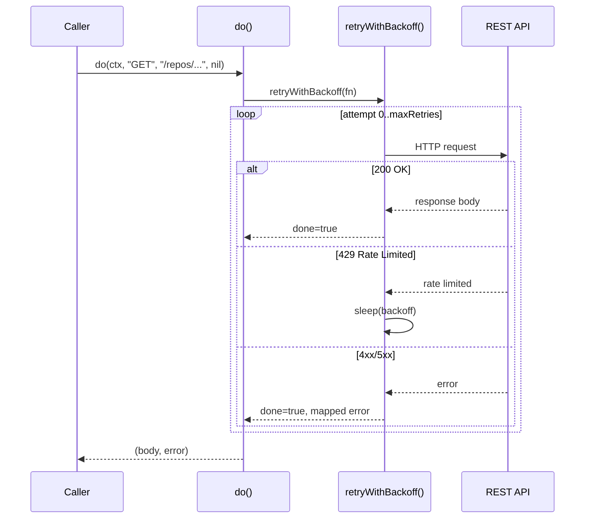

# Lesson 07: HTTP Clients in Go

Go's standard library ships with a production-grade HTTP client. There is no
need to reach for axios, requests, OkHttp, or any third-party library to make
API calls. The `net/http` package handles connection pooling, TLS, timeouts,
redirects, and HTTP/2 out of the box. This lesson walks through how CRoBot
builds on `net/http` to talk to the Bitbucket and GitHub APIs, covering
request construction, retry logic, pagination, rate limiting, and error
mapping -- all patterns you will encounter in any Go project that consumes
REST APIs.

---

## `net/http` -- Go's Standard HTTP Library

If you are coming from JavaScript, Python, or Java, the first thing you
probably do when starting a new project that needs HTTP is install a library.
In Go, you open the standard library docs.

### Creating a Request

`http.NewRequestWithContext` is the standard way to build an HTTP request. It
takes a context (for cancellation and timeouts), an HTTP method, a URL, and an
optional body.

From `internal/platform/bitbucket/client.go`:

```go
req, err := http.NewRequestWithContext(ctx, method, c.baseURL+path, bodyReader)
if err != nil {
	return true, fmt.Errorf("bitbucket: creating request: %w", err)
}
```

The `ctx` parameter is critical. When a caller cancels the context -- because
the user hit Ctrl+C, a deadline expired, or a parent operation timed out --
the HTTP request is automatically cancelled. You never need to manage
cancellation tokens or abort controllers manually. If you have used
`AbortController` in JavaScript or `CancellationToken` in C#, this is the
same concept, but baked into the language's context system from the ground up.

There is also `http.NewRequest` (without context), but you should avoid it in
production code. Always propagate a context.

### Setting Headers and Authentication

Bitbucket uses HTTP Basic Auth:

```go
req.SetBasicAuth(c.user, c.token)
if body != nil {
	req.Header.Set("Content-Type", "application/json")
}
```

GitHub uses Bearer token auth with additional required headers:

From `internal/platform/github/client.go`:

```go
func (c *Client) setHeaders(req *http.Request) {
	req.Header.Set("Authorization", "Bearer "+c.token)
	req.Header.Set("Accept", "application/vnd.github+json")
	req.Header.Set("User-Agent", c.userAgent)
	req.Header.Set("X-GitHub-Api-Version", apiVersion)
}
```

Both approaches set headers on the `req.Header` map directly. There is no
builder pattern, no fluent API -- just a map of string keys to string values.

### Executing the Request and Closing the Body

```go
resp, err := c.httpClient.Do(req)
if err != nil {
	return true, fmt.Errorf("bitbucket: executing request: %w", err)
}
```

`httpClient.Do(req)` sends the request and returns the response. The
response's `Body` is an `io.ReadCloser` -- a stream that *must* be closed
when you are done with it. Failing to close response bodies leaks TCP
connections, which eventually exhausts the connection pool and causes requests
to hang.

In most Go code, you will see `defer resp.Body.Close()` immediately after the
error check. CRoBot's `do()` methods read the body into a byte slice and
close it explicitly (`resp.Body.Close()` without defer) because the closure
needs to happen at a specific point within the retry loop, not at the end of
the enclosing function. Both patterns are correct -- the key rule is: **every
response body must be closed, on every code path, including errors**.

If you are coming from Python's `requests` library or Java's `HttpClient`,
this is the equivalent of closing the response stream. The difference is that
Go makes the requirement explicit rather than hiding it behind garbage
collection or context managers.

---

## Making API Calls -- The `do()` Pattern

Both CRoBot clients wrap their HTTP logic in a private `do()` method. This is
a very common Go pattern: a single method that handles authentication, request
construction, response reading, error mapping, and retries. The rest of the
client calls `do()` and works with the returned bytes.

### Bitbucket's `do()` -- Two Return Values

From `internal/platform/bitbucket/client.go`:

```go
func (c *Client) do(ctx context.Context, method, path string, body []byte) ([]byte, error) {
	var result []byte
	err := retryWithBackoff(ctx, func(_ int) (bool, error) {
		var bodyReader io.Reader
		if body != nil {
			bodyReader = bytes.NewReader(body)
		}
		req, err := http.NewRequestWithContext(ctx, method, c.baseURL+path, bodyReader)
		if err != nil {
			return true, fmt.Errorf("bitbucket: creating request: %w", err)
		}
		req.SetBasicAuth(c.user, c.token)
		if body != nil {
			req.Header.Set("Content-Type", "application/json")
		}

		resp, err := c.httpClient.Do(req)
		if err != nil {
			return true, fmt.Errorf("bitbucket: executing request: %w", err)
		}

		respBody, err := io.ReadAll(io.LimitReader(resp.Body, 10<<20))
		resp.Body.Close()
		if err != nil {
			return true, fmt.Errorf("bitbucket: reading response body: %w", err)
		}

		if resp.StatusCode == http.StatusTooManyRequests {
			return false, nil // signal retry
		}

		if err := mapHTTPError(resp.StatusCode, respBody); err != nil {
			return true, err
		}

		result = respBody
		return true, nil
	})
	return result, err
}
```

The signature returns `([]byte, error)` -- the standard Go two-value return.
Callers get either the response body or an error, never both.

### GitHub's `do()` -- Three Return Values

From `internal/platform/github/client.go`:

```go
func (c *Client) do(ctx context.Context, method, path string, body []byte) ([]byte, http.Header, error) {
```

GitHub's `do()` returns `([]byte, http.Header, error)` -- three values. The
extra `http.Header` return is needed because GitHub's pagination information
lives in the `Link` response header, which callers need to extract the next
page URL. Bitbucket includes pagination URLs in the response body, so its
`do()` only needs two return values.

This is a good illustration of Go's multiple return values in action. Unlike
languages where you would need a wrapper object, a tuple, or out parameters,
Go lets you return exactly the values each function needs.

### Reading with a Limit -- `io.LimitReader`

Both clients read response bodies the same way:

```go
respBody, err := io.ReadAll(io.LimitReader(resp.Body, 10<<20))
```

`io.LimitReader` wraps a reader and stops after a specified number of bytes.
`io.ReadAll` reads until EOF. Together, they read the entire response body but
cap it at a maximum size -- defensive programming against a malicious or
buggy API returning gigabytes of data.

The `10<<20` is a Go idiom for expressing byte sizes using bit shifts. The
left shift operator `<<` shifts the binary representation:

- `1<<10` = 1,024 = 1 KB
- `1<<20` = 1,048,576 = 1 MB
- `10<<20` = 10,485,760 = 10 MB

You will see this idiom throughout Go codebases. It is more readable than
`10 * 1024 * 1024` once you know the convention, and it avoids magic numbers
like `10485760`. In other languages, you might use constants like
`10 * Units.MB` -- Go devs just use the shift.

### The `body []byte` Design Decision

Notice that both `do()` methods accept `body []byte` rather than `io.Reader`.
The doc comment in the Bitbucket client explains why:

> The body parameter is a byte slice (not io.Reader) so it can be safely
> re-sent on retries.

An `io.Reader` is consumed after the first read. If a request needs to be
retried, you would need to "rewind" the reader, which is not always possible
(think: streaming from a network socket). By taking a `[]byte`, the retry
loop can create a fresh `bytes.NewReader(body)` on each attempt. This is a
practical tradeoff: it uses more memory (the entire body must fit in RAM) but
makes retries trivial.

---

## Retries with Exponential Backoff

When an API returns a rate-limit response, you need to wait before retrying.
Both CRoBot clients implement this with a `retryWithBackoff` function -- a
higher-order function that takes a closure.

### The Retry Function

From `internal/platform/bitbucket/client.go`:

```go
func retryWithBackoff(ctx context.Context, fn func(attempt int) (done bool, err error)) error {
	var lastErr error
	for attempt := range maxRetries {
		done, err := fn(attempt)
		if done || err != nil {
			return err
		}
		// fn indicated a retry is needed (rate limited).
		lastErr = fmt.Errorf("bitbucket: rate limited (attempt %d/%d)", attempt+1, maxRetries)
		backoff := time.Duration(math.Pow(2, float64(attempt))) * 100 * time.Millisecond
		select {
		case <-ctx.Done():
			return fmt.Errorf("bitbucket: %w", ctx.Err())
		case <-time.After(backoff):
		}
	}
	return lastErr
}
```

This function takes `fn` -- a closure with the signature
`func(attempt int) (done bool, err error)`. The closure protocol is:

- Return `(true, nil)` -- success, stop retrying.
- Return `(true, err)` -- permanent failure, stop retrying.
- Return `(false, nil)` -- transient failure (rate limited), retry.

### Closures in Go

If you are coming from JavaScript, closures work the same way you would
expect: the inner function captures variables from its enclosing scope.

Look at how `do()` uses `retryWithBackoff`:

```go
var result []byte
err := retryWithBackoff(ctx, func(_ int) (bool, error) {
	// ... all the HTTP logic ...
	result = respBody  // <-- writes to the outer variable
	return true, nil
})
return result, err
```

The anonymous function passed to `retryWithBackoff` captures `result` from
the enclosing `do()` method. When the request succeeds, it writes the
response body into `result`, which `do()` then returns to its caller. The
closure also captures `ctx`, `c` (the client), `method`, `path`, and `body`
from the enclosing scope.

Go closures capture variables by reference, not by value. The `result`
variable is shared between `do()` and the closure -- when the closure assigns
to `result`, `do()` sees the change. This is the same behavior as JavaScript
closures and Python's `nonlocal`, and different from Rust's default move
semantics.

### Exponential Backoff Calculation

The Bitbucket client uses `math.Pow` for its backoff:

```go
backoff := time.Duration(math.Pow(2, float64(attempt))) * 100 * time.Millisecond
```

This produces 100ms, 200ms, 400ms for attempts 0, 1, 2.

The GitHub client uses a bit-shift idiom with longer intervals:

```go
backoff := time.Duration(math.Pow(2, float64(attempt))) * time.Second
if backoff > 30*time.Second {
	backoff = 30 * time.Second
}
```

This produces 1s, 2s, 4s with a 30-second cap. GitHub's rate limits are more
aggressive, so the backoff is proportionally longer.

### Context-Aware Sleeping

Both implementations use `select` to wait:

```go
select {
case <-ctx.Done():
	return fmt.Errorf("bitbucket: %w", ctx.Err())
case <-time.After(backoff):
}
```

The `select` statement waits for whichever channel fires first. If the context
is cancelled during the backoff sleep, the function returns immediately with
the cancellation error instead of sleeping the full duration. If you have
used `Promise.race()` in JavaScript, this is the same idea.

Compare this to retry libraries in other languages -- a Python `tenacity`
decorator or a Java Resilience4j configuration. Go tends to implement these
patterns inline with 10-15 lines of code rather than pulling in a framework.
The result is more code but fewer abstractions to learn, and the retry
behavior is visible right where it is used.

---

## Pagination

REST APIs often return results across multiple pages. Bitbucket and GitHub
use different pagination mechanisms, and CRoBot handles both.

### GitHub -- Link Header Pagination

GitHub follows the RFC 8288 `Link` header convention. The response includes a
header like:

```
Link: <https://api.github.com/repos/foo/bar/pulls?page=2>; rel="next",
      <https://api.github.com/repos/foo/bar/pulls?page=5>; rel="last"
```

CRoBot extracts the "next" URL with a regex:

From `internal/platform/github/client.go`:

```go
var linkNextRe = regexp.MustCompile(`<([^>]+)>;\s*rel="next"`)

func parseLinkNext(header http.Header) string {
	link := header.Get("Link")
	if link == "" {
		return ""
	}
	matches := linkNextRe.FindStringSubmatch(link)
	if len(matches) < 2 {
		return ""
	}
	return matches[1]
}
```

A few things to note:

- The regex is compiled once at package level (`var linkNextRe`), not on every
  call. `regexp.MustCompile` panics if the regex is invalid, which is fine for
  package-level constants because the program would fail at startup rather
  than silently at runtime.

- `FindStringSubmatch` returns the full match and all capture groups. Index 0
  is the entire match; index 1 is the first capture group (the URL inside the
  angle brackets).

- The function returns an empty string when there is no next page, which is
  the natural "zero value" signal in Go. Callers check `if nextURL == ""` to
  know when pagination is done.

This is why GitHub's `do()` returns `http.Header` as a second return value --
the pagination machinery lives in the response headers, not the body.

### Bitbucket -- Response Body Pagination

Bitbucket includes pagination information in the JSON response body:

From `internal/platform/bitbucket/client.go`:

```go
type paginatedResponse struct {
	Values json.RawMessage `json:"values"`
	Next   string          `json:"next"`
}
```

Every paginated Bitbucket response has a `values` array (the actual data) and
a `next` field (the URL for the next page, or empty if there are no more
pages). Callers unmarshal into this struct, process the `Values`, then follow
`Next` until it is empty.

This is simpler to parse than Link headers -- just unmarshal JSON and check a
field -- but it puts the pagination URL in user-controlled data (the response
body), which introduces a security concern addressed in the next section.

### SSRF Prevention in `doURL()`

When following pagination URLs, CRoBot validates that the URL points to the
expected host:

From `internal/platform/bitbucket/client.go`:

```go
func (c *Client) doURL(ctx context.Context, rawURL string) ([]byte, error) {
	parsed, err := url.Parse(rawURL)
	if err != nil {
		return nil, fmt.Errorf("bitbucket: parsing pagination URL: %w", err)
	}
	base, err := url.Parse(c.baseURL)
	if err != nil {
		return nil, fmt.Errorf("bitbucket: parsing base URL: %w", err)
	}
	if parsed.Host != base.Host {
		return nil, fmt.Errorf(
			"bitbucket: pagination URL host %q does not match base host %q",
			parsed.Host, base.Host,
		)
	}
	// ... proceed with the request
}
```

This is SSRF (Server-Side Request Forgery) prevention. The pagination URL
comes from the API response -- which is external data. If a compromised or
malicious API returned `"next": "http://169.254.169.254/latest/meta-data/"`,
the client would follow the link and make a request to an internal AWS
metadata endpoint, potentially leaking credentials.

By comparing `parsed.Host` against `base.Host`, `doURL()` ensures the
pagination URL points to the same API host the client was configured to talk
to. This is a practical security habit: never blindly follow URLs from
external sources.

GitHub's `doURL()` applies the same validation:

From `internal/platform/github/client.go`:

```go
if parsed.Host != base.Host {
	return nil, nil, fmt.Errorf(
		"github: pagination URL host %q does not match base host %q",
		parsed.Host, base.Host,
	)
}
```

---

## Rate Limiting

GitHub has two distinct rate-limiting mechanisms, and CRoBot handles both in
a single function:

From `internal/platform/github/client.go`:

```go
func shouldRetry(resp *http.Response) bool {
	// Secondary/abuse rate limit: 429 with Retry-After.
	if resp.StatusCode == http.StatusTooManyRequests {
		return true
	}
	// Primary rate limit: 403 with x-ratelimit-remaining: 0.
	if resp.StatusCode == http.StatusForbidden {
		remaining := resp.Header.Get("X-Ratelimit-Remaining")
		if remaining == "0" {
			return true
		}
	}
	return false
}
```

Two different signals from the same API:

1. **HTTP 429 (Too Many Requests)** -- the standard rate-limit status code.
   GitHub uses this for secondary and abuse rate limits. The response includes
   a `Retry-After` header indicating how long to wait.

2. **HTTP 403 (Forbidden) with `X-Ratelimit-Remaining: 0`** -- GitHub's
   primary rate limit. When you exhaust your hourly quota, the API returns 403
   (not 429) with a header indicating zero remaining requests. This is
   unusual -- most APIs use 429 exclusively -- but it is documented GitHub
   behavior.

Not every 403 is a rate limit, though. A 403 could also mean "you do not have
permission to access this resource." The `shouldRetry` function distinguishes
between these by checking the `X-Ratelimit-Remaining` header. Only when it is
explicitly `"0"` does the function signal a retry.

Compare this to Bitbucket's simpler approach, which only checks for 429:

```go
if resp.StatusCode == http.StatusTooManyRequests {
	return false, nil // signal retry
}
```

The `shouldRetry` function is called inside the `do()` method's retry closure:

```go
if shouldRetry(resp) {
	return false, nil
}
```

Returning `(false, nil)` tells `retryWithBackoff` to sleep and try again,
while `(true, err)` tells it to stop and report the error.

---

## Error Mapping

Both clients convert HTTP status codes into domain-specific errors:

From `internal/platform/bitbucket/client.go`:

```go
func mapHTTPError(statusCode int, body []byte) error {
	switch {
	case statusCode >= 200 && statusCode < 300:
		return nil
	case statusCode == http.StatusUnauthorized:
		return fmt.Errorf("bitbucket: authentication failed (401): %s", truncateBody(body))
	case statusCode == http.StatusForbidden:
		return fmt.Errorf("bitbucket: access denied (403): %s", truncateBody(body))
	case statusCode == http.StatusNotFound:
		return fmt.Errorf("bitbucket: resource not found (404): %s", truncateBody(body))
	default:
		return fmt.Errorf("bitbucket: unexpected status %d: %s", statusCode, truncateBody(body))
	}
}
```

A few things to notice:

- **`switch` without a value.** Go's `switch {}` (or `switch` with no
  expression) evaluates each `case` as a boolean expression, top to bottom.
  This is different from a `switch statusCode` that matches a single value --
  it allows range checks like `statusCode >= 200 && statusCode < 300`. If you
  are coming from C, Java, or JavaScript, this is the equivalent of an
  if/else-if chain, but cleaner.

- **`http.StatusUnauthorized` instead of `401`.** Go's `net/http` package
  defines named constants for every HTTP status code. Using the constant is
  more readable and makes typos impossible.

- **`truncateBody(body)`** limits error messages to 512 bytes. Without this,
  an API returning a large HTML error page would produce an unreadable error
  message.

- **The separation of concerns.** `do()` handles the HTTP transport (request
  construction, retries, body reading), and `mapHTTPError` handles the status
  code interpretation. This keeps HTTP details out of the business logic layer.
  When a method like `GetPullRequest` calls `do()`, it gets back either JSON
  bytes or a descriptive error -- it never sees status codes, headers, or
  response bodies directly.

GitHub's `mapHTTPError` is similar but includes an additional status code:

```go
case statusCode == http.StatusUnprocessableEntity:
	return fmt.Errorf("github: validation failed (422): %s", truncateBody(body))
```

This reflects a real API difference: GitHub returns 422 for validation errors
(like posting a review comment on a line that does not exist in the diff),
while Bitbucket does not use that status code.

---

## HTTP Request Lifecycle

The following diagram shows how a single API call flows through the `do()`
method, retry logic, and error handling:



The retry loop is invisible to the caller. From the caller's perspective,
`do()` makes a single API call and returns a result or an error. The retries,
backoff calculation, context cancellation checks, and error mapping are all
internal implementation details.

---

## Key Takeaways

- **Go's `net/http` is production-ready.** No third-party HTTP client library
  needed. The standard library handles connection pooling, TLS, HTTP/2,
  timeouts, and redirects out of the box.

- **Always close response bodies with `defer resp.Body.Close()` (or close them
  explicitly).** Unclosed bodies leak TCP connections and will eventually
  exhaust the connection pool.

- **`io.LimitReader` prevents unbounded reads.** Wrapping `io.ReadAll` with
  `io.LimitReader` is defensive programming against unexpectedly large
  responses.

- **`10<<20` = 10 MB.** Bit shifts are a common Go idiom for expressing byte
  sizes. `1<<10` is 1 KB, `1<<20` is 1 MB, `1<<30` is 1 GB.

- **Higher-order functions with closures enable clean retry logic.** The
  `retryWithBackoff` function takes a closure, and the closure captures
  variables from its enclosing scope to communicate results back to the
  caller.

- **Accept `[]byte` instead of `io.Reader` when retries are needed.** A byte
  slice can be re-read on every attempt; a consumed reader cannot.

- **Validate pagination URLs to prevent SSRF.** Never blindly follow URLs from
  external responses -- always verify the host matches your expected API
  endpoint.

- **Separate transport from interpretation.** The `do()` method handles HTTP
  mechanics; `mapHTTPError` translates status codes into domain errors. The
  business logic layer never sees raw HTTP details.

---

## What's Next

In [Lesson 08: CLI with Cobra](08-cli-with-cobra.md), we look at how CRoBot
uses the Cobra framework to build its command-line interface -- command trees,
flag binding, and using closures to wire dependencies into command handlers.
