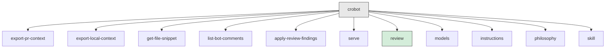

# Lesson 08: Building CLI Tools with Cobra

Go's standard library has `flag` for parsing command-line flags, but it does not
provide subcommands, help generation, shell completions, or the kind of command
tree that tools like `git`, `docker`, and `kubectl` rely on. Cobra fills that
gap. It is the most widely used CLI framework in the Go ecosystem -- kubectl,
docker, hugo, and gh (GitHub CLI) all use it.

If you have used argparse with subparsers in Python, commander in Node.js, or
clap with subcommands in Rust, Cobra fills the same role. The main difference
is how Go's closures and value semantics shape the patterns you will see.

This lesson walks through CRoBot's CLI layer to show how Cobra commands are
structured, how flags work, and how closures tie everything together.

---

## The Root Command

Every Cobra application starts with a root command. It is the top-level entry
point -- the command that runs when a user types `crobot` with no subcommand.

From `internal/cli/root.go`:

```go
func RootCmd() *cobra.Command {
	var verbose bool

	cmd := &cobra.Command{
		Use:   "crobot",
		Short: "CRoBot - AI-powered code review bot",
		Long:  "CRoBot is a local-first CLI tool that enables AI-powered automated code reviews on pull requests.",
		PersistentPreRunE: func(cmd *cobra.Command, args []string) error {
			level := slog.LevelInfo
			if verbose {
				level = slog.LevelDebug
			}
			handler := slog.NewTextHandler(os.Stderr, &slog.HandlerOptions{
				Level: level,
			})
			slog.SetDefault(slog.New(handler))
			return nil
		},
		SilenceUsage:  true,
		SilenceErrors: true,
	}

	cmd.PersistentFlags().BoolVarP(&verbose, "verbose", "v", false, "Enable verbose/debug logging")
	cmd.Version = version.Version

	// Register subcommands.
	cmd.AddCommand(newExportCmd())
	cmd.AddCommand(newSnippetCmd())
	cmd.AddCommand(newCommentsCmd())
	cmd.AddCommand(newApplyCmd())
	cmd.AddCommand(newServeCmd())
	cmd.AddCommand(newInstructionsCmd())
	cmd.AddCommand(newReviewCmd())
	cmd.AddCommand(newModelsCmd())
	cmd.AddCommand(newPhilosophyCmd())
	cmd.AddCommand(newSkillCmd())

	return cmd
}
```

The `cobra.Command` struct is the building block. Its key fields:

- **`Use`** -- the command name and usage signature. For the root, it is just
  `"crobot"`. For subcommands it can include argument placeholders like
  `"review [pr-url-or-number]"`.
- **`Short`** -- a one-line summary shown in help listings.
- **`Long`** -- a detailed description shown when a user runs `crobot --help`.
- **`PersistentPreRunE`** -- a hook that runs before *every* subcommand.
  CRoBot uses it to configure the global logger based on the `--verbose` flag.
  The `E` suffix means it returns an error -- Cobra also offers `PersistentPreRun`
  (no error return) for hooks that cannot fail.
- **`SilenceUsage`** and **`SilenceErrors`** -- prevent Cobra from printing the
  usage text or the error message automatically. CRoBot handles its own error
  output in `main()`.

The `cmd.AddCommand(...)` calls register each subcommand. Cobra automatically
generates help text, usage output, and command completion from this tree.

---

## The Function-Returning-a-Command Pattern

Each subcommand is defined in its own function that returns a `*cobra.Command`.
This is CRoBot's most common CLI pattern, and it appears in every command file.

From `internal/cli/export.go`:

```go
func newExportCmd() *cobra.Command {
	var (
		workspace string
		repo      string
		pr        int
	)

	cmd := &cobra.Command{
		Use:     "export-pr-context",
		Short:   "Export PR context as JSON",
		Long:    "Fetches and outputs the full PR context (metadata, changed files, diff hunks) as JSON to stdout.",
		Example: `  crobot export-pr-context --workspace myteam --repo my-service --pr 42`,
		RunE: func(cmd *cobra.Command, args []string) error {
			cfg, err := config.LoadDefault()
			if err != nil {
				return fmt.Errorf("loading config: %w", err)
			}

			workspace, repo = resolveWorkspaceRepo(workspace, repo, cfg)

			if workspace == "" || repo == "" || pr <= 0 {
				return fmt.Errorf("--workspace, --repo, and --pr are required")
			}

			slog.Debug("exporting PR context", "workspace", workspace, "repo", repo, "pr", pr)

			plat, err := buildPlatform(cfg)
			if err != nil {
				return fmt.Errorf("creating platform client: %w", err)
			}

			ctx := cmd.Context()
			prCtx, err := plat.GetPRContext(ctx, platform.PRRequest{
				Workspace: workspace,
				Repo:      repo,
				PRNumber:  pr,
			})
			if err != nil {
				return fmt.Errorf("fetching PR context: %w", err)
			}

			data, err := json.MarshalIndent(prCtx, "", "  ")
			if err != nil {
				return fmt.Errorf("marshaling PR context: %w", err)
			}

			return writeJSON(os.Stdout, data)
		},
	}

	cmd.Flags().StringVar(&workspace, "workspace", "", "Workspace or organization slug")
	cmd.Flags().StringVar(&repo, "repo", "", "Repository slug")
	cmd.Flags().IntVar(&pr, "pr", 0, "Pull request number")

	return cmd
}
```

The pattern has three steps:

1. **Declare flag variables** at the top of the function (`workspace`, `repo`,
   `pr`). These are local variables scoped to the enclosing function.

2. **Create the command** with a `RunE` closure that captures those variables.
   When Cobra invokes `RunE`, the flag variables have already been populated
   by Cobra's flag-parsing machinery. The closure reads them directly -- no map
   lookups, no string-to-type conversion, no casting.

3. **Bind flags** to the variables using `cmd.Flags().StringVar(...)` and
   `cmd.Flags().IntVar(...)`. Then return the fully configured command.

### Why closures matter here

The `RunE` function is a closure -- it closes over `workspace`, `repo`, and
`pr` from the enclosing scope. When the user runs
`crobot export-pr-context --workspace myteam --repo my-service --pr 42`,
Cobra parses the flags and writes the values into those variables *before*
calling `RunE`. By the time your code executes, `workspace` is `"myteam"`,
`repo` is `"my-service"`, and `pr` is `42`.

This is equivalent to how Python closures capture variables from an enclosing
function, or how JavaScript arrow functions close over variables. The key
difference in Go is that closures capture by reference -- they see the variable
itself, not a snapshot of its value. That is why the flag binding works: Cobra
writes to `&workspace` during parsing, and `RunE` reads the same variable later.

### Why a function, not a global

Defining commands as functions (`newExportCmd()`) rather than `var` declarations
has several advantages:

- Flag variables are scoped to the function, not the package. No risk of one
  command accidentally reading another command's `workspace` variable.
- The command is created lazily when `AddCommand` calls the function (though
  Cobra actually evaluates them eagerly at startup, the scope isolation still
  matters).
- It is easy to unit-test: call the function, get a command, invoke it
  programmatically.

---

## Flags -- Persistent vs Local

Cobra distinguishes two kinds of flags: **persistent** flags and **local**
flags. The distinction controls whether child commands inherit a flag.

### Persistent flags

From `internal/cli/root.go`:

```go
cmd.PersistentFlags().BoolVarP(&verbose, "verbose", "v", false, "Enable verbose/debug logging")
```

`PersistentFlags()` means this flag is available on the root command *and* every
subcommand. A user can write `crobot --verbose review 42` or
`crobot review --verbose 42` -- both work. The `--verbose` flag propagates down
the entire command tree.

The `BoolVarP` variant adds a short flag (`-v`). The `P` suffix stands for
"shorthand" -- Cobra provides `StringVar` / `StringVarP`, `IntVar` / `IntVarP`,
and so on.

### Local flags

From `internal/cli/export.go`:

```go
cmd.Flags().StringVar(&workspace, "workspace", "", "Workspace or organization slug")
cmd.Flags().StringVar(&repo, "repo", "", "Repository slug")
cmd.Flags().IntVar(&pr, "pr", 0, "Pull request number")
```

`Flags()` (without `Persistent`) means these flags belong only to the
`export-pr-context` subcommand. They do not appear in the help for `crobot` or
any other subcommand.

### `StringVar` vs `String`

Cobra offers two styles of flag binding:

```go
// StringVar: binds to a variable you declare
var workspace string
cmd.Flags().StringVar(&workspace, "workspace", "", "...")

// String: returns a *string that Cobra manages
workspace := cmd.Flags().String("workspace", "", "...")
```

CRoBot consistently uses the `Var` form. The advantage is that your `RunE`
closure reads plain variables instead of dereferencing pointers. Compare
`if workspace == ""` (using `StringVar`) with `if *workspace == ""` (using
`String`). The pointer form is fine, but the variable form reads more naturally,
and it is what you will see in most Cobra codebases.

---

## Detecting Whether a Flag Was Set

Default values create an ambiguity: did the user explicitly pass `--max-comments 0`
to mean "unlimited," or did they just not set the flag at all? Cobra solves this
with `cmd.Flags().Changed()`.

From `internal/cli/apply.go`:

```go
// Determine max comments: CLI flag > config > default.
// Only override from CLI if the flag was explicitly set to a
// positive value; 0 means unlimited when set explicitly.
mc := cfg.Review.MaxComments
if cmd.Flags().Changed("max-comments") {
	mc = maxComments
}
```

`Changed("max-comments")` returns `true` only if the user explicitly passed the
flag on the command line. If the flag is absent, `maxComments` holds its default
value of `0`, but `Changed` returns `false`, so the config file value is used
instead.

This pattern is essential for the layered config approach discussed in
[Lesson 05](05-configuration-patterns.md). The precedence chain is:
defaults < config file < environment variables < CLI flags. Without `Changed()`,
you cannot distinguish "flag set to its default value" from "flag not set."

In Python's argparse, you would check `if args.max_comments is not None` after
using `default=None`. In Rust's clap, you would use `ArgMatches::is_present()`.
Cobra's `Changed()` fills the same role.

---

## Mutually Exclusive Flags

Cobra does not have built-in mutual exclusion for flags (though recent versions
have added `MarkFlagsMutuallyExclusive`). CRoBot handles it with a simple check
at the top of `RunE`.

From `internal/cli/apply.go`:

```go
RunE: func(cmd *cobra.Command, args []string) error {
	if dryRun && write {
		return fmt.Errorf("--dry-run and --write are mutually exclusive")
	}

	// Dry-run is the default; --write overrides it. Explicitly
	// passing --dry-run is supported for clarity in scripts.
	isDryRun := !write
```

Two flags control the same behavior: `--dry-run` (validate only) and `--write`
(actually post comments). Passing both is an error. If neither is passed, the
default is dry-run -- a safe default that prevents accidentally posting comments.

The same pattern appears in the review command:

```go
if dryRun && write {
	return fmt.Errorf("--dry-run and --write are mutually exclusive")
}

isDryRun := !write
```

This is manual validation, but it is clear, explicit, and easy to test. For more
complex flag relationships, Cobra's `MarkFlagsMutuallyExclusive` or
`MarkFlagsRequiredTogether` can reduce boilerplate.

---

## Complex Commands -- The Review Command

Simpler commands like `export-pr-context` have three or four flags. The `review`
command shows what happens when a command grows in scope.

From `internal/cli/review.go`:

```go
func newReviewCmd() *cobra.Command {
	var (
		workspace       string
		repo            string
		prFlag          string
		agentName       string
		modelFlag       string
		dryRun          bool
		write           bool
		maxComments     int
		timeoutSecs     int
		showAgentOutput bool
		rawOutput       bool
		instructions    string
		agentCommand    string
		philosophyFlag  string
		baseBranch      string
	)

	cmd := &cobra.Command{
		Use:   "review [pr-url-or-number]",
		Short: "Run an AI-powered code review on a pull request or local changes",
		Long: `Spawns an ACP-compatible agent to review a PR and post inline comments.

The PR can be specified as a positional argument or via --pr:
  crobot review https://bitbucket.org/team/repo/pull-requests/42
  crobot review 42
  crobot review --pr 42

When a URL is provided, the workspace, repo, and PR number are extracted
automatically, so --workspace and --repo are not needed.

When no PR is specified, CRoBot enters local mode and reviews all changes
(committed, staged, and unstaged) relative to a base branch. Local mode
always runs as dry-run and renders findings to the terminal.`,
		Args: cobra.MaximumNArgs(1),
		RunE: func(cmd *cobra.Command, args []string) error {
			// ... orchestration logic
		},
	}

	cmd.Flags().StringVar(&prFlag, "pr", "", "Pull request number or URL")
	cmd.Flags().StringVar(&agentName, "agent", "", "ACP agent name (from config)")
	cmd.Flags().StringVar(&agentCommand, "agent-command", "", "ACP agent binary to run directly (bypasses config)")
	cmd.Flags().StringVarP(&modelFlag, "model", "m", "", "Model ID to use (or \"ask\" for interactive selection)")
	cmd.Flags().BoolVar(&dryRun, "dry-run", false, "Validate and preview without posting")
	cmd.Flags().BoolVar(&write, "write", false, "Post review comments")
	cmd.Flags().StringVar(&workspace, "workspace", "", "Workspace or organization slug")
	cmd.Flags().StringVar(&repo, "repo", "", "Repository slug")
	cmd.Flags().IntVar(&maxComments, "max-comments", 0, "Maximum number of comments to post")
	cmd.Flags().IntVarP(&timeoutSecs, "timeout", "t", 0, "Agent timeout in seconds")
	cmd.Flags().BoolVar(&showAgentOutput, "show-agent-output", false, "Show the agent's stderr output during the review")
	cmd.Flags().BoolVar(&rawOutput, "raw", false, "Disable markdown formatting of agent output")
	cmd.Flags().StringVarP(&instructions, "instructions", "i", "", "Additional instructions appended to the review prompt")
	cmd.Flags().StringVar(&philosophyFlag, "review-philosophy", "", "Path to a custom review philosophy markdown file")
	cmd.Flags().StringVar(&baseBranch, "base", "master", "Base branch for local review")

	return cmd
}
```

Several things to notice here:

### Positional arguments

```go
Use:  "review [pr-url-or-number]",
Args: cobra.MaximumNArgs(1),
```

The square brackets in `Use` are a documentation convention indicating the
argument is optional. `cobra.MaximumNArgs(1)` enforces it -- Cobra will reject
the command if the user passes more than one positional argument. Other
validators include `cobra.ExactArgs(n)`, `cobra.MinimumNArgs(n)`, and
`cobra.NoArgs`.

Inside `RunE`, positional arguments are accessed through the `args` slice:

```go
prValue := prFlag
if len(args) > 0 {
	if prValue != "" {
		return fmt.Errorf("specify the PR as a positional argument or --pr, not both")
	}
	prValue = args[0]
}
```

The command accepts the PR reference either as a positional argument
(`crobot review 42`) or as a flag (`crobot review --pr 42`), but not both. This
kind of flexible input handling is common in user-facing CLI tools.

### Flag groups

Even though Cobra does not enforce flag grouping, the flags in the `review`
command fall into logical categories:

- **Platform flags**: `--workspace`, `--repo`, `--pr`
- **Agent flags**: `--agent`, `--agent-command`, `--model`, `--timeout`
- **Output flags**: `--show-agent-output`, `--raw`
- **Review flags**: `--dry-run`, `--write`, `--max-comments`, `--instructions`,
  `--review-philosophy`
- **Local mode flags**: `--base`

Keeping these mentally grouped helps when the flag count grows. Some teams add
`cmd.Flags().SetAnnotation()` or use flag groups (available in newer Cobra
versions) to organize help output.

### Short flags

Some flags have shorthand forms:

```go
cmd.Flags().StringVarP(&modelFlag, "model", "m", "", "...")
cmd.Flags().IntVarP(&timeoutSecs, "timeout", "t", 0, "...")
cmd.Flags().StringVarP(&instructions, "instructions", "i", "", "...")
```

The `VarP` suffix (compared to `Var`) adds a single-character shorthand. The
user can type `crobot review -m claude-sonnet -t 300` instead of the longer
`--model` and `--timeout` forms. Reserve short flags for frequently used
options -- if every flag has a shorthand, users cannot remember any of them.

---

## Reading from Stdin

Unix tools traditionally use `-` as a filename placeholder meaning "read from
stdin." Cobra does not handle this convention automatically -- you implement it
yourself.

From `internal/cli/apply.go`:

```go
var findingsData []byte
var err error
if input == "-" {
	findingsData, err = io.ReadAll(io.LimitReader(os.Stdin, maxInputSize))
} else {
	f, openErr := os.Open(input)
	if openErr != nil {
		return fmt.Errorf("reading input: %w", openErr)
	}
	defer f.Close()
	findingsData, err = io.ReadAll(io.LimitReader(f, maxInputSize))
}
```

When `--input -` is passed, the command reads from `os.Stdin` instead of
opening a file. `os.Stdin` is simply an `*os.File` that satisfies `io.Reader`,
so `io.ReadAll` works identically on both paths.

The `io.LimitReader(os.Stdin, maxInputSize)` wrapper prevents unbounded reads.
Without it, a user piping a very large file could exhaust memory. This is a
defensive pattern worth copying in any command that reads arbitrary input.

This enables Unix-style piping:

```bash
cat findings.json | crobot apply-review-findings --input - --write
```

or, equivalently:

```bash
crobot apply-review-findings --input - --write < findings.json
```

---

## Helper Functions

CRoBot's `internal/cli/helpers.go` contains shared functions used across
multiple commands. These are not Cobra-specific, but they show a clean
separation of concerns.

From `internal/cli/helpers.go`:

```go
func resolveWorkspaceRepo(workspace, repo string, cfg config.Config) (string, string) {
	switch cfg.Platform {
	case "github":
		if workspace == "" {
			workspace = cfg.GitHub.Owner
		}
		if repo == "" {
			repo = cfg.GitHub.Repo
		}
	default: // "bitbucket" and others
		if workspace == "" {
			workspace = cfg.Bitbucket.Workspace
		}
		if repo == "" {
			repo = cfg.Bitbucket.Repo
		}
	}
	return workspace, repo
}
```

This function applies config-based defaults: CLI flags take precedence, but if
`--workspace` or `--repo` are not passed, the values come from the config file.
It is called by `newExportCmd`, `newApplyCmd`, and other commands that need
workspace/repo resolution. Putting this logic in a helper avoids duplicating it
across five commands.

The `buildPlatform` helper in the same file shows another reusable piece:

```go
func buildPlatform(cfg config.Config) (platform.Platform, error) {
	return platform.NewPlatform(cfg.Platform, cfg)
}
```

This is a thin wrapper around the platform factory from
[Lesson 04](04-interfaces-and-polymorphism.md). It exists so that command
functions do not need to import and understand the factory directly -- they just
call `buildPlatform(cfg)` and get back a `platform.Platform`.

---

## The Serve Command -- Single-Purpose Commands

Not every command needs a dozen flags. The `serve` command shows the pattern at
its simplest.

From `internal/cli/serve.go`:

```go
func newServeCmd() *cobra.Command {
	var mcpMode bool

	cmd := &cobra.Command{
		Use:   "serve",
		Short: "Start CRoBot as a server",
		Long: `Starts CRoBot as a server exposing its commands as tools.

Use --mcp to start as an MCP (Model Context Protocol) server over stdio.`,
		Example: `  # Start as MCP server (stdio transport)
  crobot serve --mcp`,
		RunE: func(cmd *cobra.Command, args []string) error {
			if !mcpMode {
				return fmt.Errorf("specify a server mode (e.g., --mcp)")
			}

			cfg, err := config.LoadDefault()
			if err != nil {
				return fmt.Errorf("loading config: %w", err)
			}

			slog.Debug("starting MCP server", "platform", cfg.Platform)

			plat, err := buildPlatform(cfg)
			if err != nil {
				return fmt.Errorf("creating platform client: %w", err)
			}

			srv, err := mcpserver.NewServer(plat, cfg)
			if err != nil {
				return fmt.Errorf("creating MCP server: %w", err)
			}

			return srv.Serve(cmd.Context())
		},
	}

	cmd.Flags().BoolVar(&mcpMode, "mcp", false, "Start as MCP server over stdio")

	return cmd
}
```

One flag, one mode. The same `newFooCmd()` pattern applies regardless of
complexity. A command with one flag and a command with fifteen flags use
identical structure -- the pattern scales up and down cleanly.

Note `cmd.Context()` -- Cobra carries a `context.Context` through the command
tree. This is the standard Go mechanism for cancellation and timeouts, covered
in [Lesson 09](09-concurrency.md). The serve command passes it to `srv.Serve()`
so the server can shut down gracefully when the process receives a signal.

---

## CRoBot's Command Tree

The full command tree registered in `RootCmd()`:



Every node is a `*cobra.Command` created by a `newFooCmd()` function and
registered via `cmd.AddCommand()`. Cobra uses this tree to route
`crobot export-pr-context --pr 42` to the right `RunE` function, generate help
text for `crobot --help`, and produce shell completions.

The `review` command (highlighted) is the primary entry point for end users. The
other commands are lower-level building blocks that the review workflow calls
internally, or that advanced users invoke directly for scripting.

---

## Key Takeaways

- **Cobra gives you command trees, flags, help text, and shell completion for
  free.** You define a `cobra.Command` with `Use`, `Short`, and `RunE`, register
  subcommands with `AddCommand`, and Cobra handles routing, help generation, and
  flag parsing.

- **The `newFooCmd()` pattern keeps commands self-contained.** Flag variables
  are scoped to the function, the command is returned as a value, and nothing
  leaks into package-level state. This is idiomatic Go -- a function that
  returns a fully configured value.

- **Closures capture flag variables.** Variables are declared outside `RunE` and
  used inside it. Cobra writes to them during flag parsing; your code reads
  them during execution. The closure captures by reference, which is what makes
  the binding work.

- **`PersistentFlags` propagate down the command tree; `Flags` do not.**
  Use persistent flags for cross-cutting concerns like verbosity. Use local
  flags for command-specific options.

- **`cmd.Flags().Changed()` distinguishes "user set this" from "default
  value."** This is critical for layered configuration where CLI flags override
  config file values only when explicitly provided.

- **Stdin support is your responsibility.** Cobra parses flags and arguments
  but does not know about the `-` convention. Implement it yourself with a
  simple `if input == "-"` check and `os.Stdin`.
