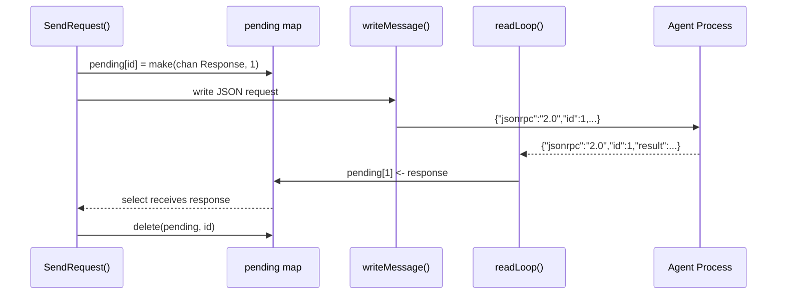
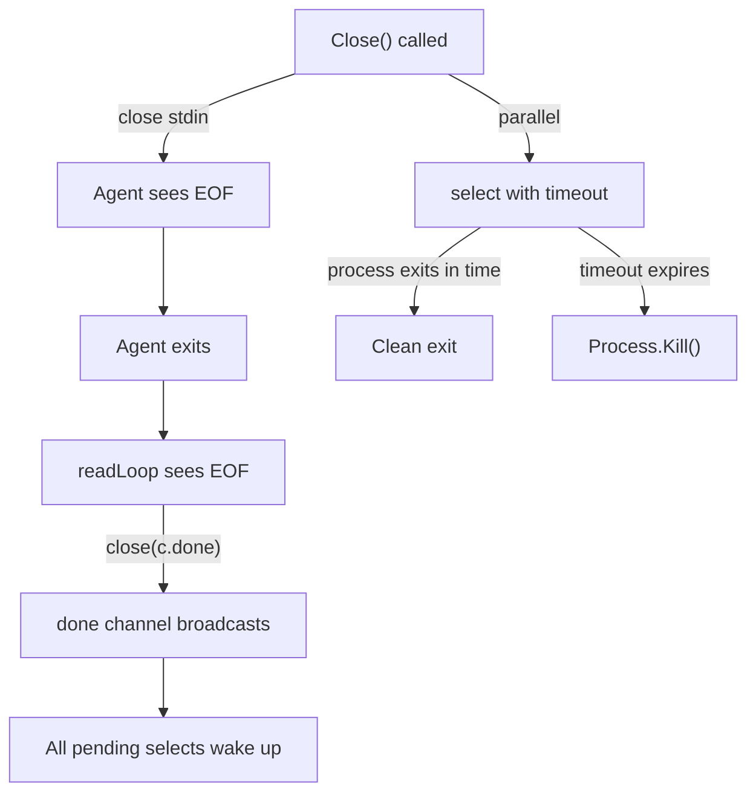

# Lesson 09: Concurrency in Go

Concurrency is Go's defining feature. Not in the sense that other languages
lack concurrency -- Java has threads, Python has asyncio, JavaScript has
Promises and async/await, Rust has tokio. But in Go, concurrency is a
first-class part of the language itself, not a library bolted on afterward. Two
keywords (`go` and `select`), one primitive (channels), and a handful of
standard library types (`sync.Mutex`, `sync.RWMutex`, `sync/atomic`,
`context.Context`) give you everything you need.

This lesson walks through every concurrency pattern in CRoBot's agent
subsystem, where a JSON-RPC client manages a subprocess over stdio --
launching goroutines, correlating requests through channels, protecting shared
state with mutexes, and threading cancellation through the entire call chain.

---

## Goroutines -- Lightweight Concurrency

A goroutine is a function executing concurrently with other goroutines in the
same address space. You launch one with the `go` keyword.

From `internal/agent/client.go`, the `Start` method:

```go
go c.readLoop()
```

That is the entire syntax. `go` followed by a function call. The `readLoop`
method starts executing concurrently, and `Start` returns immediately to the
caller. There is no thread handle to manage, no executor to configure, no
future to await.

Goroutines are not OS threads. The Go runtime multiplexes goroutines onto a
small pool of OS threads using a scheduler built into the runtime itself. A
goroutine's stack starts at roughly 4KB and grows as needed, compared to the
~1MB default stack of an OS thread. This means you can launch thousands -- even
millions -- of goroutines in a single process without exhausting memory.

Compare to other languages:

- **Java** -- `new Thread(runnable).start()` creates an OS thread with a 1MB
  stack. Thread pools exist to amortize the cost, but they add configuration
  complexity.
- **Python** -- `asyncio.create_task()` is lightweight but requires `async/await`
  coloring throughout the call chain. Regular functions cannot be made concurrent
  without rewriting them.
- **JavaScript** -- `Promise` and `async/await` are single-threaded and
  cooperative. True parallelism requires Web Workers or worker threads.

Go goroutines have none of these trade-offs. Any function can be launched as a
goroutine. There is no function coloring (no `async` keyword). The scheduler
is preemptive -- a goroutine does not need to yield explicitly.

---

## Channels -- Communication Between Goroutines

Go has a proverb: **"Do not communicate by sharing memory; share memory by
communicating."** Channels are the mechanism for that communication.

A channel is a typed conduit through which goroutines send and receive values.
CRoBot's agent client uses channels for two distinct purposes: signaling and
request/response correlation.

### Signaling with `chan struct{}`

From `internal/agent/client.go`, the `Client` struct:

```go
type Client struct {
	// ...
	done    chan struct{}
	// ...
}
```

And initialization in `NewClient`:

```go
func NewClient(cfg ClientConfig) *Client {
	return &Client{
		cfg:     cfg,
		pending: make(map[int]chan *Response),
		done:    make(chan struct{}),
	}
}
```

`chan struct{}` is a channel that carries no data. The `struct{}` type has zero
size -- it occupies no memory. The channel exists purely to signal an event:
"the read loop has finished." No information needs to travel through it; the
event itself is the message.

This channel is created with `make(chan struct{})` -- an **unbuffered** channel.
On an unbuffered channel, a send blocks until another goroutine receives, and a
receive blocks until another goroutine sends. But `done` is never sent to --
it is closed.

### Closing a channel as a broadcast

From `internal/agent/client.go`, the `readLoop` method:

```go
func (c *Client) readLoop() {
	defer close(c.done)

	scanner := bufio.NewScanner(c.stdout)
	// ...
}
```

`close(c.done)` is a broadcast. When a channel is closed, every goroutine
blocked on receiving from that channel wakes up immediately and receives the
zero value. This is how one goroutine (the read loop) can signal an arbitrary
number of waiting goroutines (pending requests, the `Close` method) that it has
finished. Closing a channel is a one-to-many notification -- sending a value
through a channel is one-to-one.

### Request/response correlation with buffered channels

From `internal/agent/client.go`, the `Client` struct and `SendRequest`:

```go
type Client struct {
	// ...
	pending  map[int]chan *Response
	// ...
}
```

```go
ch := make(chan *Response, 1)
c.mu.Lock()
c.pending[id] = ch
c.mu.Unlock()
```

Each outgoing request gets its own channel, stored in a map keyed by request
ID. This channel is **buffered** with capacity 1: `make(chan *Response, 1)`.

The difference matters:

- **Unbuffered** (`make(chan T)`) -- the sender blocks until a receiver is
  ready. Used when you want synchronization between two goroutines.
- **Buffered** (`make(chan T, n)`) -- the sender does not block until the buffer
  is full. Used when the sender and receiver operate at different speeds, or
  when the sender should not wait.

The response channel is buffered with capacity 1 because the read loop (the
sender) should not block waiting for `SendRequest` to read the response. The
read loop has other messages to process. With a buffer of 1, it drops the
response into the channel and moves on.

---

## The `select` Statement

`select` is Go's multiplexing primitive. It lets a goroutine wait on multiple
channel operations simultaneously, proceeding with whichever one is ready
first.

From `internal/agent/client.go`, the core of `SendRequest`:

```go
select {
case <-ctx.Done():
	return nil, fmt.Errorf("agent: request %q: %w", method, ctx.Err())
case <-c.done:
	return nil, fmt.Errorf("agent: connection closed while waiting for response to %q", method)
case resp := <-ch:
	if resp == nil {
		return nil, fmt.Errorf("agent: connection closed while waiting for response to %q", method)
	}
	if resp.Error != nil {
		return nil, fmt.Errorf("agent: request %q: %w", method, resp.Error)
	}
	return resp.Result, nil
}
```

This `select` blocks until one of three things happens:

1. **`<-ctx.Done()`** -- The caller's context was cancelled (timeout,
   cancellation signal, deadline exceeded). The request is abandoned with the
   context's error.
2. **`<-c.done`** -- The read loop exited (subprocess died, pipe closed). All
   pending requests fail.
3. **`resp := <-ch`** -- A response arrived on the request-specific channel.
   The read loop found a message with a matching ID and sent it here.

If multiple cases are ready simultaneously, Go picks one at random -- there is
no priority ordering. The `select` blocks until at least one case is ready;
there is no busy-waiting or polling.

Compare to other languages:

- **JavaScript** -- `Promise.race([promise1, promise2, promise3])` waits for
  the first promise to settle. Similar concept but limited to Promises.
- **Python** -- `asyncio.wait(tasks, return_when=FIRST_COMPLETED)` does
  something similar but operates on tasks, not on raw communication primitives.
- **Unix** -- `select()` / `poll()` / `epoll()` wait on file descriptors. Go's
  `select` is the same idea elevated to a type-safe language construct.

The `Close` method uses the same pattern with a timeout:

```go
select {
case err := <-waitDone:
	if err != nil {
		return fmt.Errorf("agent: subprocess exited: %w", err)
	}
	return nil
case <-time.After(closeTimeout):
	_ = c.cmd.Process.Kill()
	<-waitDone
	return fmt.Errorf("agent: subprocess killed after timeout")
}
```

`time.After(closeTimeout)` returns a channel that receives a value after the
specified duration. Combined with `select`, this creates a timeout: either the
subprocess exits cleanly, or we kill it after `closeTimeout` (3 seconds).

---

## Mutexes -- When Channels Are Overkill

Channels are for communication between goroutines. Sometimes you just need to
protect shared state -- a map, a counter, a flag -- from concurrent access. A
mutex (mutual exclusion lock) is the right tool for that.

### `sync.Mutex` -- exclusive access

From `internal/agent/client.go`, the `Client` struct:

```go
type Client struct {
	// ...
	pending  map[int]chan *Response
	mu       sync.Mutex
	// ...
	writeMu  sync.Mutex
	// ...
}
```

Two mutexes, two purposes:

- **`mu`** protects the `pending` map. Multiple goroutines read and write this
  map: `SendRequest` adds entries, `readLoop` reads entries to route responses,
  and `SendRequest`'s deferred cleanup deletes entries.
- **`writeMu`** serializes writes to the subprocess's stdin. Multiple
  goroutines can call `SendRequest` or `SendNotification` concurrently; without
  `writeMu`, their JSON messages would interleave on the pipe.

The standard pattern is `Lock`, then `defer Unlock`:

```go
func (c *Client) writeMessage(msg any) error {
	data, err := json.Marshal(msg)
	if err != nil {
		return err
	}
	data = append(data, '\n')

	c.writeMu.Lock()
	defer c.writeMu.Unlock()

	if _, err := c.stdin.Write(data); err != nil {
		return err
	}
	return nil
}
```

`defer c.writeMu.Unlock()` guarantees the mutex is released when the function
returns, regardless of which return path is taken. Without `defer`, an early
return on error could leave the mutex locked forever, deadlocking the program.

In some cases the code needs more granular control than `defer` provides.
The `SendRequest` method locks briefly to insert into the map, then unlocks
immediately -- it cannot hold the lock while waiting on the `select`:

```go
ch := make(chan *Response, 1)
c.mu.Lock()
c.pending[id] = ch
c.mu.Unlock()

defer func() {
	c.mu.Lock()
	delete(c.pending, id)
	c.mu.Unlock()
}()
```

Holding `mu` across the `select` would be disastrous: every other goroutine
needing the `pending` map would block until the response arrived. Lock as
briefly as possible.

### `sync.RWMutex` -- multiple readers, single writer

From `internal/platform/factory.go`:

```go
var (
	registryMu sync.RWMutex
	registry   = map[string]Constructor{}
)

func Register(name string, ctor Constructor) {
	registryMu.Lock()
	defer registryMu.Unlock()
	registry[name] = ctor
}

func NewPlatform(name string, cfg config.Config) (Platform, error) {
	registryMu.RLock()
	ctor, ok := registry[name]
	registryMu.RUnlock()
	if !ok {
		return nil, fmt.Errorf("%w: %q", ErrUnknownPlatform, name)
	}
	return ctor(cfg)
}
```

`sync.RWMutex` distinguishes between readers and writers:

- **`RLock()` / `RUnlock()`** -- acquire a read lock. Multiple goroutines can
  hold read locks simultaneously. This is safe because concurrent reads do not
  corrupt data.
- **`Lock()` / `Unlock()`** -- acquire a write lock. Only one goroutine can
  hold the write lock, and it blocks all readers and other writers.

The platform registry is read far more often than it is written. Writes happen
once during startup (`init()` functions call `Register`). Reads happen on every
review invocation when `NewPlatform` looks up the constructor. Using `RWMutex`
means concurrent reviews do not block each other on the registry lookup.

Use `sync.RWMutex` when reads far outnumber writes. Use `sync.Mutex` when the
read/write ratio is roughly balanced or when the critical section is so short
that the overhead of tracking reader counts is not worth it.

### Mutex in the Session

From `internal/agent/session.go`:

```go
type Session struct {
	// ...
	// mu protects agentText and stream state during concurrent notification handling.
	mu               sync.Mutex
	agentText        strings.Builder
	lastStreamWasTool bool
	trailingNewlines  int
}
```

The session's mutex protects the streaming state: accumulated text, whether the
last output was a tool call, and the trailing newline count. Notifications
arrive asynchronously from the read loop goroutine, while `Prompt` reads the
accumulated text from the calling goroutine. The mutex ensures they do not
step on each other.

---

## Atomic Operations

From `internal/agent/client.go`:

```go
type Client struct {
	// ...
	nextID   atomic.Int64
	// ...
}
```

And its usage in `SendRequest`:

```go
id := int(c.nextID.Add(1))
```

`atomic.Int64` is a 64-bit integer that can be incremented, loaded, and stored
without a mutex. `Add(1)` atomically increments the counter and returns the new
value. The operation is lock-free -- it uses CPU-level atomic instructions
(like `LOCK XADD` on x86) rather than OS-level synchronization.

Use atomics for simple values: counters, flags, single scalars. Use mutexes
for complex state: maps, structs with multiple related fields, anything where
you need to read-modify-write multiple values consistently. `nextID` is a
perfect atomic candidate -- it is a single counter that only ever increments.

Atomics live in the `sync/atomic` package. Go 1.19 introduced the typed
wrappers (`atomic.Int64`, `atomic.Bool`, `atomic.Pointer[T]`) which are
preferred over the older function-based API (`atomic.AddInt64(&val, 1)`).

---

## `context.Context` -- Cancellation and Timeouts

`context.Context` is Go's mechanism for carrying deadlines, cancellation
signals, and request-scoped values across API boundaries and between
goroutines. It is perhaps the most important concurrency-adjacent type in the
standard library.

### Context flows through the entire call chain

In CRoBot, context originates at the CLI layer and flows through every function
call down to the HTTP request.

From `internal/cli/review.go`:

```go
agentCtx, cancel := context.WithTimeout(ctx, opts.AgentCfg.Timeout)
defer cancel()
```

This creates a derived context that automatically cancels after
`opts.AgentCfg.Timeout`. The `defer cancel()` is required -- even if the
timeout fires, you must call `cancel()` to release resources associated with the
context.

That context flows into the agent session, which passes it to `SendRequest`:

```go
result, err := s.client.SendRequest(ctx, "session/prompt", params)
```

And `SendRequest` uses it in the `select`:

```go
select {
case <-ctx.Done():
	return nil, fmt.Errorf("agent: request %q: %w", method, ctx.Err())
case <-c.done:
	// ...
case resp := <-ch:
	// ...
}
```

`ctx.Done()` returns a channel that is closed when the context is cancelled or
its deadline expires. In the `select`, this means the request is automatically
abandoned if the timeout fires, even if the subprocess is still thinking.

### Context propagates to HTTP calls

From `internal/platform/bitbucket/client.go`:

```go
req, err := http.NewRequestWithContext(ctx, method, c.baseURL+path, bodyReader)
```

`http.NewRequestWithContext` attaches the context to the HTTP request. If the
context is cancelled while the request is in flight, the HTTP client
automatically aborts the request and returns an error. The cancellation
propagates all the way down to the TCP connection.

### Derived contexts with their own timeouts

From `internal/agent/session.go`, the `Close` method:

```go
stopCtx, cancel := context.WithTimeout(context.Background(), 3*time.Second)
defer cancel()

_, err := s.client.SendRequest(stopCtx, "session/stop", params)
```

Here the session creates a *new* context from `context.Background()` with a
short 3-second timeout, deliberately ignoring the caller's context. The reason
is in the comment: the caller might have a 600-second agent timeout, but
`session/stop` is a best-effort cleanup call that should not block shutdown for
10 minutes.

### How context compares to other languages

- **C#** -- `CancellationToken` serves the same purpose. You pass it through
  method signatures and check `token.IsCancellationRequested`.
- **JavaScript** -- `AbortController` and `AbortSignal` are the direct
  equivalent, used with `fetch()` and other async APIs.
- **Java** -- Thread interruption (`Thread.interrupt()`) is the traditional
  mechanism, though `CompletableFuture` and structured concurrency in newer
  Java versions move closer to Go's model.

The key difference: in Go, `context.Context` is the *first parameter* of
virtually every function that does I/O or long-running work. It is a
convention enforced by the community and the standard library, not a language
requirement -- but it is so universal that ignoring it is a red flag in code
review.

---

## Common Pitfalls

### Capturing loop variables in goroutine closures

From `internal/agent/client.go`, the `routeMessage` method:

```go
if msg.ID != nil && msg.Method != "" {
	// ...
	go func() {
		id := *msg.ID
		// ... use id throughout the goroutine ...
	}()
	return
}
```

The goroutine captures `msg` from the enclosing scope, but immediately
dereferences `*msg.ID` into a local variable `id`. This is intentional. `msg`
is a struct value on the stack that might be reused or overwritten by the
caller. By copying `*msg.ID` into `id` at the start of the goroutine, the code
captures the *value* at the time the goroutine is created, not a reference that
might change.

This is a classic Go pitfall. In older Go versions (before 1.22), loop
variables were reused across iterations, so launching goroutines inside a loop
that captured the loop variable would cause all goroutines to see the *last*
value. Go 1.22 fixed this for `for` loops specifically, but the general
principle remains: if a goroutine closure references a variable that might
change, copy it into a local variable first.

### Goroutine leaks

Every goroutine you launch must eventually terminate. If a goroutine is blocked
on a channel that nobody will ever send to, it leaks -- the goroutine stays
alive, consuming memory, forever. CRoBot avoids this with two mechanisms:

1. `close(c.done)` in `readLoop` -- wakes up all goroutines blocked in
   `select` on `<-c.done`.
2. Closing pending channels in `readLoop`'s cleanup -- any `SendRequest` still
   waiting on its response channel receives a nil value and returns.

```go
// Wake up any pending requests.
c.mu.Lock()
for _, ch := range c.pending {
	close(ch)
}
c.mu.Unlock()
```

Without this cleanup, if the subprocess dies unexpectedly, every in-flight
`SendRequest` would block forever on `<-ch`.

### Race conditions -- `go test -race`

Go includes a built-in race detector. Run your tests with:

```bash
go test -race ./...
```

The race detector instruments memory accesses at compile time and detects
unsynchronized concurrent reads and writes at runtime. It has no false
positives -- if it reports a race, you have a bug. The trade-off is
approximately 2-10x slowdown, so it is typically used in CI and during
development, not in production.

---

## `defer` for Cleanup

`defer` schedules a function call to run when the enclosing function returns.
It is Go's answer to `finally` blocks, destructors, and context managers.

### Guaranteed cleanup on exit

From `internal/agent/client.go`, the `readLoop` method:

```go
func (c *Client) readLoop() {
	defer close(c.done)

	scanner := bufio.NewScanner(c.stdout)
	// ...
}
```

`defer close(c.done)` runs when `readLoop` returns, regardless of whether it
returns normally, hits an error, or panics. This guarantees that every
goroutine waiting on `<-c.done` will be woken up, even if the read loop crashes
with an unexpected panic.

### Pairing Lock with Unlock

```go
c.writeMu.Lock()
defer c.writeMu.Unlock()
```

This is the idiomatic mutex pattern. The `defer` is on the line immediately
after the `Lock`. You cannot forget to unlock, you cannot accidentally skip
the unlock on an early return, and the intent is immediately visible: "this
function holds the lock for its remaining duration."

### `sync.Once` -- run exactly once

From `internal/cli/progress.go`:

```go
type progressWriter struct {
	// ...
	closeOnce   sync.Once
	// ...
}
```

And in the `Finish` method:

```go
func (pw *progressWriter) Finish() {
	pw.closeOnce.Do(func() {
		if pw.ticker != nil {
			pw.ticker.Stop()
			close(pw.done)
		}
	})
	// ...
}
```

`sync.Once` guarantees that the function passed to `Do` executes exactly once,
no matter how many goroutines call `Do` concurrently. It is used here because
`Finish` might be called multiple times (by the normal exit path and by a
deferred cleanup), but stopping the ticker and closing the `done` channel must
happen only once -- closing an already-closed channel panics in Go.

### LIFO ordering

When multiple `defer` statements appear in a function, they execute in
last-in, first-out order:

```go
func example() {
	defer fmt.Println("first deferred -- runs last")
	defer fmt.Println("second deferred -- runs first")
}
// Output:
// second deferred -- runs first
// first deferred -- runs last
```

This mirrors the natural stack-based acquisition pattern: if you acquire
resource A, then resource B, you release B before A.

### How `defer` compares to other languages

- **Java** -- `finally` blocks serve a similar purpose but are scoped to
  try/catch, not to the function.
- **Python** -- `with` statements and context managers (`__enter__` /
  `__exit__`) are the equivalent.
- **C++** -- RAII (Resource Acquisition Is Initialization) ties cleanup to
  object lifetimes. Go's `defer` is explicit rather than implicit.
- **Rust** -- The `Drop` trait is RAII-based like C++. Rust does not need
  `defer` because ownership and lifetimes handle cleanup.

---

## Channel-Based Request/Response Correlation

This diagram shows how `SendRequest` and `readLoop` coordinate through the
`pending` map and per-request channels:



The flow is straightforward:

1. `SendRequest` creates a buffered channel and stores it in the `pending` map
   under the request ID.
2. It writes the JSON-RPC request to the subprocess's stdin.
3. The subprocess processes the request and writes a JSON-RPC response to its
   stdout.
4. `readLoop` reads the response, looks up the channel by ID in the `pending`
   map, and sends the response through the channel.
5. `SendRequest`'s `select` receives the response and cleans up the map entry.

Multiple requests can be in flight simultaneously -- each has its own channel,
and the `pending` map routes responses to the correct caller.

---

## Graceful Shutdown Flow



Shutdown is a choreographed sequence:

1. `Close()` closes stdin, signaling the subprocess to exit.
2. In parallel, it starts a `select` with a 3-second timeout.
3. If the subprocess exits and `readLoop` finishes before the timeout,
   `close(c.done)` broadcasts to all waiters and the process is reaped cleanly.
4. If the subprocess hangs, the timeout fires and the process is killed.

---

## Key Takeaways

- **Goroutines are cheap -- launch them freely, but clean them up.** Every
  goroutine you start must have a clear termination path. A goroutine blocked on
  a channel that nobody will ever close is a resource leak.

- **Channels for communication, mutexes for protection, atomics for counters.**
  These are not interchangeable tools. Channels coordinate between goroutines.
  Mutexes protect shared data structures. Atomics handle single-value
  lock-free operations.

- **`select` multiplexes across channels.** It is Go's concurrency Swiss army
  knife -- timeouts, cancellation, competing event sources -- all handled in a
  single, readable construct.

- **`context.Context` threads cancellation through the entire call chain.** It
  starts at the top (CLI layer), flows through every function that does I/O, and
  propagates down to the HTTP transport. Always accept a `context.Context` as
  the first parameter of functions that block or do I/O.

- **`defer` ensures cleanup.** Pair it with every `Lock`, `Close`, or resource
  acquisition. It runs when the function returns, in LIFO order, even on panic.

- **Always run `go test -race`.** The race detector has no false positives. If
  it reports a data race, you have a bug. Make it part of your CI pipeline.

---

## What's Next

In [Lesson 10](10-testing.md), we cover testing in Go -- table-driven tests,
test helpers, the `testing` package, and how to test concurrent code without
flaky results.
