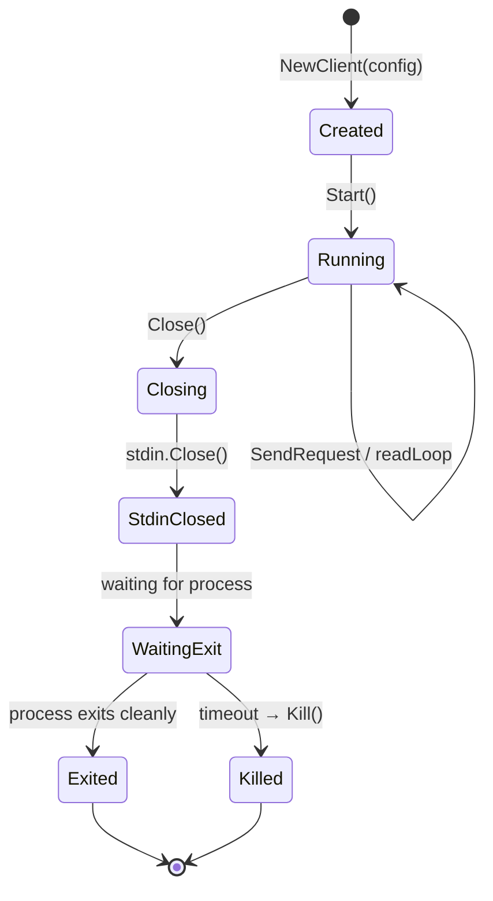

# Lesson 10: Subprocess Management

CRoBot is a Go program that orchestrates other programs. It shells out to `git`
for repository operations, spawns long-lived agent subprocesses for AI-powered
code reviews, and communicates with them over stdin/stdout pipes using JSON-RPC.
This lesson covers the full spectrum of subprocess management in Go -- from
fire-and-forget commands to bidirectional IPC -- along with several standard
library tools (`go:embed`, `strings.Builder`, `bufio.Scanner`) that appear
throughout the codebase.

---

## `os/exec` -- Running External Commands

The simplest way to run an external program in Go is `exec.CommandContext`. The
`git()` helper in CRoBot's local provider is a clean example:

```go
// internal/platform/local/provider.go

func (p *Provider) git(ctx context.Context, args ...string) (string, error) {
    cmd := exec.CommandContext(ctx, "git", args...)
    cmd.Dir = p.repoDir
    out, err := cmd.Output()
    if err != nil {
        if exitErr, ok := err.(*exec.ExitError); ok {
            return "", fmt.Errorf("git %s: %s", args[0], strings.TrimSpace(string(exitErr.Stderr)))
        }
        return "", err
    }
    return strings.TrimSpace(string(out)), nil
}
```

Several things are happening here:

**`exec.CommandContext(ctx, "git", args...)`** creates a `*exec.Cmd` struct that
represents a command ready to run. The context provides cancellation -- if the
context is cancelled (e.g., due to a timeout or a signal), Go sends SIGKILL to
the child process. This is analogous to `subprocess.run(..., timeout=...)` in
Python, except the cancellation is wired through Go's universal `context.Context`
mechanism.

**`cmd.Dir = p.repoDir`** sets the working directory for the child process. If
left empty, the child inherits the parent's working directory. This is important
for `git` commands that need to run in a specific repository.

**`cmd.Output()`** starts the process, waits for it to finish, and returns
stdout as a `[]byte`. It is a blocking call -- the goroutine sits here until the
process exits. If the process exits with a non-zero status, `Output()` returns
an error.

**The type assertion `err.(*exec.ExitError)`** is how you extract structured
information from a failed command. When a subprocess exits with a non-zero
status, Go wraps the error as `*exec.ExitError`, which gives you access to
`exitErr.Stderr` (the process's stderr output) and `exitErr.ExitCode()`. Without
this type assertion, you would only get a generic "exit status 1" message with
no diagnostic detail.

**Comparison to other languages:**

- **Python:** `subprocess.run(["git", ...], capture_output=True, check=True, cwd=dir)`.
  Go's version requires you to check the error yourself rather than raising an
  exception, but gives you more control over how failures are handled.
- **Node.js:** `child_process.execSync("git ...")`. The Go version is
  structurally safer because arguments are passed as an array (no shell
  injection), and you handle errors explicitly rather than catching exceptions.

---

## `cmd.Start()` vs `cmd.Run()`

`cmd.Output()` (used above) and `cmd.Run()` are both blocking -- they start the
process and wait for it to finish in a single call. `Run()` is effectively
`Start()` + `Wait()`. These are the right choice for fire-and-forget commands
like `git diff` or `git rev-parse`, where you just need the output.

`Start()` is non-blocking. It launches the process and returns immediately,
leaving you responsible for the lifecycle. Use `Start()` when you need ongoing
communication with the subprocess.

CRoBot's agent client uses `Start()` to launch an AI agent subprocess and
maintain a persistent JSON-RPC connection over stdio:

```go
// internal/agent/client.go

func (c *Client) Start(ctx context.Context) error {
    c.mu.Lock()
    if c.started {
        c.mu.Unlock()
        return fmt.Errorf("agent: client already started")
    }
    c.started = true
    c.mu.Unlock()

    cmd := exec.Command(c.cfg.Command, c.cfg.Args...)
    if c.cfg.Dir != "" {
        cmd.Dir = c.cfg.Dir
    }
    if len(c.cfg.Env) > 0 {
        cmd.Env = append(cmd.Environ(), c.cfg.Env...)
    }
    if c.cfg.Stderr != nil {
        cmd.Stderr = c.cfg.Stderr
    } else {
        cmd.Stderr = io.Discard
    }

    stdin, err := cmd.StdinPipe()
    if err != nil {
        return fmt.Errorf("agent: creating stdin pipe: %w", err)
    }
    stdout, err := cmd.StdoutPipe()
    if err != nil {
        stdin.Close()
        return fmt.Errorf("agent: creating stdout pipe: %w", err)
    }

    if err := cmd.Start(); err != nil {
        return fmt.Errorf("agent: starting subprocess: %w", err)
    }

    c.cmd = cmd
    c.stdin = stdin
    c.stdout = stdout
    c.startCtx = ctx

    go c.readLoop()

    return nil
}
```

Notice this code uses `exec.Command` (without context), not
`exec.CommandContext`. The comment in the source explains why:
`CommandContext` can interact poorly with manual timeout/kill logic and with
`cmd.Wait()` draining I/O. When you manage the lifecycle yourself -- as CRoBot
does with its `Close()` method -- you want full control over when the process
is killed.

The pattern here is: create pipes, start the process, launch a goroutine to
read stdout, and store everything in struct fields. The caller gets back a
`Client` that can send requests and receive responses for the lifetime of the
subprocess.

---

## Pipes -- Bidirectional Communication

Pipes are the standard mechanism for IPC with subprocesses. CRoBot opens two
pipes to the agent process:

```go
// internal/agent/client.go

stdin, err := cmd.StdinPipe()
if err != nil {
    return fmt.Errorf("agent: creating stdin pipe: %w", err)
}
stdout, err := cmd.StdoutPipe()
if err != nil {
    stdin.Close()
    return fmt.Errorf("agent: creating stdout pipe: %w", err)
}
```

`cmd.StdinPipe()` returns an `io.WriteCloser` -- a standard Go interface for
writing bytes and signaling end-of-stream. `cmd.StdoutPipe()` returns an
`io.ReadCloser` -- a standard interface for reading bytes. These are the same
interfaces used for files, network connections, and HTTP bodies. Any code that
works with `io.Reader` or `io.Writer` works with subprocess pipes.

**Closing stdin signals EOF.** When the parent process closes the stdin pipe,
the child process sees EOF on its standard input. For CRoBot's agent subprocess,
this is the signal to shut down gracefully:

```go
// internal/agent/client.go

func (c *Client) Close() error {
    // ...
    // Close stdin to signal the subprocess to exit.
    if c.stdin != nil {
        c.stdin.Close()
    }
    // ...
}
```

**Stderr must be handled explicitly.** Notice this code from `Start()`:

```go
// internal/agent/client.go

if c.cfg.Stderr != nil {
    cmd.Stderr = c.cfg.Stderr
} else {
    cmd.Stderr = io.Discard
}
```

If `cmd.Stderr` is left as `nil`, Go inherits the parent's stderr file
descriptor. This creates a subtle problem: `cmd.Wait()` blocks until all
holders of that fd close it, including any grandchild processes. If the agent
spawns child processes that inherit stderr, `Wait()` hangs even after the
agent itself exits. Setting `cmd.Stderr = io.Discard` prevents this by giving
the child a dedicated fd that has no other holders.

**Comparison to other languages:**

- **Python:** `subprocess.Popen(stdin=PIPE, stdout=PIPE, stderr=DEVNULL)`. Same
  concept, but Go's pipe types implement standard interfaces, making them
  composable with the entire I/O ecosystem.
- **Node.js:** `child_process.spawn()` with `stdio: ['pipe', 'pipe', 'ignore']`.
  Again, the same idea -- Node returns stream objects, Go returns interface
  values.

---

## `bufio.Scanner` -- Line-by-Line Reading

CRoBot communicates with the agent subprocess using newline-delimited JSON. Each
JSON-RPC message is a single line. To read this stream line by line, it uses
`bufio.Scanner`:

```go
// internal/agent/client.go

func (c *Client) readLoop() {
    defer close(c.done)

    scanner := bufio.NewScanner(c.stdout)
    // Allow up to 1MB messages.
    scanner.Buffer(make([]byte, 0, 64*1024), 1024*1024)

    for scanner.Scan() {
        line := scanner.Bytes()
        if len(line) == 0 {
            continue
        }

        var msg rawMessage
        if err := json.Unmarshal(line, &msg); err != nil {
            slog.Debug("agent: readLoop: skipping non-JSON line", "error", err)
            continue
        }

        c.routeMessage(msg)
    }

    c.readErr = scanner.Err()

    // Wake up any pending requests.
    c.mu.Lock()
    for _, ch := range c.pending {
        close(ch)
    }
    c.mu.Unlock()
}
```

**`bufio.NewScanner(c.stdout)`** wraps any `io.Reader` for line-by-line
scanning. The scanner handles buffering internally -- you do not need to worry
about partial reads or line boundaries.

**`scanner.Buffer(make([]byte, 0, 64*1024), 1024*1024)`** sets a custom buffer
size. The first argument is the initial buffer (64KB), and the second is the
maximum allowed line length (1MB). The default maximum is 64KB
(`bufio.MaxScanTokenSize`), which is too small for CRoBot's use case -- JSON-RPC
messages containing full file contents or large diffs can easily exceed 64KB.
Without this line, `scanner.Scan()` would return `false` and
`scanner.Err()` would report `bufio.ErrTooLong`.

**The scanner loop** follows a standard pattern:

1. `scanner.Scan()` reads the next line, returning `true` if a line was read
2. `scanner.Bytes()` or `scanner.Text()` retrieves the line content (without the newline)
3. When `Scan()` returns `false`, check `scanner.Err()` -- `nil` means clean
   EOF, non-nil means a read error

**`defer close(c.done)`** signals that the read loop has exited. Other
goroutines (like `Close()`) wait on this channel to know when it is safe to
call `cmd.Wait()`. This is a common Go pattern: use a channel as a
synchronization signal, and `close()` it to broadcast "I'm done" to all
waiters.

---

## `go:embed` -- Compile-Time File Embedding

CRoBot's review instructions are written as Markdown files and embedded into
the binary at compile time:

```go
// internal/prompt/prompt.go

import _ "embed"

//go:embed core.md
var coreInstructions string

//go:embed philosophy.md
var defaultPhilosophy string

//go:embed multi_agent.md
var multiAgent string

//go:embed workflow_mcp.md
var mcpWorkflow string

//go:embed workflow_acp.md
var acpWorkflow string

//go:embed commands_cli.md
var cliCommands string

//go:embed workflow_cli.md
var cliWorkflow string

//go:embed skill.md
var defaultSkill string
```

**`//go:embed filename.md`** is a compiler directive (not a comment). It tells
the Go compiler to read the file at build time and store its contents in the
variable. The variable must be a `string`, `[]byte`, or `embed.FS`. There must
be no blank line between the directive and the variable declaration.

**The binary becomes self-contained.** When you run `go build`, the compiled
binary contains all the Markdown files as static data. There are no runtime
file dependencies to deploy alongside the binary. This is one of Go's strengths
for CLI tools -- `go build` produces a single executable with everything baked
in.

**The `import _ "embed"` is required.** Even though the code does not call any
functions from the `embed` package, the blank import enables the `//go:embed`
directive. Without it, the compiler reports an error.

You can also embed multiple files or entire directories:

```go
//go:embed templates/*.html
var templates embed.FS

//go:embed static/*
var staticFiles embed.FS
```

`embed.FS` implements `fs.FS`, so it works with `http.FileServer`,
`template.ParseFS`, and other standard library functions that accept filesystem
interfaces.

**Comparison to other languages:**

- **C/C++:** Similar in spirit to `#include` for data, or `xxd -i` to convert a
  file to a byte array. Go's version is more ergonomic.
- **Java:** Similar to packaging resources in a JAR and reading them with
  `getResourceAsStream()`. Go's version is compile-time, not archive-time.
- **Rust:** `include_str!("file.md")` -- nearly identical semantics.
- **Python:** No built-in equivalent. You typically use `importlib.resources`
  or `pkg_resources`, both of which read files at runtime.

---

## `strings.Builder` -- Efficient String Construction

When you need to build a string incrementally -- appending pieces in a loop --
`strings.Builder` is the right tool. CRoBot uses it in several places.

Here is how `render.go` constructs comment bodies:

```go
// internal/review/render.go

func RenderComment(f platform.ReviewFinding, botLabel string) string {
    var b strings.Builder

    icon := severityIcons[f.Severity]
    b.WriteString(fmt.Sprintf("%s **%s**", icon, f.Severity))
    if f.SeverityScore > 0 {
        b.WriteString(fmt.Sprintf(" (%d/10)", f.SeverityScore))
    }
    if f.Category != "" {
        b.WriteString(fmt.Sprintf(" | %s %s", categoryIcon(f.Category), f.Category))
    }
    b.WriteString("\n\n")

    if len(f.Criteria) > 0 {
        b.WriteString(fmt.Sprintf("\U0001F4CB **Criteria:** %s\n\n", strings.Join(f.Criteria, ", ")))
    }

    b.WriteString(f.Message)
    b.WriteString("\n")

    if f.Suggestion != "" {
        b.WriteString("\n```suggestion\n")
        b.WriteString(f.Suggestion)
        b.WriteString("\n```\n")
    }

    // ...
    return b.String()
}
```

And here is how `session.go` accumulates streaming output from the agent:

```go
// internal/agent/session.go

type Session struct {
    // ...
    mu        sync.Mutex
    agentText strings.Builder
    // ...
}

// In handleNotification, accumulating text from streaming chunks:
s.mu.Lock()
s.agentText.WriteString(text)
// ...
s.mu.Unlock()

// In Prompt, retrieving the accumulated text:
s.mu.Lock()
finalText := s.agentText.String()
s.mu.Unlock()
```

**Why not just use `+` concatenation?** In Go, strings are immutable. Every `+`
operation allocates a new string and copies both operands into it. For a loop
that appends N fragments, this is O(N^2) in total memory allocations.
`strings.Builder` maintains an internal byte buffer that grows as needed
(doubling capacity), making the same operation O(N) amortized.

For a handful of concatenations (2-3 fragments), `+` is fine. But in a loop,
or when constructing a large string from many pieces, `strings.Builder` is the
correct choice.

**The API is minimal:**

- `b.WriteString(s)` -- append a string
- `b.WriteByte(c)` -- append a single byte
- `b.Write(p)` -- append a byte slice
- `b.String()` -- return the accumulated string
- `b.Reset()` -- clear the buffer for reuse
- `b.Len()` -- return the current length

**Comparison to other languages:**

- **Java:** `StringBuilder` -- essentially identical in purpose and API.
- **Python:** `io.StringIO` or `"".join(parts)`. Go's `strings.Builder` is
  closer to `StringIO` but with a simpler interface.
- **C#:** `StringBuilder` -- same concept.

---

## Path Sanitization

When subprocess arguments come from external input, you must validate them
before passing them to the command. CRoBot's `FSHandler` reads file paths
from the agent subprocess (which is an AI model generating arbitrary text)
and uses them in `git show` commands:

```go
// internal/agent/fs.go

func (h *FSHandler) readTextFile(ctx context.Context, params json.RawMessage) (any, error) {
    var p readTextFileParams
    if err := json.Unmarshal(params, &p); err != nil {
        return nil, fmt.Errorf("agent: fs: parsing read params: %w", err)
    }

    if p.Path == "" {
        return nil, fmt.Errorf("agent: fs: path must not be empty")
    }

    // Sanitize the path to prevent directory traversal.
    cleaned := path.Clean(p.Path)
    if cleaned == ".." || cleaned == "." || path.IsAbs(cleaned) || strings.HasPrefix(cleaned, "../") {
        return nil, fmt.Errorf("agent: fs: invalid path %q", p.Path)
    }
    p.Path = cleaned

    // Use git show to read the file at the specific commit.
    ref := fmt.Sprintf("%s:%s", h.headCommit, p.Path)
    cmd := exec.CommandContext(ctx, "git", "show", ref)
    cmd.Dir = h.repoDir

    output, err := cmd.Output()
    if err != nil {
        return nil, fmt.Errorf("agent: fs: reading %s: %w", p.Path, err)
    }

    return map[string]string{
        "content": string(output),
    }, nil
}
```

The sanitization logic is defensive on multiple fronts:

- **`path.Clean()`** normalizes paths by collapsing redundant separators and
  resolving `.` and `..` references. For example, `foo/../bar/./baz` becomes
  `bar/baz`.
- **Rejecting `..` and `../` prefixes** prevents directory traversal. Without
  this check, a malicious path like `../../etc/passwd` would be cleaned to
  `../../etc/passwd` and passed directly to `git show`, potentially exposing
  files outside the repository.
- **Rejecting absolute paths** prevents the agent from referencing files by
  their full filesystem path (e.g., `/etc/shadow`).
- **Rejecting `.`** prevents reading the repository root as a tree object,
  which is not meaningful for this API.

The commit hash is also validated when the `FSHandler` is created, using a
regex that only accepts 4-40 lowercase hex characters:

```go
// internal/agent/fs.go

var validCommitHash = regexp.MustCompile(`^[0-9a-f]{4,40}$`)

func NewFSHandler(headCommit, repoDir string) (*FSHandler, error) {
    if !validCommitHash.MatchString(headCommit) {
        return nil, fmt.Errorf("agent: fs: invalid commit hash %q: must be 4-40 lowercase hex characters", headCommit)
    }
    // ...
}
```

This is not paranoia -- it is necessary. The agent subprocess is an AI model
that generates text. It can produce any string, including paths designed to
escape the repository root. Every argument that flows from untrusted input into
a subprocess command must be validated.

---

## Subprocess Lifecycle

The following diagram shows how CRoBot manages the agent subprocess from
creation through shutdown. The key insight is that `Close()` is defensive: it
tries to let the process exit gracefully (by closing stdin), but falls back to
killing it if it does not exit within 3 seconds.



The `Close()` method implements this lifecycle:

```go
// internal/agent/client.go

func (c *Client) Close() error {
    c.mu.Lock()
    if c.closed {
        c.mu.Unlock()
        return nil
    }
    c.closed = true
    c.mu.Unlock()

    if c.stdin != nil {
        c.stdin.Close()
    }

    if !c.started || c.cmd == nil || c.cmd.Process == nil {
        return nil
    }

    waitDone := make(chan error, 1)
    go func() {
        <-c.done // wait for read loop
        waitDone <- c.cmd.Wait()
    }()

    select {
    case err := <-waitDone:
        if err != nil {
            return fmt.Errorf("agent: subprocess exited: %w", err)
        }
        return nil
    case <-time.After(closeTimeout):
        _ = c.cmd.Process.Kill()
        <-waitDone
        return fmt.Errorf("agent: subprocess killed after timeout")
    }
}
```

This is a common pattern for graceful shutdown in Go: signal the process to stop
(close stdin), wait with a timeout (`select` + `time.After`), and kill it if
the timeout expires. The `select` statement lets you wait on multiple channels
simultaneously -- whichever event happens first wins.

---

## Key Takeaways

- **`exec.CommandContext` for simple run-and-wait; `Start()` + pipes for ongoing
  communication.** Most subprocess interactions are fire-and-forget commands.
  Reserve the pipe-based approach for long-lived processes that need
  bidirectional IPC.
- **Always handle stderr explicitly.** Don't let it inherit the parent's file
  descriptor -- it can cause `Wait()` to hang if child processes inherit the
  same fd.
- **`bufio.Scanner` with custom buffer sizes for large messages.** The default
  64KB maximum line length is too small for many real-world protocols. Set
  the max explicitly when you know your messages can be large.
- **`go:embed` creates self-contained binaries.** No deployment dependencies,
  no config files to ship alongside the binary. Embed your templates,
  instructions, and static assets at compile time.
- **`strings.Builder` for efficient string construction in loops.** It is Go's
  equivalent of Java's `StringBuilder`. Use it whenever you are appending more
  than a few fragments.
- **Sanitize all paths before passing to subprocess commands.** When arguments
  come from untrusted input, validate them defensively. Reject `..`, absolute
  paths, and any pattern that could escape the intended directory.

---

Next lesson: concurrency patterns -- goroutines, channels, and `sync` primitives
used throughout CRoBot's agent communication layer.
