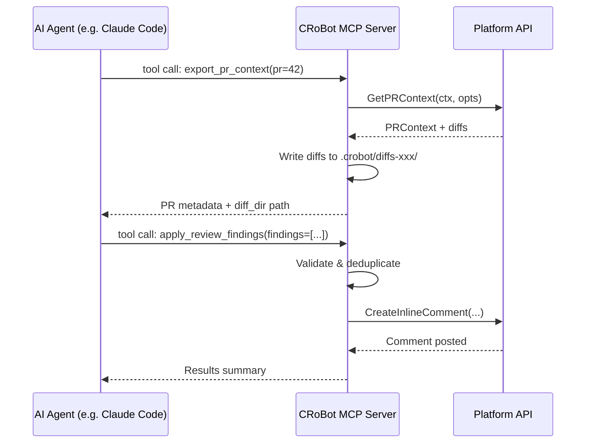
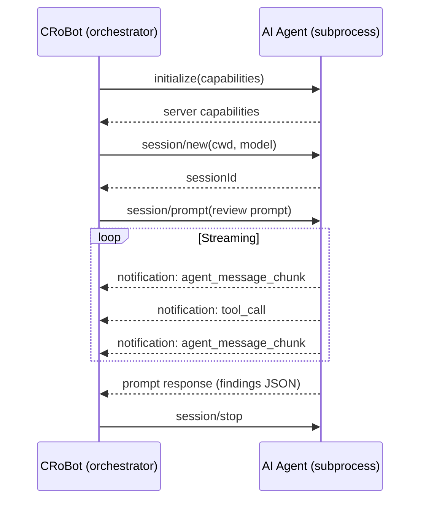
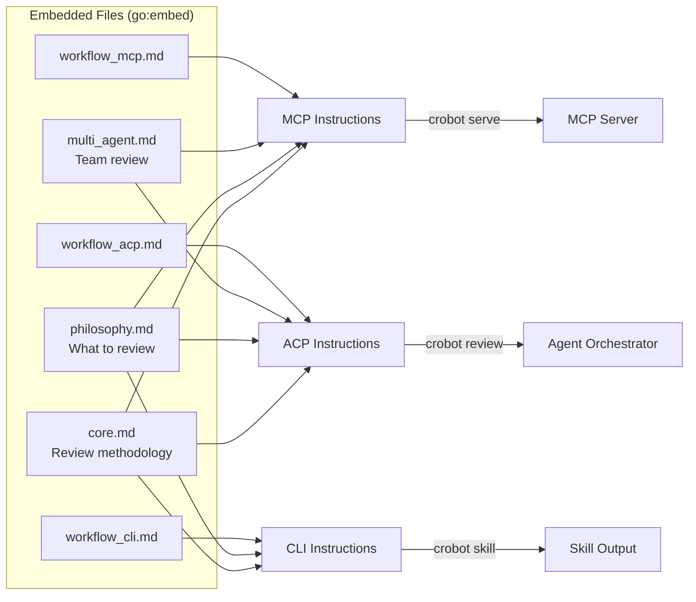
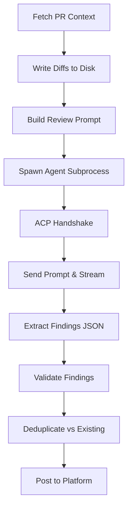

# Lesson 11: AI Agent Protocols

CRoBot is not just a CLI tool -- it is a bridge between AI agents and code
review platforms. This capstone lesson explores the two communication protocols
that make that possible: MCP (Model Context Protocol) and ACP (Agent
Communication Protocol). Along the way, it ties together Go concepts from
earlier lessons -- interfaces, concurrency, subprocess management, JSON
serialization, and `go:embed`.

---

## Section 1: What is an AI Agent?

A simple API call to an LLM is like calling a function: you send a prompt, you
get a response. An agent is different. An agent has access to tools, can decide
which ones to call, inspect the results, and loop until the task is complete.
The LLM is the brain, the tools are the hands, and the loop is the autonomy.

The challenge is communication. How does the agent discover what tools are
available? How does a program launch an agent and collect its output? These are
protocol problems, and they have protocol solutions.

CRoBot implements both sides of this equation. It acts as a **tool provider**
(MCP server) -- exposing its review capabilities so any AI agent can call them.
And it acts as an **agent orchestrator** (ACP client) -- spawning an AI agent
subprocess, feeding it a review prompt, and collecting structured findings.

---

## Section 2: MCP -- CRoBot as a Tool Provider

MCP (Model Context Protocol) is an open standard created by Anthropic for
exposing tools to AI agents. Think of it as a universal adapter -- like USB for
AI. Any MCP-capable agent can connect to any MCP server and discover its tools
automatically, without custom integration code.

The transport is stdio: stdin for incoming requests, stdout for outgoing
responses. No network stack, no ports, no TLS. The agent starts the MCP server
as a subprocess and communicates over pipes. This simplicity is deliberate --
it works everywhere, from developer laptops to CI containers.

### CRoBot's MCP Server Setup

The MCP server lives in `internal/mcp/server.go`. Here is how it is created:

```go
// From internal/mcp/server.go

func NewServer(plat platform.Platform, cfg config.Config) (*Server, error) {
    // Load custom review philosophy if configured.
    philosophy, _ := config.LoadPhilosophy(cfg)
    instructions := prompt.MCPInstructionsWithPhilosophy(philosophy)

    mcpSrv := server.NewMCPServer(
        "crobot",
        version.Version,
        server.WithToolCapabilities(false),
        server.WithInstructions(instructions),
    )

    // Register tools.
    h := newHandler(plat, cfg)
    defs := toolDefinitions()
    for _, td := range defs {
        mcpSrv.AddTool(td.tool, h.dispatch(td.name))
    }

    return &Server{
        stdioServer: server.NewStdioServer(mcpSrv),
    }, nil
}
```

A few things to notice:

- The server declares its **name** (`"crobot"`) and **version**, so agents know
  what they are talking to.
- The **instructions** string is the review philosophy -- it tells the agent
  what CRoBot cares about (bugs, security, architecture) and what to skip
  (formatting, style nits). This is compiled into the binary via `go:embed`
  (covered in Section 4).
- Tools are registered in a loop. Each `toolDef` pairs a tool definition
  (what the agent sees) with a dispatch function (what CRoBot executes).

The `Serve` method is straightforward -- it listens on stdin/stdout until the
context is cancelled:

```go
// From internal/mcp/server.go

func (s *Server) Serve(ctx context.Context) error {
    return s.stdioServer.Listen(ctx, os.Stdin, os.Stdout)
}
```

### Tool Definitions

Tools are defined in `internal/mcp/tools.go` using a declarative API that
produces JSON Schema descriptions. Each tool has a name, a human-readable
description, typed parameters, and hint annotations. This is the menu that
the agent sees when it connects.

```go
// From internal/mcp/tools.go

func toolDefinitions() []toolDef {
    return []toolDef{
        {
            name: "export_pr_context",
            tool: mcp.NewTool("export_pr_context",
                mcp.WithDescription("Export PR context (metadata, changed files, diff hunks) as JSON."),
                mcp.WithString("workspace", mcp.Required(), mcp.Description("Workspace or organization slug")),
                mcp.WithString("repo", mcp.Required(), mcp.Description("Repository slug")),
                mcp.WithNumber("pr", mcp.Required(), mcp.Description("Pull request number")),
                mcp.WithReadOnlyHintAnnotation(true),
            ),
        },
        {
            name: "apply_review_findings",
            tool: mcp.NewTool("apply_review_findings",
                mcp.WithDescription("Apply review findings as inline PR comments. Dry-run by default; set dry_run=false to post."),
                mcp.WithString("workspace", mcp.Required(), mcp.Description("Workspace or organization slug")),
                mcp.WithString("repo", mcp.Required(), mcp.Description("Repository slug")),
                mcp.WithNumber("pr", mcp.Required(), mcp.Description("Pull request number")),
                mcp.WithArray("findings", mcp.Required(), mcp.Description("Array of ReviewFinding objects")),
                mcp.WithBoolean("dry_run", mcp.Description("If true (default), validate only without posting")),
                mcp.WithNumber("max_comments", mcp.Description("Maximum number of comments to post (0 = use config default)")),
                mcp.WithReadOnlyHintAnnotation(false),
                mcp.WithDestructiveHintAnnotation(true),
            ),
        },
        // ... additional tools: get_file_snippet, list_bot_comments, export_local_context
    }
}
```

The `ReadOnlyHintAnnotation` and `DestructiveHintAnnotation` are metadata hints
for the agent. An agent can use these to decide whether a tool call needs user
confirmation. `export_pr_context` is read-only and safe to call freely;
`apply_review_findings` is destructive (it posts comments) and the agent may
want to confirm first.

### Tool Dispatch

When an agent calls a tool, the MCP library routes the call to CRoBot's
handler. The dispatch logic in `internal/mcp/handler.go` uses a simple switch
on the tool name:

```go
// From internal/mcp/handler.go

func (h *handler) dispatch(name string) func(ctx context.Context, req mcp.CallToolRequest) (*mcp.CallToolResult, error) {
    return func(ctx context.Context, req mcp.CallToolRequest) (*mcp.CallToolResult, error) {
        switch name {
        case "export_pr_context":
            return h.handleExportPRContext(ctx, req)
        case "get_file_snippet":
            return h.handleGetFileSnippet(ctx, req)
        case "list_bot_comments":
            return h.handleListBotComments(ctx, req)
        case "export_local_context":
            return h.handleExportLocalContext(ctx, req)
        case "apply_review_findings":
            return h.handleApplyReviewFindings(ctx, req)
        default:
            return mcp.NewToolResultError(fmt.Sprintf("unknown tool: %s", name)), nil
        }
    }
}
```

The `dispatch` method returns a closure -- a pattern covered in Lesson 08. The
closure captures `name` from the outer scope so the switch can route correctly.

Each handler method follows the same three-step pattern: extract parameters,
call the platform interface, return results. Here is `handleExportPRContext`:

```go
// From internal/mcp/handler.go

func (h *handler) handleExportPRContext(ctx context.Context, req mcp.CallToolRequest) (*mcp.CallToolResult, error) {
    workspace := mcp.ParseString(req, "workspace", "")
    repo := mcp.ParseString(req, "repo", "")
    pr := mcp.ParseInt(req, "pr", 0)

    if workspace == "" || repo == "" || pr <= 0 {
        return mcp.NewToolResultError("workspace, repo, and pr are required"), nil
    }

    prCtx, err := h.platform.GetPRContext(ctx, platform.PRRequest{
        Workspace: workspace,
        Repo:      repo,
        PRNumber:  pr,
    })
    if err != nil {
        return toolError("failed to fetch PR context", err), nil
    }

    // Write diffs to disk for incremental agent consumption.
    stats := platform.ComputeDiffStats(prCtx.DiffHunks)
    diffDir := platform.NewDiffDir(".crobot")
    if err := platform.WriteDiffFiles(prCtx.DiffHunks, stats, diffDir); err != nil {
        return toolError("failed to write diff files", err), nil
    }

    // Return context without inline hunks; agents read from diff_dir.
    ctxCopy := *prCtx
    ctxCopy.DiffHunks = nil
    resp := exportResponse{
        PRContext: &ctxCopy,
        DiffDir:   diffDir,
        DiffStats: stats,
    }

    data, err := json.MarshalIndent(resp, "", "  ")
    if err != nil {
        return nil, fmt.Errorf("marshaling PR context: %w", err)
    }

    return mcp.NewToolResultText(string(data)), nil
}
```

Notice `h.platform.GetPRContext(...)` -- the handler calls through the
`platform.Platform` interface, not a concrete implementation. This is the
interface pattern from Lesson 04 in action. The same handler works for
Bitbucket, GitHub, or the local git provider because it depends only on the
abstraction.

### How It Works End-to-End

The full MCP flow looks like this:

1. An AI agent (like Claude Code) starts CRoBot as a subprocess with
   `crobot serve`.
2. CRoBot's MCP server initializes and advertises its tools.
3. The agent sends JSON-RPC requests over stdin -- e.g., "call
   `export_pr_context` with PR number 42."
4. CRoBot executes the tool, fetches data from the platform API, and returns
   the result as JSON over stdout.
5. The agent reads the result, decides what to do next (maybe call
   `apply_review_findings`), and loops until the review is complete.



---

## Section 3: ACP -- CRoBot as an Orchestrator

MCP answers "how does an agent call tools?" ACP (Agent Communication Protocol)
answers the inverse: "how does a program control an agent?" ACP is a protocol
for programmatically launching AI agent subprocesses, sending them prompts, and
collecting structured output.

CRoBot uses ACP to launch an AI agent, send it a review prompt with the PR
diff, and get back a JSON array of findings. The agent does the thinking;
CRoBot handles everything else -- fetching PR data, writing diffs to disk,
validating findings, deduplicating against existing comments, and posting to
the platform.

### The JSON-RPC 2.0 Foundation

ACP is built on JSON-RPC 2.0, a simple request/response protocol over any
transport. CRoBot's implementation lives in `internal/agent/client.go`. There
are three message types:

```go
// From internal/agent/client.go

// Request is a JSON-RPC 2.0 request message.
type Request struct {
    JSONRPC string          `json:"jsonrpc"`
    ID      int             `json:"id"`
    Method  string          `json:"method"`
    Params  json.RawMessage `json:"params,omitempty"`
}

// Response is a JSON-RPC 2.0 response message.
type Response struct {
    JSONRPC string          `json:"jsonrpc"`
    ID      int             `json:"id"`
    Result  json.RawMessage `json:"result,omitempty"`
    Error   *RPCError       `json:"error,omitempty"`
}

// Notification is a JSON-RPC 2.0 notification (no ID, no response expected).
type Notification struct {
    JSONRPC string          `json:"jsonrpc"`
    Method  string          `json:"method"`
    Params  json.RawMessage `json:"params,omitempty"`
}
```

The key distinction: **requests** have an `ID` and expect a response;
**notifications** have no `ID` and are fire-and-forget. This matters because
ACP uses notifications for streaming -- the agent sends incremental output as
notifications while it works, and the final response arrives as a proper
request/response pair.

#### Sending Requests and Correlating Responses

The `SendRequest` method shows how CRoBot tracks in-flight requests. This is
where the concurrency patterns from Lesson 09 come together -- goroutines,
channels, mutexes, and atomic operations:

```go
// From internal/agent/client.go

func (c *Client) SendRequest(ctx context.Context, method string, params any) (json.RawMessage, error) {
    id := int(c.nextID.Add(1))

    // ... marshal params into rawParams ...

    req := Request{
        JSONRPC: "2.0",
        ID:      id,
        Method:  method,
        Params:  rawParams,
    }

    ch := make(chan *Response, 1)
    c.mu.Lock()
    c.pending[id] = ch
    c.mu.Unlock()

    defer func() {
        c.mu.Lock()
        delete(c.pending, id)
        c.mu.Unlock()
    }()

    if err := c.writeMessage(req); err != nil {
        return nil, fmt.Errorf("agent: sending request: %w", err)
    }

    select {
    case <-ctx.Done():
        return nil, fmt.Errorf("agent: request %q: %w", method, ctx.Err())
    case <-c.done:
        return nil, fmt.Errorf("agent: connection closed while waiting for response to %q", method)
    case resp := <-ch:
        if resp.Error != nil {
            return nil, fmt.Errorf("agent: request %q: %w", method, resp.Error)
        }
        return resp.Result, nil
    }
}
```

The pattern:

1. Generate a unique ID using `atomic.Int64` -- no lock needed for the counter.
2. Create a buffered channel and register it in the `pending` map, keyed by ID.
3. Send the request as newline-delimited JSON over the subprocess's stdin.
4. Block on a `select` -- waiting for either the response, context cancellation,
   or connection closure.

On the receiving side, a `readLoop` goroutine reads lines from the subprocess's
stdout and routes each message. When a response arrives, it looks up the pending
channel by ID and sends the response through it:

```go
// From internal/agent/client.go

func (c *Client) routeMessage(msg rawMessage) {
    // Response: has an ID but no Method.
    if msg.ID != nil && msg.Method == "" {
        c.mu.Lock()
        ch, ok := c.pending[*msg.ID]
        c.mu.Unlock()
        if ok {
            ch <- &Response{
                JSONRPC: msg.JSONRPC,
                ID:      *msg.ID,
                Result:  msg.Result,
                Error:   msg.Error,
            }
        }
        return
    }

    // Notification: has a Method but no ID.
    if msg.Method != "" {
        c.mu.Lock()
        nh := c.notifyHandler
        c.mu.Unlock()
        if nh != nil {
            nh(msg.Method, msg.Params)
        }
    }
}
```

This is a textbook producer-consumer pattern: `readLoop` produces messages,
`SendRequest` consumes them via channels. The `pending` map and its mutex
provide the coordination.

### Session Lifecycle

An ACP session has four phases. The implementation lives in
`internal/agent/session.go`.



#### Phase 1: Initialize

The `Initialize` method performs the capability handshake. CRoBot tells the
agent what it supports (filesystem access), and the agent responds with its own
capabilities. This is similar to a TLS handshake -- both sides negotiate before
any real work begins.

```go
// From internal/agent/session.go

func (s *Session) Initialize(ctx context.Context) error {
    params := map[string]any{
        "protocolVersion": acpProtocolVersion,
        "clientInfo": map[string]string{
            "name":    "crobot",
            "version": version.Version,
        },
        "clientCapabilities": map[string]any{
            "fs": map[string]any{
                "readTextFile": true,
            },
        },
    }

    result, err := s.client.SendRequest(ctx, "initialize", params)
    if err != nil {
        return fmt.Errorf("agent: initialize: %w", err)
    }

    var serverCaps map[string]any
    if err := json.Unmarshal(result, &serverCaps); err != nil {
        return fmt.Errorf("agent: initialize: parsing server capabilities: %w", err)
    }

    return nil
}
```

Notice the `"clientCapabilities"` map -- CRoBot declares that it supports
`fs.readTextFile`. This tells the agent it can request file contents during
the review (covered below in "Filesystem Access").

#### Phase 2: Create Session

The `createSession` method starts a new conversation. The agent returns a
session ID and metadata about available models:

```go
// From internal/agent/session.go

func (s *Session) createSession(ctx context.Context) error {
    cwd, _ := os.Getwd()

    params := map[string]any{
        "cwd":        cwd,
        "mcpServers": []any{},
    }
    if s.modelID != "" {
        params["modelId"] = s.modelID
    }

    result, err := s.client.SendRequest(ctx, "session/new", params)
    if err != nil {
        return fmt.Errorf("agent: session/new: %w", err)
    }

    var sessionResp struct {
        SessionID string `json:"sessionId"`
        Models    struct {
            AvailableModels []ModelInfo `json:"availableModels"`
            CurrentModelID  string     `json:"currentModelId"`
        } `json:"models"`
    }
    if err := json.Unmarshal(result, &sessionResp); err != nil {
        return fmt.Errorf("agent: session/new: parsing response: %w", err)
    }

    s.sessionID = sessionResp.SessionID
    s.CurrentModel = sessionResp.Models.CurrentModelID
    s.AvailableModels = sessionResp.Models.AvailableModels

    return nil
}
```

The anonymous struct for `sessionResp` is a Go idiom you see often when you
only need to parse a JSON response in one place. There is no reason to create a
named type for a structure that is used exactly once.

#### Phase 3: Prompt

The `Prompt` method sends the review prompt and waits for the final response.
But the real output arrives incrementally via notifications (covered next):

```go
// From internal/agent/session.go

func (s *Session) Prompt(ctx context.Context, prompt string) (*SessionResult, error) {
    if s.sessionID == "" {
        if err := s.createSession(ctx); err != nil {
            return nil, err
        }
    }

    // Reset accumulated text for this turn.
    s.mu.Lock()
    s.agentText.Reset()
    s.mu.Unlock()

    params := map[string]any{
        "sessionId": s.sessionID,
        "prompt": []map[string]string{
            {"type": "text", "text": prompt},
        },
    }

    result, err := s.client.SendRequest(ctx, "session/prompt", params)
    if err != nil {
        return nil, fmt.Errorf("agent: prompt: %w", err)
    }

    s.mu.Lock()
    finalText := s.agentText.String()
    s.mu.Unlock()

    return &SessionResult{
        FinalText:  finalText,
        StopReason: promptResult.StopReason,
    }, nil
}
```

The `agentText` field is a `strings.Builder` that accumulates text from
streaming notifications while `SendRequest` blocks waiting for the response.
This works because `SendRequest` blocks on a channel, and the `readLoop`
goroutine continues to process incoming messages -- including notifications --
on a separate goroutine. The mutex protects `agentText` from concurrent access.

#### Phase 4: Close

```go
// From internal/agent/session.go

func (s *Session) Close(_ context.Context) error {
    if s.sessionID == "" {
        return nil
    }

    stopCtx, cancel := context.WithTimeout(context.Background(), 3*time.Second)
    defer cancel()

    params := map[string]any{
        "sessionId": s.sessionID,
    }

    _, err := s.client.SendRequest(stopCtx, "session/stop", params)
    if err != nil {
        // session/stop is optional in ACP -- log but don't fail.
        slog.Debug("agent: session/stop not supported or failed", "error", err)
    }

    s.sessionID = ""
    return nil
}
```

Note the short, dedicated timeout. The `session/stop` method is optional in
ACP -- some agents support it, some do not. CRoBot logs the error and moves on
rather than failing the entire review because cleanup did not work.

### Streaming via Notifications

While the agent processes the review, it streams output as `session/update`
notifications. The notification handler in `internal/agent/session.go`
processes these in real-time:

```go
// From internal/agent/session.go

func (s *Session) handleNotification(method string, params json.RawMessage) {
    if method != "session/update" {
        return
    }

    // ... parse the notification envelope and update object ...

    switch sessionUpdate {
    case "agent_message_chunk":
        for _, b := range blocks {
            if b.Type == "text" {
                text += b.Text
            }
        }
    case "tool_call", "tool_call_update":
        toolName := extractToolName(rawUpdate, rawContent)
        if s.activityFunc != nil {
            if toolName != "" {
                s.activityFunc("tool: " + toolName)
            } else {
                s.activityFunc("using tool...")
            }
        }
        return
    }

    // Accumulate agent text for the final result.
    s.mu.Lock()
    s.agentText.WriteString(text)
    s.writeStream(text)
    s.mu.Unlock()
}
```

There are two update types to understand:

- **`agent_message_chunk`** -- a fragment of the agent's text output. These are
  accumulated in the `strings.Builder` and also streamed to the terminal if
  `--show-agent-output` is enabled.
- **`tool_call`** / **`tool_call_update`** -- the agent is using a tool (reading
  a file, running a command). CRoBot shows this as a progress indicator.

This is how CRoBot shows live progress while the agent thinks -- the
notification handler runs on the `readLoop` goroutine while `Prompt` blocks
on the `SendRequest` channel. Two goroutines, coordinated by a mutex and a
channel.

### Filesystem Access

During a review, the agent may need to read files beyond what the diff shows --
to trace call chains, check type definitions, or understand the broader
context. The `FSHandler` in `internal/agent/fs.go` serves these requests:

```go
// From internal/agent/fs.go

type FSHandler struct {
    headCommit string
    repoDir    string
}

func (h *FSHandler) readTextFile(ctx context.Context, params json.RawMessage) (any, error) {
    var p readTextFileParams
    if err := json.Unmarshal(params, &p); err != nil {
        return nil, fmt.Errorf("agent: fs: parsing read params: %w", err)
    }

    // Sanitize the path to prevent directory traversal.
    cleaned := path.Clean(p.Path)
    if cleaned == ".." || cleaned == "." || path.IsAbs(cleaned) || strings.HasPrefix(cleaned, "../") {
        return nil, fmt.Errorf("agent: fs: invalid path %q", p.Path)
    }

    // Use git show to read the file at the specific commit.
    ref := fmt.Sprintf("%s:%s", h.headCommit, p.Path)
    cmd := exec.CommandContext(ctx, "git", "show", ref)
    cmd.Dir = h.repoDir

    output, err := cmd.Output()
    if err != nil {
        return nil, fmt.Errorf("agent: fs: reading %s: %w", p.Path, err)
    }

    return map[string]string{
        "content": string(output),
    }, nil
}
```

Two details worth calling out:

1. **Path sanitization** prevents directory traversal attacks. The agent
   subprocess could request `../../../etc/passwd`, so the handler rejects
   absolute paths, `..` prefixes, and bare `.` paths. This connects to the
   security awareness discussed in Lesson 10.

2. **`git show` at a specific commit** ensures the agent reads files as they
   exist at the PR's head commit, not whatever happens to be on disk. This
   guarantees consistency -- the file content matches the diff the agent is
   reviewing.

There is also a special case: files under `.crobot/` (like the diff files
CRoBot writes to disk) are read directly from the filesystem since they are
not tracked by git.

---

## Section 4: Skills and Prompts -- Teaching the Agent What To Do

An agent without instructions is like a contractor without blueprints. Skills
are packaged instructions that teach an agent a specific capability -- in
CRoBot's case, how to perform a code review.

### Prompt Composition with go:embed

The instruction content lives in Markdown files alongside the Go source. They
are embedded into the binary at compile time using `go:embed`, so the binary is
self-contained -- no external files to distribute.

From `internal/prompt/prompt.go`:

```go
// From internal/prompt/prompt.go

import _ "embed"

//go:embed core.md
var coreInstructions string

//go:embed philosophy.md
var defaultPhilosophy string

//go:embed multi_agent.md
var multiAgent string

//go:embed workflow_mcp.md
var mcpWorkflow string

//go:embed workflow_acp.md
var acpWorkflow string

//go:embed commands_cli.md
var cliCommands string

//go:embed workflow_cli.md
var cliWorkflow string

//go:embed skill.md
var defaultSkill string
```

Each `//go:embed` directive tells the Go compiler to read the file at build
time and store its contents in the corresponding `string` variable. At runtime,
these variables contain the full file contents -- no file I/O needed.

The `import _ "embed"` is required even though the `embed` package is not
referenced directly. The blank import (`_`) tells Go to initialize the package
for its side effects, which enables the `//go:embed` directive. Without this
import, the build fails.

### Layered Instruction Composition

Different operating modes need different instructions. The composition
functions combine the same core content with mode-specific workflows:

```go
// From internal/prompt/prompt.go

// base builds the common prefix: core instructions + philosophy + multi-agent.
func base(philosophy string) string {
    phil := defaultPhilosophy
    if philosophy != "" {
        phil = philosophy
    }
    return coreInstructions + "\n" + phil + "\n" + multiAgent
}

func MCPInstructionsWithPhilosophy(philosophy string) string {
    return base(philosophy) + "\n" + mcpWorkflow
}

func ACPInstructionsWithPhilosophy(philosophy string) string {
    return base(philosophy) + "\n" + acpWorkflow
}

func CLIInstructionsWithPhilosophy(philosophy string) string {
    return base(philosophy) + "\n" + cliCommands + "\n" + cliWorkflow
}
```

The layered approach:

- **Core** (`core.md`) -- review methodology, finding schema, severity rules.
  Shared by all modes.
- **Philosophy** (`philosophy.md`) -- what to comment on and what to skip.
  Replaceable by users via configuration.
- **Multi-agent** (`multi_agent.md`) -- instructions for agents that can spawn
  sub-agents to parallelize the review.
- **Workflow** -- mode-specific steps. MCP agents call tools; ACP agents read
  data from their prompt; CLI agents run shell commands.

The custom philosophy feature is worth noting: users can provide their own
`philosophy.md` that overrides the default. This lets teams focus the reviewer
on what matters to them -- a security-focused team might want aggressive
vulnerability scanning, while a data team might prioritize correctness and
edge-case coverage.



### The Review Prompt

When CRoBot runs in ACP mode, it builds a structured prompt that gives the
agent everything it needs to perform the review. The `BuildReviewPrompt`
function in `internal/agent/prompt.go` assembles:

- PR metadata (title, author, source and target branches)
- A list of changed files
- Instructions for reading diffs from disk
- Output format requirements (a JSON array of findings)

```go
// From internal/agent/prompt.go

func BuildReviewPrompt(prCtx *platform.PRContext, ref *platform.PRRequest, diffDir ...string) string {
    var b strings.Builder

    b.WriteString("# Pull Request Review\n\n")

    // PR metadata
    b.WriteString("## PR Metadata\n\n")
    b.WriteString(fmt.Sprintf("- **Title**: %s\n", prCtx.Title))
    b.WriteString(fmt.Sprintf("- **Author**: %s\n", prCtx.Author))
    b.WriteString(fmt.Sprintf("- **Source Branch**: %s\n", prCtx.SourceBranch))
    b.WriteString(fmt.Sprintf("- **Target Branch**: %s\n", prCtx.TargetBranch))

    // ... changed files list ...

    // Diff section: file-based if diffDir provided, inline otherwise.
    dir := ""
    if len(diffDir) > 0 {
        dir = diffDir[0]
    }

    if dir != "" {
        b.WriteString("\n## Diff Access\n\n")
        b.WriteString("Per-file diffs are available on disk. Start by reading the index:\n")
        b.WriteString(fmt.Sprintf("  %s/.crobot-index.md\n\n", dir))
        b.WriteString(fmt.Sprintf("Then read individual file diffs at `%s/<file-path>`.\n", dir))
    }

    // ... output format instructions ...

    return b.String()
}
```

For large PRs, embedding the entire diff in the prompt would exceed token
limits. The file-based approach writes each file's diff to disk under
`.crobot/diffs-<run-id>/`, and the prompt tells the agent where to find them.
The agent reads diffs incrementally via the filesystem access mechanism covered
in Section 3.

The `BuildFullPromptWithPhilosophy` function combines the system instructions
and the review prompt into a single string:

```go
// From internal/agent/prompt.go

func BuildFullPromptWithPhilosophy(prCtx *platform.PRContext, ref *platform.PRRequest, philosophy string, diffDir ...string) string {
    return BuildSystemPromptWithPhilosophy(philosophy) + "\n---\n\n" + BuildReviewPrompt(prCtx, ref, diffDir...)
}
```

---

## Section 5: How It All Connects -- The Full Review Flow

The `runReview` function in `internal/cli/review.go` ties everything together.
It is the orchestration layer -- the code that coordinates the platform, the
agent, and the review engine into a single pipeline.

```go
// From internal/cli/review.go (abbreviated)

func runReview(ctx context.Context, opts ReviewOpts) (*review.ReviewResult, error) {
    // 1. Fetch PR context.
    prCtx, err := opts.Platform.GetPRContext(ctx, opts.PRRequest)

    // 2. Write per-file diffs to disk.
    stats := platform.ComputeDiffStats(prCtx.DiffHunks)
    diffDir := platform.NewDiffDir(".crobot")
    platform.WriteDiffFiles(prCtx.DiffHunks, stats, diffDir)
    defer platform.CleanupDiffDir(diffDir)

    // 3. Build review prompt.
    prompt := agent.BuildFullPromptWithPhilosophy(prCtx, &opts.PRRequest, opts.Philosophy, diffDir)

    // 4. Create and start agent client.
    client := agent.NewClient(agent.ClientConfig{
        Command: opts.AgentCfg.Command,
        Args:    opts.AgentCfg.Args,
        Timeout: opts.AgentCfg.Timeout,
    })
    client.Start(agentCtx)
    defer client.Close()

    // 5. Create session and initialize.
    fsHandler, _ := agent.NewFSHandler(prCtx.HeadCommit, ".")
    session := agent.NewSession(agent.SessionConfig{
        Client:    client,
        FSHandler: fsHandler,
        ModelID:   opts.ModelID,
    })

    session.Initialize(agentCtx)
    defer session.Close(agentCtx)

    session.CreateSession(agentCtx)

    // 6. Send prompt, stream response.
    result, _ := session.Prompt(agentCtx, prompt)

    // 7. Extract findings from agent output.
    findings, _ := agent.ExtractFindings(result.FinalText)

    // 8. Run review engine: validate, deduplicate, post.
    engine := review.NewEngine(opts.Platform, review.EngineConfig{
        MaxComments: opts.MaxComments,
        DryRun:      opts.DryRun,
    })

    return engine.RunWithContext(ctx, opts.PRRequest, prCtx, findings)
}
```

The full flow, step by step:



1. **Fetch PR context** from the platform API (Bitbucket, GitHub, or local git).
2. **Write diffs to disk** as individual files under `.crobot/diffs-<run-id>/`.
3. **Build the review prompt** -- system instructions + PR metadata + diff
   pointers + output format instructions.
4. **Spawn the agent subprocess** (e.g., `claude` CLI) and set up stdio pipes.
5. **ACP handshake** -- `initialize` + `session/new`.
6. **Send the prompt** and stream the agent's output via notifications.
7. **Extract findings** -- parse the JSON array from the agent's text output.
8. **Validate findings** -- ensure line numbers are within diff hunks, severity
   values are valid, required fields are present.
9. **Deduplicate** -- compare against existing bot comments to avoid posting
   the same finding twice.
10. **Post to platform** -- create inline comments on the PR (or skip if
    `--dry-run`).

Notice the `defer` statements: `client.Close()`, `session.Close()`, and
`platform.CleanupDiffDir()` ensure cleanup happens even if the review fails
partway through. This is Go's answer to `try/finally` -- covered in Lesson 03.

### CRoBot's Three Operating Modes

The same codebase serves three distinct modes, each using a different protocol
and instruction set:

**MCP mode** (`crobot serve`) -- CRoBot runs as a tool server. An external
agent (like Claude Code) connects via MCP, discovers the available tools, and
drives the review autonomously. CRoBot provides the tools; the agent provides
the intelligence and the loop.

**ACP mode** (`crobot review`) -- CRoBot is the orchestrator. It launches an
agent subprocess, feeds it a prompt with the PR data, and collects findings.
The agent is a black box -- CRoBot controls the lifecycle, the agent does the
analysis.

**CLI mode** -- individual commands (`export-pr-context`, `apply-review-findings`,
etc.) are called by a human or a script. The `skill` command outputs the review
instructions as a skill definition that CLI-based agents can load.

---

## Key Takeaways

- **MCP** standardizes how agents discover and call tools. CRoBot is an MCP
  tool server that exposes review capabilities over stdio.
- **ACP** standardizes how programs control agent subprocesses. CRoBot is an
  ACP orchestrator that launches agents, sends prompts, and collects structured
  output.
- **Skills** are packaged instructions embedded at compile time via `go:embed`.
  They teach the agent what to review, how to format findings, and what workflow
  to follow.
- The same codebase serves three modes -- tool server (MCP), orchestrator (ACP),
  and CLI -- by composing shared core logic with mode-specific instructions and
  workflows.
- All of this is built on Go concepts from earlier lessons: **interfaces**
  (Lesson 04) for platform abstraction, **concurrency** (Lesson 09) for
  request/response correlation and streaming, **subprocess management** for
  agent lifecycle, **JSON serialization** (Lesson 02) for protocol messages,
  and **`go:embed`** for compile-time resource bundling.
