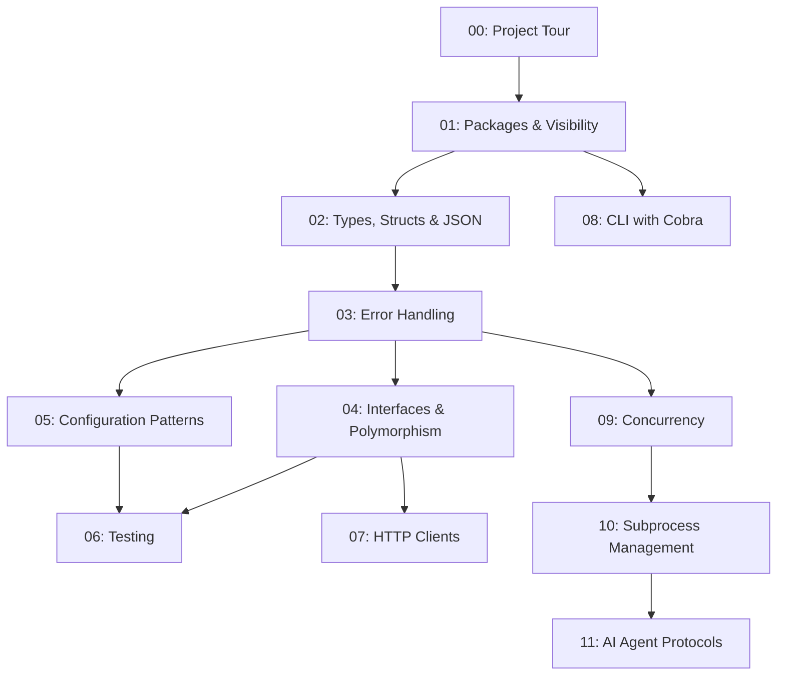

# Learn Go Through CRoBot

**A practical Go guide for experienced engineers, using a real codebase.**

## Who this is for

This guide is for senior software engineers who are proficient in one or more
programming languages but have little or no experience with Go. Rather than
teaching Go in the abstract, every lesson is grounded in a real, working
project -- CRoBot -- so you can see how idiomatic Go looks in production code.

## What is CRoBot?

CRoBot is a local-first CLI tool for AI-powered code reviews on pull requests.
It supports Bitbucket, GitHub, and local git repositories, giving you a
practical codebase that covers HTTP clients, CLI frameworks, concurrency,
testing, and more.

## Prerequisites

- **Go 1.25+** installed ([download](https://go.dev/dl/))
- Clone the repository: `git clone https://github.com/cristian-fleischer/CRoBot.git`
- Verify the build: `go build ./...`

## Curriculum

| Lesson | Title | Summary |
|--------|-------|---------|
| [00](00-project-tour.md) | Project Tour | Architecture, directory layout, Go module system |
| [01](01-packages-and-visibility.md) | Packages & Visibility | Packages, exports, init(), blank imports |
| [02](02-types-structs-and-json.md) | Types, Structs & JSON | Structs, tags, JSON marshaling, zero values, receivers |
| [03](03-error-handling.md) | Error Handling | The error interface, wrapping, sentinels, custom types |
| [04](04-interfaces-and-polymorphism.md) | Interfaces & Polymorphism | Implicit interfaces, factory pattern, composition |
| [05](05-configuration-patterns.md) | Configuration Patterns | Layered config, YAML tags, function type injection |
| [06](06-testing.md) | Testing | Table-driven, parallel, subprocess helpers, TestMain |
| [07](07-http-clients.md) | HTTP Clients | net/http, retries, pagination, SSRF prevention |
| [08](08-cli-with-cobra.md) | CLI with Cobra | Cobra framework, command trees, flags, closures |
| [09](09-concurrency.md) | Concurrency | Goroutines, channels, mutexes, atomics, select, context |
| [10](10-subprocess-management.md) | Subprocess Management | os/exec, pipes, bufio, go:embed, strings.Builder |
| [11](11-ai-agent-protocols.md) | AI Agent Protocols | What AI agents are, MCP, ACP, Skills |

## Lesson dependency graph

The following diagram shows how lessons build on each other. Arrows indicate
that a lesson assumes knowledge from an earlier one.

## How to use this guide

**Follow the lessons in order** for the full experience. Each lesson builds on
concepts introduced in earlier ones, and the dependency graph above shows
exactly which prerequisites each lesson expects.

If you already have some Go experience, feel free to jump directly to the
lessons that interest you. Check the dependency graph to make sure you are
comfortable with the prerequisite material first. Every lesson is self-contained
enough to be useful on its own, as long as you understand the foundations it
builds on.
